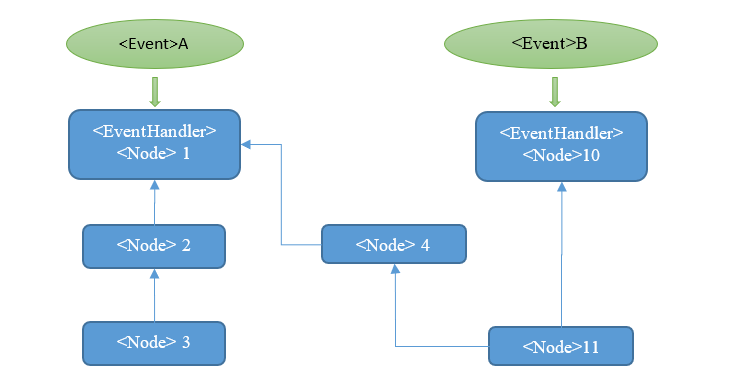
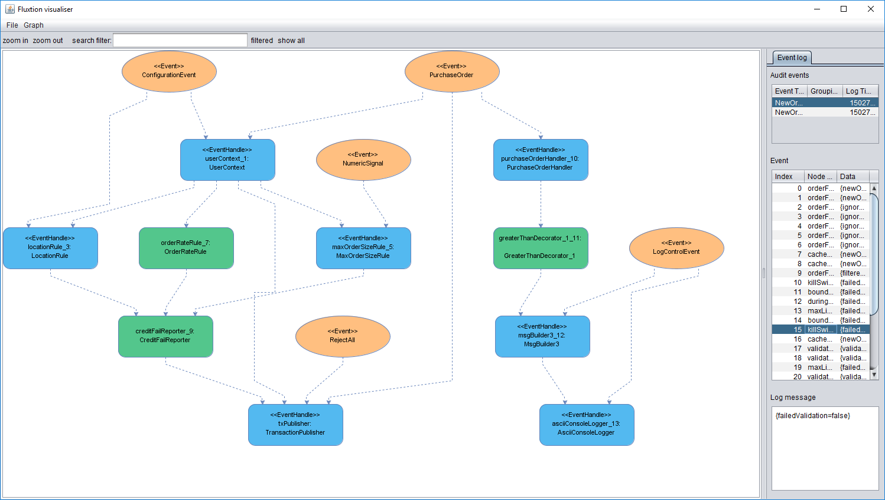

  

## Overview
Thanks for dropping by, hope we can persuade you to donate your time to investigate Fluxtion further. 

Fluxtion is a code generator that automates the production of event stream processing logic. The generated code is self-contained and designed to sit within an application. The application delivers events to the Fluxtion generated Static Event Processor for stream processing.

Low latency, easy maintenance, zero gc, complex graph processing, simplified development and the "wow you can do that!!" reaction are the principles that guide our project. 

As a stretch goal we would like to be the [fastest single threaded java stream processor](https://github.com/v12technology/fluxtion-quickstart/blob/master/README.md#run) on the planet. 

## What are we solving
Fluxtion is focused on optimising the implementation of stream processing logic. Other stream processors support marshalling, distributed processing, event ordering and a multitude of other feature. Fluxtion presumes there is an event queue it can drain, and concentrates solely on delivering correct and optimal execution of application logic. 

### Graph processing primer

In a stream processor events are received and processed with predictable results. A set of dependent behaviours can be modelled as a directed acyclic graph. Where the behaviours are nodes on the graph, in our case these behaviours are functions. For predictable processing to hold true we can say the following:

*  An execution path is formed of nodes that have an event handler as a parent
*  Functions are nodes on the execution path.
*  The first node on an execution path is an event handler.
*  An event handler is a node that accepts an incoming event for processing.
*  Functions will always be invoked in execution path order.
*  Execution path order is topologically sorted such that all parent nodes are invoked before child nodes.
*  A child node will be given a valid reference to each parent dependency before any event processing occurs.

For the example above:
*  **Event graph:** Node 1, Node 2, Node 3, Node 4, Node 10, Node 11
*  **Event handlers:** Node 1, Node 10
*  **Execution Paths:**
   * Event A: Node 1, Node 2, Node 3 Node 4, Node 11
   * Event B: Node 10, Node 11

## Motivation
Fluxtion is a tool for generating high performance event stream processing applications. 
The ideas behind Fluxtion have been used extensively in the low latency high 
frequency trading space, where low response time for complex calculation graphs 
is the main requirement.

Uniquely among stream process applications Fluxtion interjects in the standard build 
process and seamlessly adds a second compiler stage. The generated code is optimised
for performance and low memory usage. 

If you need to process multiple event types, each with a unique execution path,
producing multiple outputs, Fluxtion is for you. It will reduce your development
time, ease your maintenance and cut your processing costs.

A maven plugin is provided that integrates the Fluxtion generator into a standard developer build process. [Quick start](https://github.com/v12technology/fluxtion-quickstart/blob/master/README.md) example fliuxtion java wc, faster than unix wc.

## Philosophy
We generate code and not byte code for several reasons: 
* Most project costs are spent in maintenance which is easier and faster if the code is accessible. 
* There are no Fluxtion servers to deploy, the generated code easily integrates into existing applications.
* Fluxtion supports complex constructs, such as recursive compilation, that would be difficult to develop in byte code alone.

## Maintenance tools 
As well as generating code code we also generate features that help supporting and
fault find an application:
*  graphml and png's to represent the graph. 
*  The graphml can be loaded into the visualiser for analysis.
*  Auditors can record all event and node execution paths.
*  Audit records are in a structured machine friendly form. 
*  Any property can de dynamically traced using reflection.
*  Auditors can record performance for events and individual nodes. 

This README is a work in progress and will be updating regularly

