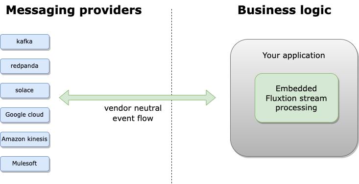

<p align="center">
    <a href="https://v12technology.github.io/fluxtion/">
        
    </a>
</p>

[](https://github.com/v12technology/fluxtion/actions)
[](https://maven-badges.herokuapp.com/maven-central/com.fluxtion/runtime)

# [USER DOCUMENTATION](https://v12technology.github.io/fluxtion/)

# Fluxtion embedded stream processing

Fluxtion is a Java library and code generation utility designed for building high-performance, low-latency streaming
applications. It provides a lightweight framework for event-driven programming, particularly suited for applications
such as financial trading systems, real-time analytics, and sensor data processing. Fluxtion emphasizes simplicity,
efficiency, and ease of use in handling streaming data.


<div class="grid">
<div class="col-1-2">
<div class="content">
<ul>
  <li><strong>Streaming event processing</strong></li>
  <li><strong>AOT compiled for fast cloud start</strong></li>
  <li><strong>Spring integration</strong></li>
</ul>
</div>
</div>
<div class="col-1-2">
<div class="content">
<ul>
  <li><strong>Optimised to reduce processing costs</strong></li>
  <li><strong>Low latency nanosecond response with zero gc</strong></li>
  <li><strong>30 million events per second per core</strong></li>
</ul>
</div>
</div>
</div>

## Application integration
Embed a Fluxtion stream processing engine in your application, freeing your business logic from messaging vendor lock-in.



## Performance 
See the [performance section](https://v12technology.github.io/fluxtion/sections/performance.html) for jmh and hdr results

* 33 million events processed per second
* Average latency is 30 nanoseconds to process one event including app logic
* The Fluxtion event processor is in the low nanosecond range for event processing overhead
* Zero gc
* Single threaded application


## Code sample
Fluxtion supports both imperative service style and functional patterns. Below is an example of functional coding style
that adds two numbers from independent data streams and logs when the sum is greater than 100.

```java
/**
 * Simple Fluxtion hello world stream example. Add two numbers and log when sum > 100
 * <ul>
 *     <li>Subscribe to two event streams, Data1 and Data1</li>
 *     <li>Map the double values of each stream using getter</li>
 *     <li>Apply a stateless binary function {@link Double#sum(double, double)}</li>
 *     <li>Apply a filter that logs to console when the sum > 100</li>
 * </ul>
 */
public class HelloWorld {
    public static void main(String[] args) {
        //builds the EventProcessor
        EventProcessor eventProcessor = Fluxtion.interpret(cfg -> {
            var data1Stream = subscribe(Data1.class)
                    .console("rcvd -> {}")
                    .mapToDouble(Data1::value);

            subscribe(Data2.class)
                    .console("rcvd -> {}")
                    .mapToDouble(Data2::value)
                    .map(Double::sum, data1Stream)
                    .filter(d -> d > 100)
                    .console("OUT: sum {} > 100");
        });
        //init and send events
        eventProcessor.init();
        //no output < 100
        eventProcessor.onEvent(new Data1(20.5));
        //no output < 100
        eventProcessor.onEvent(new Data2(63));
        //output > 100 - log to console
        eventProcessor.onEvent(new Data1(56.8));
    }

    public record Data1(double value) {
    }

    public record Data2(double value) {
    }
}
```

## Execution output
```text
rcvd -> Data1[value=20.5]
rcvd -> Data2[value=63.0]
rcvd -> Data1[value=56.8]
OUT: sum 119.8 > 100

Process finished with exit code 0
```

## Processing graph


# Top level components
There are two major components provided by Fluxtion the developer uses to build event driven logic.

## Compiler
The compiler analyses the configuration information provided by the programmer and builds a dependency injection container
that houses all the user components or beans combined with pre-calculated event dispatch. Outputs from the compiler 
are either 
- In memory di container running in an interpreted mode
- A container generated ahead of time and serialised to code 

## Runtime
The runtime provides the dependency injection container with a core set of libraries required at runtime. An AOT generated
container only requires the runtime to function, no compiler libraries are required.


# Donations

The guys from ej technologies kindly donated their [java profiler JProfiler](https://www.ej-technologies.com/products/jprofiler/overview.html)
to allow me to optimise Fluxtion, many thanks.

[](https://www.ej-technologies.com/products/jprofiler/overview.html)

# Contributing
We welcome contributions to the project. Detailed information on our ways of working will
be written in time. In brief our goals are:

* Sign the [Fluxtion Contributor Licence Agreement](https://github.com/v12technology/fluxtion/blob/master/contributorLicenseAgreement).
* Author a change with suitabke test case and documentation.
* Push your changes to a fork.
* Submit a pull request.
# License
Fluxtion is licensed under the [Server Side Public License](https://www.mongodb.com/licensing/server-side-public-license).
This license is created by MongoDb, for further info see [FAQ](https://www.mongodb.com/licensing/server-side-public-license/faq)
and comparison with [AGPL v3.0](https://www.mongodb.com/licensing/server-side-public-license/faq).

