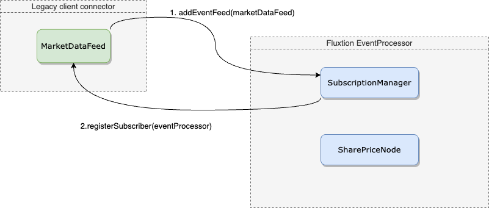

## Introduction
This example demonstrates the pattern for integrating legacy data feeds into an [EventProcessor]({{site.EventProcessor_link}}). 

1. Create a client feed that implement the [EventFeed]() interface
2. The implementation of an EventFeed converts external data into events and publishes to registered EventProcessors 
3. Build an EventProcessor where a subscription node injects a [SubscriptionManager]() 
4. The subscription node issues subscription requests to the SubscriptionManager
5. Add client event feeds to the EventProcessor [EventProcessor.addEventFeed]()
6. The SubscriptionManager collects and sends subscription requests to the client feed 
7. The client feed converts legacy data streams into events and publishes events, [EventProcessor.onEvent]()

## Subscription and publishing calls
### Register an EventFeed with EventProcessor
  

### SharePriceNode subscribes to symbols
  

### Publics data from legacy app
  

## Example

[Share price events]() are published from a [MarketDataFeed]() to an EventProcessor. There are several [SharePriceSubscriber]()
in the EventProcessor, each one listening to a different symbolId. The SharePriceSubscriber subscribes to a symbol using
the SubscriptionManager. The SubscriptionManager sends a subscription request to any registered EventFeed's with the
EventProcessor instance that has requested that symbol. The MarketDataFeed then converts a market price update into a
SharePrice and publishes to an interested EventProcessor.

All the subscription requests are automatically handled by the SubscriptionManager, it is the responsibility of the
MarketDataFeed to decide how it handles the subscription request.

### SharePriceSubscriber node


public class SharePriceSubscriber {

    private final String symbolId;
    @Inject
    public SubscriptionManager subscriptionManager;

    public SharePriceSubscriber(String symbolId) {
        this.symbolId = symbolId;
    }

    @Initialise
    public void init() {
        subscriptionManager.subscribe(symbolId);
    }

    @OnEventHandler(filterVariable = "symbolId")
    public void AssetPrice(SharePrice assetPriceUpdate) {
        System.out.println("subscriber:" + symbolId + " -> " + assetPriceUpdate);
    }
}


### External MarketDataFeed


public class MarketDataFeed implements EventFeed {

    private final Set<StaticEventProcessor> targetProcessorSet = new HashSet<>();

    public void publish(String symbolId, double price) {
        targetProcessorSet.forEach(e -> {
            e.onEvent(new SharePrice(symbolId, price));
        });
    }

    @Override
    public void registerFeedTarget(StaticEventProcessor staticEventProcessor) {
        //do nothing feed arrived
    }

    @Override
    public void subscribe(StaticEventProcessor target, Object subscriptionId) {
        if (!targetProcessorSet.contains(target)) {
            targetProcessorSet.add(target);
            System.out.println("MarketDataFeed adding EventProcessor as a sink, count:" + targetProcessorSet.size());
        }
    }

    @Override
    public void unSubscribe(StaticEventProcessor target, Object subscriptionId) {
        //some complex unsubscription logic
    }

    @Override
    public void removeAllSubscriptions(StaticEventProcessor eventProcessor) {
        targetProcessorSet.remove(eventProcessor);
        System.out.println("MarketDataFeed removing EventProcessor as sink, count:" + targetProcessorSet.size());
    }
}


### Running the example

Build an EventProcessor in memory and add the EventFeed, then fire updates to the MarketDataFeed.


public class SharePriceSubscriber {

    private final String symbolId;
    @Inject
    public SubscriptionManager subscriptionManager;

    public SharePriceSubscriber(String symbolId) {
        this.symbolId = symbolId;
    }

    @Initialise
    public void init() {
        subscriptionManager.subscribe(symbolId);
    }

    @OnEventHandler(filterVariable = "symbolId")
    public void AssetPrice(SharePrice assetPriceUpdate) {
        System.out.println("subscriber:" + symbolId + " -> " + assetPriceUpdate);
    }
}


Running the example prints this to console:


MarketDataFeed subscription request symbolId:MSFT
MarketDataFeed adding EventProcessor as a sink, count:1
MarketDataFeed subscription request symbolId:AMZN

publishing prices from MarketDataFeed:
subscriber:MSFT -> SharePrice[symbolId=MSFT, price=21.36]
subscriber:MSFT -> SharePrice[symbolId=MSFT, price=22.11]
subscriber:AMZN -> SharePrice[symbolId=AMZN, price=72.6]

tear down marketPriceProcessor:
MarketDataFeed removing EventProcessor as sink, count:0

restart marketPriceProcessor:
MarketDataFeed subscription request symbolId:MSFT
MarketDataFeed adding EventProcessor as a sink, count:1
MarketDataFeed subscription request symbolId:AMZN

publishing prices from MarketDataFeed:
subscriber:MSFT -> SharePrice[symbolId=MSFT, price=22.51]


