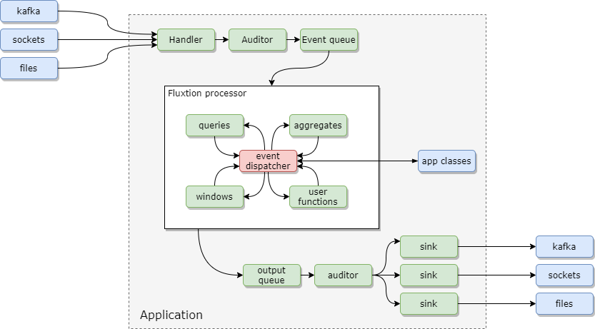

# Introduction to Fluxtion
Welcome to Fluxtion, and thanks for coming, hope you enjoy exploring :) 

Fluxtion is a java utility that builds embeddable, reactive complex event processors for data in motion streaming
applications. Suitable use cases include:

- **Real-time applications** processing multiple event streams
- **Embedding within an existing system** No middleware vendor lock-in
- **Edge processing** executing on edge devices zero dependency
- **Low latency** response time in microseconds
- **Fast start times** supports ahead of time compilation 

Write simple clean Java code to create real-time applications. programs are quick to build, test, deploy and debug ,with
no dependencies. Data streams can be merged, filtered, aggregated, joined, grouped and enriched. Windowing of data is 
fully supported.

A full set of tools for debugging, tracing, auditing and visualisation are provided to reduce development and support costs.

## Fluxtion dependencies
<div class="tab">
  <button class="tablinks" onclick="openTab(event, 'Maven')" id="defaultOpen">Maven</button>
  <button class="tablinks" onclick="openTab(event, 'Gradle')">Gradle</button>
</div>
<div id="Maven" class="tabcontent">
<div markdown="1">

    <dependencies>
        <dependency>
            <groupId>com.fluxtion</groupId>
            <artifactId>runtime</artifactId>
            <version>5.0.8</version>
        </dependency>
        <dependency>
            <groupId>com.fluxtion</groupId>
            <artifactId>compiler</artifactId>
            <version>5.0.8</version>
        </dependency>
    </dependencies>

</div>
</div>
<div id="Gradle" class="tabcontent">
<div markdown="1">

implementation 'com.fluxtion:runtime:{{site.fluxtion_version}}'
implementation 'com.fluxtion:compiler:{{site.fluxtion_version}}'

</div>
</div>

Fluxtion dependency description

| Fluxtion dependency | Example use                             | Description                                           | 3rd party<br/> dependencies |
|---------------------|-----------------------------------------|-------------------------------------------------------|-----------------------------|
| Compiler            | Fluxtion#interpret<br/>Fluxtion#compile | Generates the EventProcessor <br/> from a description | Many                        |
| Runtime             | EventProcessor#onEvent                  | Runtime dispatch of events and helper libraries       | None                        |

It is possible to use ```Fluxtion#compile``` to create an EventProcessor ahead of time and then only the runtime 
library is required on the running classpath to support the source code generated EventProcessor. In this case 
set the scope to provided in maven.

## Steps to create an EventProcessor instance
1. **Describe** the processing logic in user code
2. **Generate** the EventProcessor by supplying a description to the Fluxtion generator
3. **Process** events in the Fluxtion generated EventProcessor instance from (2)

# Processing events in a stream processor

There are three main steps to building and running a stream processor application using Fluxtion

## Step 1: Describe processing logic
Describe the values that are calculated and actions invoked in response to an incoming event. Fluxtion provides two
api's to describe the processing logic:
1. [A set of annotations](https://github.com/v12technology/fluxtion/tree/{{site.fluxtion_version}}/runtime/src/main/java/com/fluxtion/runtime/annotations) 
that mark members of user written classes as being managed by the event processor
2. [A java 8 stream like api](https://github.com/v12technology/fluxtion/tree/{{site.fluxtion_version}}/compiler/src/main/java/com/fluxtion/compiler/builder/stream)
, that can describe processing with a fluent functional style

## Step 2: Build an EventProcessor
Fluxtion provides a generator that converts the description into an executable
[EventProcessor](https://github.com/v12technology/fluxtion/tree/{{site.fluxtion_version}}/runtime/src/main/java/com/fluxtion/runtime/EventProcessor.java)
instance. The generator
is invoked from 
[Fluxtion](https://github.com/v12technology/fluxtion/tree/{{site.fluxtion_version}}/compiler/src/main/java/com/fluxtion/compiler/Fluxtion.java)
with one of two utility methods:
1. **compile**: this generates a java source code version of the EventProcessor. The file is compiled in process and used
to handle events. Total nodes are limited to the number of elements a source file can handle
2. **interpret**: Creates an in memory model of the processing backed with data structures. Can support millions of nodes

## Step 3: Process events
Once the
[EventProcessor](https://github.com/v12technology/fluxtion/tree/{{site.fluxtion_version}}/runtime/src/main/java/com/fluxtion/runtime/EventProcessor.java)
has been generated the instance is ready to consume events. The EventProcessor has a lifecycle so **init must be called
before sending any events for processing**. 

The application pulls events from any source and invokes ```EventProcessor#onEvent```

# Application integration
---



A Fluxtion event processor embeds within a user application, processing events,
publishing events to sinks or interacting with user classes. Events are feed from
the application directly into the processor or into a pipeline. A pipeline provides
additional capabilities such as threading, scheduling, auditing, access control. 

<script>
document.getElementById("defaultOpen").click();
</script>