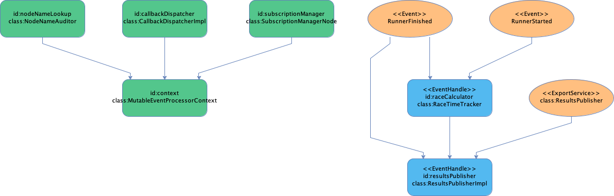

# Fluxtion automating event driven development

---

Fluxtion is a code generation utility that simplifies building event driven applications. Generated code binds event 
streams to application functions, increasing developer productivity by automating creation of dispatch logic. 
Application code is free from vendor lock-in, deployable anywhere and simple to test.

<ul>
  <li><strong>Streaming event processing</strong></li>
  <li><strong>AOT compilation for fast start</strong></li>
  <li><strong>Spring integration</strong></li>
</ul>

<ul>
  <li><strong>Low latency microsecond response</strong></li>
  <li><strong>Event sourcing compatible</strong></li>
  <li><strong>Optimised for zero gc to reduce running costs</strong></li>
</ul>

{: .info }
Fluxtion saves developer time and increases stability when building event driven applications
{: .fs-4 }

# Example
[This example]({{site.cookbook_src}}/racing) tracks and calculates times for runners in a race. Start and finish times are received as stream of events,
as a runner finishes they receive their individual time. A call to `publishAllResults` will publish all current results.

The developer writes the core business logic, Fluxtion takes care of generating all the event dispatch code that is time
consuming to write, error prone and adds little value. The generated event processor is used like any normal java class 
in the application.

  <button class="tablinks2" onclick="openTab2(event, 'Event logic')" id="defaultExample">Event logic</button>
  <button class="tablinks2" onclick="openTab2(event, 'App integration')">App integration</button>
  <button class="tablinks2" onclick="openTab2(event, 'Binding functions')">Bind event logic</button>
  <button class="tablinks2" onclick="openTab2(event, 'Fluxtion generated')">Generated code</button>

Custom business logic written by developer

public class RaceCalculator {
    //streamed events
    public record RunnerStarted(long runnerId, Instant startTime) {}
    public record RunnerFinished(long runnerId, Instant finishTime) {}

    //service api
    public interface ResultsPublisher {
        void publishAllResults();
    }

    //event driven logic
    @Getter
    public static class RaceTimeTracker {

        private final transient Map<Long, Long> runnerRaceTimeMap = new HashMap<>();

        @OnEventHandler(propagate = false)
        public boolean runnerStarted(RunnerStarted runnerStarted) {
            //add runner start time to map
            return false;
        }

        @OnEventHandler
        public boolean runnerFinished(RunnerFinished runnerFinished) {
            //calc runner total race time and add to map
            return true;
        }
    }

    @RequiredArgsConstructor
    public static class ResultsPublisherImpl implements @ExportService ResultsPublisher{

        private final RaceTimeTracker raceTimeTracker;

        @OnEventHandler(propagate = false)
        public boolean runnerFinished(RunnerFinished runnerFinished) {
            //get the runner race time and send individual their results
            long raceTime = raceTimeTracker.getRunnerRaceTimeMap().get(runnerFinished.runnerId());
            return false;
        }

        @Override
        public void publishAllResults() {
            //get all results and publish
            var runnerRaceTimeMap = raceTimeTracker.getRunnerRaceTimeMap();
        }
    }
}



Application feeds events to an instance of the generated event processor. The event processor dispatches 
events to business functions

public class RaceCalculatorApp {
    public static void main(String[] args) {
        RaceCalculatorProcessor raceCalculatorProcessor = new RaceCalculatorProcessor();
        raceCalculatorProcessor.init();

        ResultsPublisher resultsPublisher = raceCalculatorProcessor.getExportedService();
        
        //connect to event stream and process runner timing events
        raceCalculatorProcessor.onEvent(new RunnerStarted(1, Instant.now()));
        raceCalculatorProcessor.onEvent(new RunnerStarted(2, Instant.now()));
        raceCalculatorProcessor.onEvent(new RunnerStarted(3, Instant.now()));

        raceCalculatorProcessor.onEvent(new RunnerFinished(2, Instant.now()));
        raceCalculatorProcessor.onEvent(new RunnerFinished(3, Instant.now()));
        raceCalculatorProcessor.onEvent(new RunnerFinished(1, Instant.now()));
        
        //publish full results
        resultsPublisher.publishAllResults();
    }
}


Bind user functions to the event processor at build time with maven plugin

public class RaceCalculatorAotBuilder implements FluxtionGraphBuilder {
    @Override
    public void buildGraph(EventProcessorConfig eventProcessorConfig) {
        RaceTimeTracker raceCalculator = eventProcessorConfig.addNode(new RaceTimeTracker(), "raceCalculator");
        eventProcessorConfig.addNode(new ResultsPublisherImpl(raceCalculator), "resultsPublisher");
    }

    @Override
    public void configureGeneration(FluxtionCompilerConfig fluxtionCompilerConfig) {
        fluxtionCompilerConfig.setClassName("RaceCalculatorProcessor");
        fluxtionCompilerConfig.setPackageName("com.fluxtion.example.cookbook.racing.generated");
    }
}


Pom.xml executes maven plugin to generate the event processor

<?xml version="1.0" encoding="UTF-8"?>
<project xmlns="http://maven.apache.org/POM/4.0.0"
xmlns:xsi="http://www.w3.org/2001/XMLSchema-instance"
xsi:schemaLocation="http://maven.apache.org/POM/4.0.0 http://maven.apache.org/xsd/maven-4.0.0.xsd">

    <dependencies>
        <dependency>
            <groupId>com.fluxtion</groupId>
            <artifactId>compiler</artifactId>
            <version>{{site.fluxtion_version}}</version>
        </dependency>
    </dependencies>

    <build>
        <plugins>
            <plugin>
                <groupId>com.fluxtion</groupId>
                <artifactId>fluxtion-maven-plugin</artifactId>
                <version>3.0.14</version>
                <executions>
                    <execution>
                        <id>fluxtion builder cookbook</id>
                        <goals>
                            <goal>scan</goal>
                        </goals>
                    </execution>
                </executions>
            </plugin>
        </plugins>
    </build>
</project>


Event processor generated at build time by maven plugin, connects events to business logic

/**
 *
 *
 * <pre>
 * generation time                 : Not available
 * eventProcessorGenerator version : {{site.fluxtion_version}}
 * api version                     : {{site.fluxtion_version}}
 * </pre>
 *
 * Event classes supported:
 *
 * <ul>
 *   <li>com.fluxtion.compiler.generation.model.ExportFunctionMarker
 *   <li>com.fluxtion.example.cookbook.racing.RaceCalculator.RunnerFinished
 *   <li>com.fluxtion.example.cookbook.racing.RaceCalculator.RunnerStarted
 *   <li>com.fluxtion.runtime.time.ClockStrategy.ClockStrategyEvent
 * </ul>
 *
 * @author Greg Higgins
 */
@SuppressWarnings({"unchecked", "rawtypes"})
public class RaceCalculatorProcessor
    implements EventProcessor<RaceCalculatorProcessor>,
        StaticEventProcessor,
        InternalEventProcessor,
        BatchHandler,
        Lifecycle,
        ResultsPublisher {

  // Node declarations
  private final CallbackDispatcherImpl callbackDispatcher = new CallbackDispatcherImpl();
  public final NodeNameAuditor nodeNameLookup = new NodeNameAuditor();
  public final RaceTimeTracker raceCalculator = new RaceTimeTracker();
  public final ResultsPublisherImpl resultsPublisher = new ResultsPublisherImpl(raceCalculator);
  private final SubscriptionManagerNode subscriptionManager = new SubscriptionManagerNode();
  private final MutableEventProcessorContext context =
      new MutableEventProcessorContext(
          nodeNameLookup, callbackDispatcher, subscriptionManager, callbackDispatcher);
  public final Clock clock = new Clock();
  private final ExportFunctionAuditEvent functionAudit = new ExportFunctionAuditEvent();
  // Dirty flags
  private boolean initCalled = false;
  private boolean processing = false;
  private boolean buffering = false;
  private final IdentityHashMap<Object, BooleanSupplier> dirtyFlagSupplierMap =
      new IdentityHashMap<>(1);
  private final IdentityHashMap<Object, Consumer<Boolean>> dirtyFlagUpdateMap =
      new IdentityHashMap<>(1);

  private boolean isDirty_raceCalculator = false;
  // Forked declarations

  // Filter constants

  public RaceCalculatorProcessor(Map<Object, Object> contextMap) {
    context.replaceMappings(contextMap);
    // node auditors
    initialiseAuditor(clock);
    initialiseAuditor(nodeNameLookup);
    subscriptionManager.setSubscribingEventProcessor(this);
    context.setEventProcessorCallback(this);
  }

  public RaceCalculatorProcessor() {
    this(null);
  }

  @Override
  public void init() {
    initCalled = true;
    auditEvent(Lifecycle.LifecycleEvent.Init);
    // initialise dirty lookup map
    isDirty("test");
    clock.init();
    afterEvent();
  }

  @Override
  public void start() {
    if (!initCalled) {
      throw new RuntimeException("init() must be called before start()");
    }
    processing = true;
    auditEvent(Lifecycle.LifecycleEvent.Start);

    afterEvent();
    callbackDispatcher.dispatchQueuedCallbacks();
    processing = false;
  }

  @Override
  public void stop() {
    if (!initCalled) {
      throw new RuntimeException("init() must be called before stop()");
    }
    processing = true;
    auditEvent(Lifecycle.LifecycleEvent.Stop);

    afterEvent();
    callbackDispatcher.dispatchQueuedCallbacks();
    processing = false;
  }

  @Override
  public void tearDown() {
    initCalled = false;
    auditEvent(Lifecycle.LifecycleEvent.TearDown);
    nodeNameLookup.tearDown();
    clock.tearDown();
    subscriptionManager.tearDown();
    afterEvent();
  }

  @Override
  public void setContextParameterMap(Map<Object, Object> newContextMapping) {
    context.replaceMappings(newContextMapping);
  }

  @Override
  public void addContextParameter(Object key, Object value) {
    context.addMapping(key, value);
  }

  // EVENT DISPATCH - START
  @Override
  public void onEvent(Object event) {
    if (buffering) {
      triggerCalculation();
    }
    if (processing) {
      callbackDispatcher.processReentrantEvent(event);
    } else {
      processing = true;
      onEventInternal(event);
      callbackDispatcher.dispatchQueuedCallbacks();
      processing = false;
    }
  }

  @Override
  public void onEventInternal(Object event) {
    if (event instanceof com.fluxtion.example.cookbook.racing.RaceCalculator.RunnerFinished) {
      RunnerFinished typedEvent = (RunnerFinished) event;
      handleEvent(typedEvent);
    } else if (event instanceof com.fluxtion.example.cookbook.racing.RaceCalculator.RunnerStarted) {
      RunnerStarted typedEvent = (RunnerStarted) event;
      handleEvent(typedEvent);
    } else if (event instanceof com.fluxtion.runtime.time.ClockStrategy.ClockStrategyEvent) {
      ClockStrategyEvent typedEvent = (ClockStrategyEvent) event;
      handleEvent(typedEvent);
    }
  }

  public void handleEvent(RunnerFinished typedEvent) {
    auditEvent(typedEvent);
    // Default, no filter methods
    isDirty_raceCalculator = raceCalculator.runnerFinished(typedEvent);
    resultsPublisher.runnerFinished(typedEvent);
    afterEvent();
  }

  public void handleEvent(RunnerStarted typedEvent) {
    auditEvent(typedEvent);
    // Default, no filter methods
    isDirty_raceCalculator = raceCalculator.runnerStarted(typedEvent);
    afterEvent();
  }

  public void handleEvent(ClockStrategyEvent typedEvent) {
    auditEvent(typedEvent);
    // Default, no filter methods
    clock.setClockStrategy(typedEvent);
    afterEvent();
  }
  // EVENT DISPATCH - END

  // EXPORTED SERVICE FUNCTIONS - START
  @Override
  public void publishAllResults() {
    beforeServiceCall(
        "public void com.fluxtion.example.cookbook.racing.RaceCalculator$ResultsPublisherImpl.publishAllResults()");
    ExportFunctionAuditEvent typedEvent = functionAudit;
    resultsPublisher.publishAllResults();
    afterServiceCall();
  }
  // EXPORTED SERVICE FUNCTIONS - END

  public void bufferEvent(Object event) {
    buffering = true;
    if (event instanceof com.fluxtion.example.cookbook.racing.RaceCalculator.RunnerFinished) {
      RunnerFinished typedEvent = (RunnerFinished) event;
      auditEvent(typedEvent);
      isDirty_raceCalculator = raceCalculator.runnerFinished(typedEvent);
      resultsPublisher.runnerFinished(typedEvent);
    } else if (event instanceof com.fluxtion.example.cookbook.racing.RaceCalculator.RunnerStarted) {
      RunnerStarted typedEvent = (RunnerStarted) event;
      auditEvent(typedEvent);
      isDirty_raceCalculator = raceCalculator.runnerStarted(typedEvent);
    } else if (event instanceof com.fluxtion.runtime.time.ClockStrategy.ClockStrategyEvent) {
      ClockStrategyEvent typedEvent = (ClockStrategyEvent) event;
      auditEvent(typedEvent);
      clock.setClockStrategy(typedEvent);
    }
  }

  public void triggerCalculation() {
    buffering = false;
    String typedEvent = "No event information - buffered dispatch";
    afterEvent();
  }

  private void auditEvent(Object typedEvent) {
    clock.eventReceived(typedEvent);
    nodeNameLookup.eventReceived(typedEvent);
  }

  private void auditEvent(Event typedEvent) {
    clock.eventReceived(typedEvent);
    nodeNameLookup.eventReceived(typedEvent);
  }

  private void initialiseAuditor(Auditor auditor) {
    auditor.init();
    auditor.nodeRegistered(raceCalculator, "raceCalculator");
    auditor.nodeRegistered(resultsPublisher, "resultsPublisher");
    auditor.nodeRegistered(callbackDispatcher, "callbackDispatcher");
    auditor.nodeRegistered(subscriptionManager, "subscriptionManager");
    auditor.nodeRegistered(context, "context");
  }

  private void beforeServiceCall(String functionDescription) {
    functionAudit.setFunctionDescription(functionDescription);
    auditEvent(functionAudit);
    if (buffering) {
      triggerCalculation();
    }
    processing = true;
  }

  private void afterServiceCall() {
    afterEvent();
    callbackDispatcher.dispatchQueuedCallbacks();
    processing = false;
  }

  private void afterEvent() {

    clock.processingComplete();
    nodeNameLookup.processingComplete();
    isDirty_raceCalculator = false;
  }

  @Override
  public void batchPause() {
    auditEvent(Lifecycle.LifecycleEvent.BatchPause);
    processing = true;

    afterEvent();
    callbackDispatcher.dispatchQueuedCallbacks();
    processing = false;
  }

  @Override
  public void batchEnd() {
    auditEvent(Lifecycle.LifecycleEvent.BatchEnd);
    processing = true;

    afterEvent();
    callbackDispatcher.dispatchQueuedCallbacks();
    processing = false;
  }

  @Override
  public boolean isDirty(Object node) {
    return dirtySupplier(node).getAsBoolean();
  }

  @Override
  public BooleanSupplier dirtySupplier(Object node) {
    if (dirtyFlagSupplierMap.isEmpty()) {
      dirtyFlagSupplierMap.put(raceCalculator, () -> isDirty_raceCalculator);
    }
    return dirtyFlagSupplierMap.getOrDefault(node, StaticEventProcessor.ALWAYS_FALSE);
  }

  @Override
  public void setDirty(Object node, boolean dirtyFlag) {
    if (dirtyFlagUpdateMap.isEmpty()) {
      dirtyFlagUpdateMap.put(raceCalculator, (b) -> isDirty_raceCalculator = b);
    }
    dirtyFlagUpdateMap.get(node).accept(dirtyFlag);
  }

  private boolean guardCheck_resultsPublisher() {
    return isDirty_raceCalculator;
  }

  @Override
  public <T> T getNodeById(String id) throws NoSuchFieldException {
    return nodeNameLookup.getInstanceById(id);
  }

  @Override
  public <A extends Auditor> A getAuditorById(String id)
      throws NoSuchFieldException, IllegalAccessException {
    return (A) this.getClass().getField(id).get(this);
  }

  @Override
  public void addEventFeed(EventFeed eventProcessorFeed) {
    subscriptionManager.addEventProcessorFeed(eventProcessorFeed);
  }

  @Override
  public void removeEventFeed(EventFeed eventProcessorFeed) {
    subscriptionManager.removeEventProcessorFeed(eventProcessorFeed);
  }

  @Override
  public RaceCalculatorProcessor newInstance() {
    return new RaceCalculatorProcessor();
  }

  @Override
  public RaceCalculatorProcessor newInstance(Map<Object, Object> contextMap) {
    return new RaceCalculatorProcessor();
  }

  @Override
  public String getLastAuditLogRecord() {
    try {
      EventLogManager eventLogManager =
          (EventLogManager) this.getClass().getField(EventLogManager.NODE_NAME).get(this);
      return eventLogManager.lastRecordAsString();
    } catch (Throwable e) {
      return "";
    }
  }
}


Image is generated as part of the code generator

# Latest release

| component | maven central                                                                                                                                                                    |
|-----------|----------------------------------------------------------------------------------------------------------------------------------------------------------------------------------|
| Runtime   |     |
| Compiler  |  |

## Build dependencies

  <button class="tablinks" onclick="openTab(event, 'Maven')">Maven</button>
  <button class="tablinks" onclick="openTab(event, 'Gradle')" id="defaultOpen">Gradle</button>


    <dependencies>
        <dependency>
            <groupId>com.fluxtion</groupId>
            <artifactId>runtime</artifactId>
            <version>{{site.fluxtion_version}}</version>
        </dependency>
        <dependency>
            <groupId>com.fluxtion</groupId>
            <artifactId>compiler</artifactId>
            <version>{{site.fluxtion_version}}</version>
        </dependency>
    </dependencies>



implementation 'com.fluxtion:runtime:{{site.fluxtion_version}}'
implementation 'com.fluxtion:compiler:{{site.fluxtion_version}}'


# The cost of complexity problem

Increasing system complexity makes delivery of new features expensive and time-consuming to deliver. Efficiently managing
complexity reduces both operational costs and time to market for new functionality, critical for a business to remain
profitable in a competitive environment.

Event driven systems have two types of complexity to manage:

- Delivering events to application components in a fault-tolerant predictable fashion.
- Developing application logic responses to events that meets business requirements

Initially all the project complexity centres on the event delivery system, but over time this system becomes stable and
the complexity demands are minimal. Pre-packaged event delivery systems are a common solution to control complexity and
cost of event distribution. The opposite is true for event driven application logic, functional requirements increase
over time and developing application logic becomes ever more complex and expensive to deliver. As more functionality is 
added the danger of instability increases.

Fluxtion reduces the cost to develop and maintain business logic, while maintaining stability. Automating the expensive
and error-prone process of wiring application logic to multiple event streams is Fluxtion's target. For long term development
projects the ROI of using Fluxtion increases exponentially.

