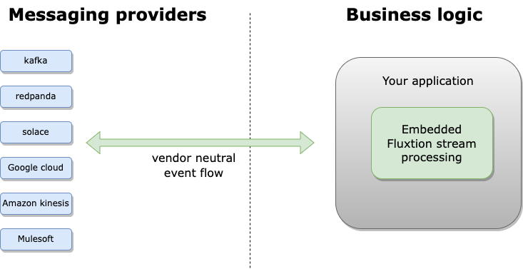

# Simple stream processing in java

---

**Vanilla java. No vendor lockin. Deploy anywhere.**
{: .fs-5 }

**Use streaming DataFlows or your own classes to develop stream processing pipelines in fewer lines of code.**
{: .fs-5 }

<ul>
  <li>Streaming event processing</li>
  <li>AOT compiled for fast cloud start</li>
  <li>Spring integration</li>
</ul>

<ul>
  <li>Optimised to reduce processing costs</li>
  <li>Low latency nanosecond response with zero gc</li>
  <li>30 million events per second per core</li>
</ul>

  <button class="tablinks2" onclick="openTab2(event, 'Windowing')" id="defaultExample">Windowing</button>
  <button class="tablinks2" onclick="openTab2(event, 'Filtering')">Filtering</button>
  <button class="tablinks2" onclick="openTab2(event, 'GroupBy')" >GroupBy and aggregate</button>


//create a streaming event processor
var sep = Fluxtion.interpret(c ->
    //subscribe to "car speeds" messages
    DataFlow.subscribe(Message.class, "car speeds")
        //map function get speed
        .map(Message::speed)
        //calculate average speed, sliding window 5 buckets of 200 millis
        .slidingAggregate(Aggregates.doubleAverageFactory(), 200, 5)
        //publish to 
        .sink("average car speed"));

//init the streaming event processor and connect to your event flow source
sep.init();
connectEventFlow(sep);



//create a streaming event processor
var sep = Fluxtion.interpret(c ->
    //subscribe to "car speeds" messages
    DataFlow.subscribe(Message.class, "car speeds")
        //map function get speed
        .map(Message::speed)
        //filter and warn if speed > 100
        .filter(s -> s > 100)
        .map(s -> "warning speed > 100 detected")
        //publish to a sink output
        .sink("excess car speed"));

//init the streaming event processor and connect to your event flow source
sep.init();
connectEventFlow(sep);



//create a streaming event processor
var sep = Fluxtion.interpret(c -> {
    //reset signal for aggregate function
    var resetSignal = DataFlow.subscribe(ResetList.class).console("\n--- RESET ---");
    //subscribe to Integers
    DataFlow.subscribe(Integer.class)
        //group by odd/even and aggregate to a list
        .groupByToList(i -> i % 2 == 0 ? "evens" : "odds")
        //attaches the aggregate reset trigger to the resetSignal data flow
        .resetTrigger(resetSignal)
        .map(GroupBy::toMap)
        .console("ODD/EVEN map:{}"))
};

//init the streaming event processor and connect to your event flow source
sep.init();
sep.onEvent(1);
sep.onEvent(2);
sep.onEvent(5);
sep.onEvent(7);
sep.onEvent(2);
sep.onEvent(new ResetList());



//OUTPUT
ODD/EVEN map:{odds=[1]}
ODD/EVEN map:{odds=[1], evens=[2]}
ODD/EVEN map:{odds=[1, 5], evens=[2]}
ODD/EVEN map:{odds=[1, 5, 7], evens=[2]}
ODD/EVEN map:{odds=[1, 5, 7], evens=[2, 2]}

--- RESET ---
ODD/EVEN map:{}


# Embedded stream processing engine 
---
Checkout **[Why fluxtion](sections/why-fluxtion)** for an ecosystem comparison

Read our **[performance numbers](sections/performance)**, nano second response times in java

Embed a Fluxtion stream processing engine in your application, freeing your business logic from messaging vendor lock-in.

# Fluxtion technology
---
**Event-driven Programming**: Fluxtion is based on the concept of event-driven programming, where components react to
incoming events in real-time. Events can represent changes in data, user actions, or any other relevant triggers.

**Dependency Graphs**: Fluxtion models the processing logic of the application as a directed acyclic graph (DAG) of
nodes,
where each node represents a computation or transformation operation. Nodes can subscribe to input events, perform
calculations, and publish output events.

**Event Processing Pipelines**: Fluxtion allows developers to define event processing pipelines, where events flow
through a
series of interconnected nodes. This allows for complex data transformations and aggregations to be performed
efficiently.

**Annotation-Based Configuration**: Fluxtion provides an annotation-based configuration mechanism, allowing developers
to
define event processing logic using simple annotations. This simplifies the development
process and reduces boilerplate code.

**Code Generation**: Fluxtion employs code generation techniques to optimize the performance of event processing
pipelines.
During compilation, Fluxtion generates highly optimized Java code tailored to the specific event processing logic
defined by the developer.

**Low Latency**: Fluxtion is designed to achieve low latency and high throughput, making it suitable for applications
where
real-time responsiveness is critical, such as financial trading systems.

**Support for Complex Event Processing (CEP)**: Fluxtion includes support for complex event processing, allowing
developers
to define complex event patterns and rules using a high-level DSL (Domain-Specific Language).

**Instantaneous Startup:** Our innovative Ahead-of-Time (AOT) compiled streaming engine minimizes startup times to near zero.

**Integration with External Systems**: Fluxtion can easily integrate with external systems and libraries, allowing
developers to incorporate Fluxtion-based event processing logic into existing applications or frameworks.

**Developer Productivity**: Fluxtion has been designed to increases developer productivity when building and
supporting event driven applications

# Developer documentation
---

## Developers
For a quick introduction to programming Fluxtion visit the [hello world](sections/helloworld/helloworld_imperative) examples.

A [developer workflow document](sections/gettingstarted/developer-workflow) describes the approach integrating Fluxtion into your work cycle

A series of tutorials are provided that a developer should follow to become familiar with the practical coding of
Fluxtion, start with [tutorial 1](sections/gettingstarted/tutorial-1.md).

## Architects

For a deeper understanding of the architecture, design and paradigms that underpin Fluxtion head over to the
[Fluxtion explored section](sections/fluxtion-explored).

## Reference documentation

* [Reference docs index](sections/reference-documentation)
* [Mark event handling methods](sections/runtime.md)
* [Build an event processor](sections/build-event-processor)
* [Integrate an event processor](sections/integrate-eventprocessor)
* [Fluxtion DSL deep dive](sections/fluxtion-explored/fluxtion-dsl)

# Latest release
---

Open source on [GitHub]({{site.fluxtion_src}}), artifacts published to maven central.

  <button class="tablinks" onclick="openTab(event, 'Maven')">Maven</button>
  <button class="tablinks" onclick="openTab(event, 'Gradle')" id="defaultOpen">Gradle</button>


    <dependencies>
        <dependency>
            <groupId>com.fluxtion</groupId>
            <artifactId>runtime</artifactId>
            <version>{{site.fluxtion_version}}</version>
        </dependency>
        <dependency>
            <groupId>com.fluxtion</groupId>
            <artifactId>compiler</artifactId>
            <version>{{site.fluxtion_version}}</version>
        </dependency>
    </dependencies>



implementation 'com.fluxtion:runtime:{{site.fluxtion_version}}'
implementation 'com.fluxtion:compiler:{{site.fluxtion_version}}'


