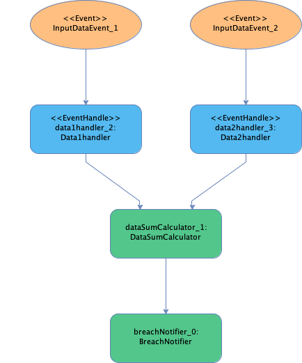

# 5 minute hello world - imperative

Fluxtion hello world stream example. Add two numbers from different event streams and log when the sum > 100.
The sum is the addition of the current value from each event stream.

This example creates an event processor, initialises it and fires data events at the processor. If a breach occurs
a warning will be logged to console.

Code is available as a [maven project]({{page.example_src}})

## Steps to build an EventProcessor

All projects that build a Fluxtion [EventProcessor]({{site.EventProcessor_link}}) at runtime follow similar steps

- Create a maven or gradle project adding the Fluxtion compiler dependency to the project runtime classpath
- Write pojo's that will be nodes in the graph
- [Annotate]({{site.fluxtion_src_runtime}}/annotations/) a method to indicate it is an event handling callback
- Create a collection of instances of the pojo's that will act as nodes in the EvenProcessor
- Set references between the pojos as per normal java. Constructor, getter/setter, public access etc.
- Use one of the [Fluxtion]({{site.Fluxtion_link}}) compile/interpret methods passing in a
  builder method that accepts [EventProcessorConfig]({{site.fluxtion_src_compiler}}/EventProcessorConfig.java)
- Add your the root node/s of your object instance graph using EventProcessorConfig.addNode in your builder method or
  give the list of nodes to the Fluxtion builder method
- An EventProcessor instance is returned ready to be used
- Call EventProcessor.init() to ensure the graph is ready to process events
- To publish events to the processor call EventProcessor.onEvent(object)
- Fluxtion guarantees the dispatch of notifications to your pojo's is in topological order
- When you process ends you can optionally call EventProcessor.tearDown()

## Processing graph

Graphical representation of the processing graph that Fluxtion will generate.

## Dependencies

  <button class="tablinks" onclick="openTab(event, 'Maven')" id="defaultOpen">Maven</button>
  <button class="tablinks" onclick="openTab(event, 'Gradle')">Gradle</button>


    <dependencies>
        <dependency>
            <groupId>com.fluxtion</groupId>
            <artifactId>compiler</artifactId>
            <version>{{site.fluxtion_version}}</version>
        </dependency>
    </dependencies>



implementation 'com.fluxtion:compiler:{{site.fluxtion_version}}'


## Java code

All the elements are joined together using an imperative style in the Fluxtion builder. There are two style of class in
the example, pojo nodes that hold processing logic and events that notify the EventProcessor of a change.

The example [Main method]({{page.example_src}}/Main.java) constructs an EvenProcessor, initialises it and fires events
to the processor for processing

### Pojo classes

| Name              | Event handler | Description                                                      |
|-------------------|---------------|------------------------------------------------------------------|
| Data1Handler      | yes           | Handles incoming events of type InputDataEvent_1                 |
| Data2Handler      | yes           | Handles incoming events of type InputDataEvent_2                 |
| DataSumCalculator | no            | References DataHandler nodes and calcultes the current sum       |
| BreachNotifier    | no            | References the DataSumCalculator and logs a warning if sum > 100 |

#### [Data1Handler]({{page.example_src}}/Data1handler.java)

An entry point for processing events of type InputDataEvent_1 and stores the latest value as a member variable.
Annotate the event handler method as follows:


public class Data1handler {
    private double value;

    @OnEventHandler
    public boolean data1Update(InputDataEvent_1 data1) {
        value = data1.value();
        return true;
    }

    public double getValue() {
        return value;
    }
}


#### [Data2Handler]({{page.example_src}}/Data2handler.java)

An entry point for processing events of type InputDataEvent_2 and stores the latest value as a member variable.
Annotate the event handler method as follows:


public class Data2handler {
    private double value;

    @OnEventHandler
    public boolean data1Update(InputDataEvent_2 data2) {
        value = data2.value();
        return true;
    }

    public double getValue() {
        return value;
    }
}


#### [DataSumCalculator]({{page.example_src}}/DataSumCalculator.java)

Calculates the current sum adding the values of Data1Handler and Data2Handler. Will be triggered when either handler
has its updated method invoked. Annotate the trigger method as follows:


public class DataSumCalculator {
    private final Data1handler data1handler;
    private final Data2handler data2handler;
    private double sum;

    public DataSumCalculator(Data1handler data1handler, Data2handler data2handler) {
        this.data1handler = data1handler;
        this.data2handler = data2handler;
    }

    public DataSumCalculator() {
        this(new Data1handler(), new Data2handler());
    }

    /**
     * The {@link OnTrigger} annotation marks this method to be called if any parents have changed
     *
     * @return flag indicating a change and a propagation of the event wave to child dependencies if the sum > 100
     */
    @OnTrigger
    public boolean calculate() {
        sum = data1handler.getValue() + data2handler.getValue();
        System.out.println("sum:" + sum);
        return sum > 100;
    }

    public double getSum() {
        return sum;
    }
}


The return flag indicates that the event notification should be propagated and any child nodes trigger methods
should be invoked.

#### [BreachNotifier]({{page.example_src}}/BreachNotifier.java)

Logs to console when the sum breaches a value, BreachNotifier holds a reference to the DataSumCalculator instance.
The trigger method is only invoked if the DataSumCalculator propagates the notification, by returning true from its
trigger
method. Annotate the trigger method as follows:


public class BreachNotifier {
    private final DataSumCalculator dataAddition;

    public BreachNotifier(DataSumCalculator dataAddition) {
        this.dataAddition = dataAddition;
    }

    public BreachNotifier() {
        this(new DataSumCalculator());
    }

    @OnTrigger
    public boolean printWarning() {
        System.out.println("WARNING DataSumCalculator value is greater than 100 sum = " + dataAddition.getSum());
        return true;
    }
}


### Event classes

Java records as used as events.


public record InputDataEvent_1(double value) {}
public record InputDataEvent_2(double value) {}


## Building the EventProcessor and processing events

See [Main]({{page.example_src}}/Main.java)

Building the EventProcessor is simply giving the root node instance, BreachNotifier to
a [Fluxtion]({{site.Fluxtion_link}}) builder method. The Fluxtion.interpret()
method accepts a list of nodes to add to the container. Fluxtion inspects all the references from the root node(s) and
constructs the EventProcessor with instances of Data1Handler,
Data2Handler and DataSumCalculator all included.

Publishing events to the container is simply a case of calling init on the EventProcessor and then call onEvent() with instances of
InputDataEvent_1
or InputDataEvent_2. The code for building and sending events follows:
root nodes to as follows:


public class Main {
  public static void main(String[] args) {
    var eventProcessor = Fluxtion.interpret(new BreachNotifier());
    eventProcessor.init();
    eventProcessor.onEvent(new InputDataEvent_1(34.4));
    eventProcessor.onEvent(new InputDataEvent_2(52.1));
    eventProcessor.onEvent(new InputDataEvent_1(105));//should create a breach warning
    eventProcessor.onEvent(new InputDataEvent_1(12.4));
  }
}


### Example execution output


sum:34.4
sum:86.5
sum:157.1
WARNING DataSumCalculator value is greater than 100 sum = 157.1
sum:64.5


