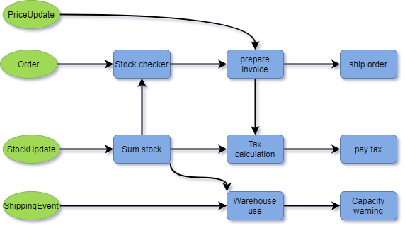

# Introduction

Fluxtion is a routing utility for use within a stream processing application, 
 connecting event streams to processing pipelines. Nodes on the pipeline perform
business functions.

### The what, when and how for stream processing

When building a stream processing application the developer has to answer three questions:

| Question | Answer |
| :--- | :--- |
| **WHAT**  requires processing? | Event streams are the input source to the application  |
| **WHEN** does the processing take place? | Bespoke dispatch logic that connects events to functions |
| **HOW**  does the input need processing? | Custom written logic or library functions |

Fluxtion is the automatic generation of the **WHEN** logic in a streaming application. 
Looking at the example diagram below Fluxtion acts as the arrows connecting components:

When a specific event is received only connected components are executed and always 
in the [correct predictable order](https://www.geeksforgeeks.org/topological-sorting/). 
The generated dispatcher is a highly optimized graph processing engine for embedding in the host application.

### Why is this useful

Projects and components exist that help developers answer the what and the how 
questions in a streaming application. Kafka for example supplies a reliable event stream, 
this is **what** we process. Many utilities exist for re-use to meet application calculation 
requirements, this is **how** we process. 

Fluxtion is the missing piece in the puzzle. As an application develops over time 
the way we connect components changes and evolves requiring constant re-working. 
Manually coded dispatch logic become more fragile and increasingly complex. 
This leads to many bugs and time consuming maintenance, Fluxtion static analysis 
algorithms remove these time and money drains from the development cycle. Dispatch 
logic or **when** to connect components is generated automatically.  

### Birdseye technical view

Fluxtion is a java utility that generates complex dispatch logic. Conceptually Fluxtion 
operates like a hybrid of java streams, RX java and google guava event bus. 
Each incoming event requires a unique execution path, those paths may combine for 
different events and each path is reactive.  The generated dispatcher is a bespoke 
graph processing engines specifically tailored for the application.
