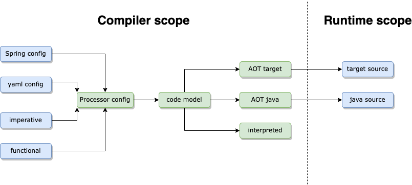

# Generating an event processor
{: .no_toc }

The Fluxtion compiler library provides several tools for generating an event processor from a model supplied by the client.
This section documents the utilities and tools available for event processor generation and how to use them. 
The binding of nodes to the event processor is covered in [binding user classes](binding_user_classes)

The [Fluxtion]({{site.Fluxtion_link}}) class gives static access to the generation methods.

## Generating modes

To complete building an event processor the code model and a generation mode is passed to the compiler. The final event
processor binds in all user classes combined with pre-calculated event dispatch to meet the dispatch rules.

Supported generation modes

- **Interpreted** In memory execution of an event processor
- **In memory compilation** In memory execution of compiled event processor
- **Ahead of time compilation** Ahead of time generation of compiled event processor, execute in another process

Regardless of which generation mode is used the generated event processor will behave the same with respect to the
dispatch rules.

## Generation modes comparison

| Mode                      | Required libraries   | Advantage                                  | Disadvantages                     | Use case |
|---------------------------|----------------------|--------------------------------------------|-----------------------------------|----------|
| Interpreted               | compiler runtime | Supports 1000's nodes Quick to develop | {{page.interpreted_disadvantage}} |          |
| In memory compilation     | compiler runtime | {{page.compile_advantage}}                 | {{page.compile_disadvantage}}     |          |
| Ahead of time compilation | runtime              | {{page.aot_advantage}}                     | Limit on generated code size      |          |

# Interpreted
The interpreted mode implements the event processor with a map based dispatch. Generation and execution all happen in the
same process so both the runtime and compiler Fluxtion libraries are required at runtime. 

[Fluxtion.interpret]({{site.Fluxtion_link}}) methods are the entry point to generating an interpreted version of the 
event processor. 

A user can either supply a varargs list of objects to include in the final event processor, or configure a supplied [EventProcessorConfig]({{site.EventProcessorConfig_link}})
and imperatively add nodes. See the interpreted section of [binding user classes](binding_user_classes) document for
a description of binding functions into an event processor.

# Compiling
The compiling mode generates a source file that represents the event processor, ready for compilation and use within an
application. The source generation and compilation process can happen either in process or as part of the build stage. If
the source generation happens as part of the build process the event processor is classed as ahead of time (AOT).

The generate source file is a serialised state of the event processor and all the instances it manages. This places stricter
requirements on the nodes bound to the event processor than running in interpreted mode. Bound user classes are declared as fields
in the generated event processor. The fields of a bound class will be serialized as well.

Rules for serializing bound classes

- Bound class must have a public constructor or constructors, either:
  - A zero argument constructor
  - For complex construction add a custom serializer with [`EventProcessorConfig.addClassSerialize`]({{site.EventProcessorConfig_link}})
- Final non-transient fields must be assigned in the constructor
- A constructor must exist that matches the final non-transient fields as arguments
- Transient fields are not serialised 
- Rules for serializing fields of bound classes
  - Only non-transient fields are serialized
  - All standard types are supported
  - Java bean properties are serialized using setter
  - Public fields are serialized 

## To be documented

- AOT building
- Interpreted
- Programmatic api
- Spring support
- Yaml support
- Maven plugin
- Serialising AOT
    - final/transient
    - constructor
    - getter/setter
    - public
    - collection support
    - Default serialisers
    - Custom serialisers
    - New instance

