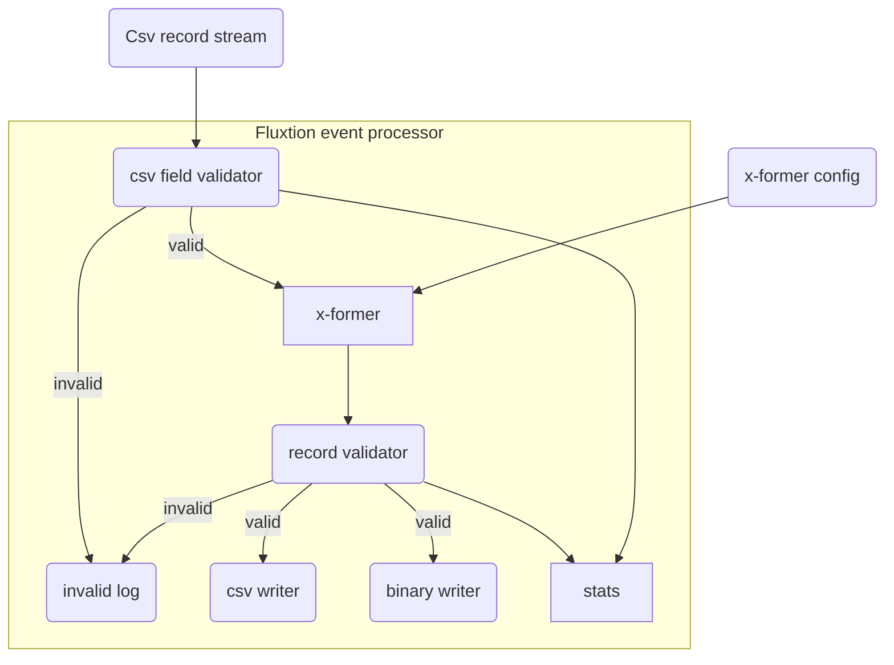

https://github.com/v12technology/fluxtion-examples/tree/main/cookbook/src/main/java/com/fluxtion/example/cookbook/dataingestion

## Introduction

This example demonstrates real-time data ingestion using the Fluxtion event processing framework. The requirements for
the processing are:

- Subscribe to a stream of string data csv records
- Process each string and validate it is a valid CSV record
  - log invalid input records
- For valid records
  - Transform each record with a user supplied function
  - Validate the transformed record
    - log invalid input records
  - write valid records to CSV
  - write valid records to a binary format
- Record realtime statistic of processing that can be queried
  - count of all records
  - count of invalid csv records
  - count of failed validation records
  - 
- 

## Process flow diagram

## Solution design

## API

## User functions

## Pipeline building

## Testing

## Running

## Code example

[See the example here]({{page.example_src}}/dataingestion)

[Pipe line builder]({{page.example_src}}/dataingestion/PipelineBuilder.java)





### Running the example prints this to console:




