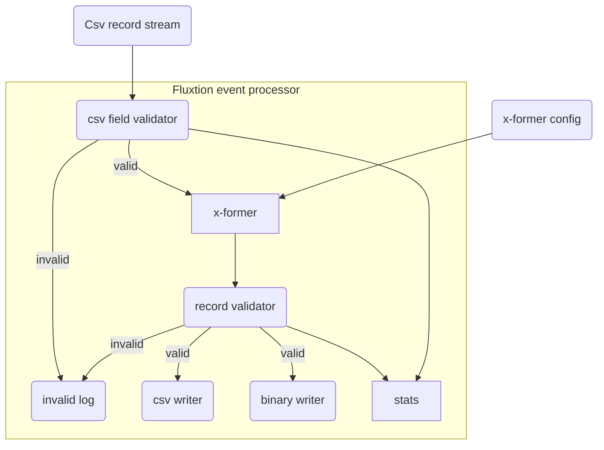

## Introduction

This example demonstrates real-time data ingestion using the Fluxtion event processing framework.

- Stream of string data csv records
- Process each record from CSV to a java object
- Perform basic field validation
  - log invalid input records
- For valid records
  - Transform each record with lookups + calculations
  - Validate the transformed record
  - write valid records to CSV
  - write valid records to a binary format
- Record realtime statistic of processing that can be queried

## Process flow diagram

## Code example

[See the example here]({{page.example_src}}/dataingestion)

[Pipe line builder]({{page.example_src}}/dataingestion/DataIngestionPipelineBuilder.java)





### Running the example prints this to console:




