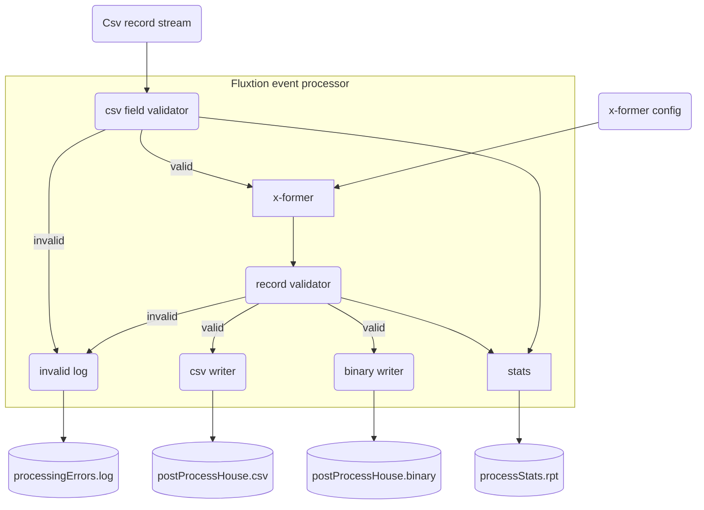

# Work in progress
**TO BE COMPLETED**

# Realtime data ingestion example
---

This example demonstrates real-time data ingestion using the Fluxtion event processing framework. The requirements for
the processing are:

- Use kaggle's Ames housing csv data set, process each row as a single event
- Subscribe to a stream of string events from the data set
- Process each string event and tests it is a valid CSV record
  - log invalid input records
- For valid records
  - Transform each record with a user supplied function
  - Validate the transformed record
    - log invalid input records
  - write valid records to CSV
  - write valid records to a binary format
- Record processing statistics in realtime that can be queried
  - count of all records
  - count of invalid csv records
  - count of failed validation records

## Example project
A maven project is [here]({{page.example_src}}/dataingestion) that processes kaggle's Ames housing csv data set

## Process flow diagram


## Solution design
This example using the Fluxtion DataFlow api to manage event subscription and notification to user supplied functions.

The actual processing logic is encapsulated in user classes and functions. The goal is to have no Fluxtion api calls
in the business logic only pure vanilla java. The advantages of this approach:


* Business logic components are re-usable and testable
* Business code is not tied to a library api
* There is a clear separation between event notification and business logic
* The aot generated source file DataIngestionPipeline simplifies debugging

## Pipeline building
The [PipelineBuilder]({{page.example_src}}/dataingestion/PipelineBuilder.java) builds the processing pipeline with the 
behaviour:

* **Valid records**
  * Subscribes to String events
  * Tries to marshal the String from csv into a HouseRecord 
  * Transforms the HouseRecord by applying a user transform function
  * Validates the transformed HouseRecord is valid with a user supplied java.util.function.Predicate
  * Writes the valid HouseRecord to a user supplied java.io.Writer as CSV
  * Writes the valid HouseRecord to a user supplied java.io.OutputStream in a binary format
  * Processing stats are updated with each valid transformed HouseRecord
* **Errors/invalid records**
  * Add an entry in the invalid log that writes to a user supplied java.io.Writer
  * Processing stats are updated with each csv errors
  * Processing stats are updated with each HouseRecord validation failures

The data PipelineBuilder is invoked by the Fluxtion maven plugin to generate the pipeline AOT as part of the build.

### PipelineBuilder 

```java
public class PipelineBuilder implements FluxtionGraphBuilder {

    @Override
    public void buildGraph(EventProcessorConfig eventProcessorConfig) {

        //flow: Csv String -> HouseInputRecord
        var csv2HouseRecordFlow = DataFlow
                .subscribe(String.class)
                .map(new CsvToHouseRecordSerializer()::marshall);

        //flow: HouseInputRecord -> x_formed(HouseInputRecord) -> validated(HouseInputRecord)
        var validTransformedFlow = csv2HouseRecordFlow
                .map(CsvToHouseRecordSerializer::getHouseRecord)
                .map(new HouseRecordTransformer()::transform)
                .map(new HouseRecordValidator()::validate);

        //outputs
        var csvWriter = new PostProcessCsvWriter();
        var binaryWriter = new PostProcessBinaryWriter();
        var stats = new ProcessingStats();
        var invalidLog = new InvalidLogWriter();

        //write validated output push to [stats, csv, binary]
        validTransformedFlow
                .map(HouseRecordValidator::getValidHouseRecord)
                .push(stats::validHouseRecord, csvWriter::validHouseRecord, binaryWriter::validHouseRecord);

        //invalid csv parsing output push to [invalid log, stats]
        csv2HouseRecordFlow
                .filter(CsvToHouseRecordSerializer::isBadCsvMessage)
                .push(invalidLog::badCsvRecord, stats::badCsvRecord);

        //invalid transform output push to [invalid log, stats]
        validTransformedFlow
                .filter(HouseRecordValidator::isInValidRecord)
                .push(invalidLog::invalidHouseRecord, stats::invalidHouseRecord);
    }

    @Override
    public void configureGeneration(FluxtionCompilerConfig compilerConfig) {
        compilerConfig.setClassName("DataIngestionPipeline");
        compilerConfig.setPackageName("com.fluxtion.example.cookbook.dataingestion.pipeline");
    }
}
```

## User functions

User functions are bound into the event processor and perform the actual business processing. The dsl binds a function 
into the graph, all state management and event dispatch is handled by the event processor. Developers can concentrate on
writing business logic confident that all dispatch will be automatically generated.

There are a several user functions for handling and processing data in the pipeline. All the functions are simple java
POJO's, an export service annotation allows a function to receive a config callback from the outside world.

* **CsvToHouseRecordSerializer** - converts csv string to a HouseRecord pojo
* **HouseRecordTransformer** - applies a custom transformer to a HouseRecord. The transformer is supplied at runtime and is dynamic
* **HouseRecordValidator** - applies a custom validator to a HouseRecord. The validator is supplied at runtime and is dynamic
* **InvalidLogWriter** - writes error log to a custom writer. The writer is supplied at runtime and is dynamic
* **PostProcessBinaryWriter** - writes binary output of valid records to a custom writer. The writer is supplied at runtime and is dynamic
* **PostProcessCsvWriter** - writes csv output of valid records to a custom writer. The writer is supplied at runtime and is dynamic
* **ProcessingStats** - writes processing stats report to a custom writer. The writer is supplied at runtime and is dynamic

A sample user function is shown below, all the user functions are [in this package]({{page.example_src}}/dataingestion/function)

```java
public class InvalidLogWriter
        implements
        DataIngestLifecycle,
        @ExportService(propagate = false) DataIngestComponent {

    private Writer logWriter;

    @Override
    public void init() {
        logWriter = NullWriter.NULL_WRITER;
    }

    @Override
    public boolean configUpdate(DataIngestConfig config) {
        logWriter = config.getInvalidLogWriter() == null ? NullWriter.NULL_WRITER : config.getInvalidLogWriter();
        return false;
    }

    @SneakyThrows
    public void badCsvRecord(CsvToHouseRecordSerializer message) {
        String inputString = message.getInputString().substring(0, message.getInputString().length() - 1);
        logWriter.append("csv error " + message.getProcessingException().getMessage() + " msg[" + inputString + "]\n");
    }

    @SneakyThrows
    public void invalidHouseRecord(HouseRecordValidator message) {
        logWriter.append("validation error record[" + message.getInValidHouseRecord() + "]\n");
    }

    @Override
    @SneakyThrows
    public void tearDown() {
        logWriter.flush();
    }
}
```

## API
**TO BE COMPLETED**

## Testing
**TO BE COMPLETED**

## Running
The main method uses the executes a DataIngestionPipeline with data from kaggle's AmesHousing.csv data file.

Dynamic configuration is supplied in an instance of DataIngestConfig for:

* HouseRecord validation java.util.function.Predicate
* HouseRecord validation transformer as java.util.function.UnaryOperator
* Post process Csv output - java.io.Writer
* Post process binary output - ava.io.OutputStream
* Statistics output - java.io.Writer
* Invalid log output - java.io.Writer

### Executing the pipeline  



public class Main {

    public static void main(String[] args) throws IOException {
        //set up pipeline
        var dataIngest = new DataIngestionPipeline();
        //lifecycle call to init pipeline, user components that implement DataIngestLifecycle receive init callback
        dataIngest.init();

        //get the exported DataIngestComponent service, used to set configuration as an api call
        DataIngestComponent dataIngestComponent = dataIngest.getExportedService();

        //set up a config for pipeline - can be changed dynamically during the run
        Path dataPath = Path.of("data/dataingest/");
        Path dataOutPath = Path.of("data/dataingest/output/");
        Files.createDirectories(dataOutPath);
        DataIngestConfig dataIngestConfig = DataIngestConfig.builder()
                .houseRecordValidator(houseRecord -> houseRecord.MS_Zoning().equalsIgnoreCase("FV"))
                .houseTransformer(Main::tansformInputHouseRecord)
                .csvWriter(Files.newBufferedWriter(dataOutPath.resolve("postProcessHouse.csv")))
                .binaryWriter(new BufferedOutputStream(Files.newOutputStream(dataOutPath.resolve("postProcessHouse.binary"))))
                .statsWriter(Files.newBufferedWriter(dataOutPath.resolve("processStats.rpt")))
                .invalidLogWriter(Files.newBufferedWriter(dataOutPath.resolve("processingErrors.log")))
                .build();

        //update the config for the pipeline
        dataIngestComponent.configUpdate(dataIngestConfig);

        //send some data as individual events
        try (Stream<String> reader = Files.lines(dataPath.resolve("input/AmesHousing.csv"))) {
            reader.forEach(dataIngest::onEvent);
        }

        //lifecycle call to close pipeline, user components that implement DataIngestLifecycle are receive tearDown callback
        dataIngest.tearDown();
    }

    //User supplied function to transform a HouseRecord for post process output
    public static HouseRecord tansformInputHouseRecord(HouseRecord houseRecord) {
        int lotFrontage = houseRecord.Lot_Frontage();
        houseRecord.Lot_Frontage_Squared(lotFrontage * lotFrontage);

        switch (houseRecord.MS_Zoning()) {
            case "A" -> houseRecord.ms_zone_category(1);
            case "FV" -> houseRecord.ms_zone_category(2);
            case "RL" -> houseRecord.ms_zone_category(3);
            case "RM" -> houseRecord.ms_zone_category(4);
            default -> houseRecord.ms_zone_category(-1);
        }
        return houseRecord;
    }
}



### Example output
A set of files are produced in the data output directory after the main has finished and the ProcessingStats are printed 
to console


ProcessingStats:
startTime          : 2024-04-21 07:06:52
endTime            : 2024-04-21 07:06:53
badCsvCount        :                   1
invalidHouseRecord :                 139
validHouseRecord   :                2790
inputMessageCount  :                2930
--------------------------------------------


cookbook % ls -l data/dataingest/output
-rw-r--r--  postProcessHouse.binary
-rw-r--r--  postProcessHouse.csv
-rw-r--r--  processStats.rpt
-rw-r--r--  processingErrors.log


### Output file contents

* postProcessHouse.csv - Validated and transformed HouseRecord's as a CSV file
* postProcessHouse.binary - Validated and transformed HouseRecord's as a binary encoded file
* processStats.rpt - Processing stats record
* processingErrors.log - Csv and validation error log
