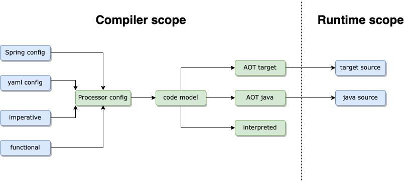

# Introduction

Fluxtion is a DI container that combines dependency injection with event dispatch for realtime data processing.
The Fluxtion container can be thought of as a spreadsheet on steroids, each bean is like a formula cell, if any input
to the formula changes the spreadsheet forces a recalculation. As the container receives an event Fluxtion evaluates
which beans are connected to the handler and only triggers the connected beans for recalculation.

Following the spreadsheet analogy, the programmer provides the formula cells and immediate dependencies. The spreadsheet
calculates the global set of dependencies and manages the recalculation of formulas when any cell is updated. Delegating
the mechanical but difficult task of calculating global dependencies to an algorithm allows us to build spreadsheets
that are complex but very predictable. Enabling non programmers to solve computational problems that would be out of
their reach without the support of the spreadsheet engine.

Fluxtion brings this spreadsheet like paradigm and efficiency benefits to the realtime processing world. Methods on
beans are the formula cells, references between beans are the formula dependencies. The Fluxtion dependency analyser
uses the dependency information to calculate the global set of dependencies. When any bean is updated from an external
event dependent recalculation methods are called.

With Fluxtion a single junior developer can build and maintain event driven logic that would have previously required a
team of specialist experienced developers
{: .info }

## Key terms

| Term                 | Description                                                                                                                                     |
|----------------------|-------------------------------------------------------------------------------------------------------------------------------------------------|
| Event                | An event is any valid java instance that is submitted to the event processor                                                                    |
| Stream               | A stream is a set of events                                                                                                                     |
| EventProcessor       | Processes the event stream with user defined logic. An EventProcessor instance is generated by Fluxtion                                         |
| DI container         | interchangeable term for EventProcessor                                                                                                         |
| Node                 | A pojo instance that is managed within an EventProcessor                                                                                        |
| Managed bean         | interchangeable term for node                                                                                                                   |
| Event propagation    | Invoking methods in a topological order on nodes within an EventProcessor                                                                       |
| Event handler method | A method on a node that is an entry point for processing an external event                                                                      |
| Trigger method       | A method on a node that is triggered once all parent nodes have completed their trigger methods                                                 |
| Event notification   | Trigger or event handler methods notify a change by returning a boolean flag to control event propagation                                       |
| Graph space          | Construction of the meta model occurs in graph space, before generating the EventProcessor and after the user has provided all node information |

Fluxtion can be classified as a combination of incremental computation and data flow programming.

# Event dispatch rules
Notification connections between beans are calculated at construction time using the same data that is used to add beans
to the DI container and annotations that mark recalculation methods.

When the proxy event handler method is called on the container it dispatches with the following with logic:

- Any top level event handler is invoked with the arguments provided
- The event handler method indicates whether child instances should be notified with a Boolean return type
- Any child reference defined in the DI structure is conditionally notified of the parent event handler completing
  processing
- A child instance can only be notified if all of its parents have finished processing their notifications
- The trigger method of the child returns a Boolean indicating whether the event notification should propagate
- The container recursively works through the child references and trigger methods in the container
- Dispatch callbacks are in strict topological order, with the event handler the root of the call tree
- Each instance is guaranteed to be invoked at maximum once per event processing cycle
- Any instances not connected to an executing root event handler will not be triggered in the cycle
- Connections can be either direct or through a reference chain

# Combining dependency injection and event processing

The introduction of dependency injection gave developers a consistent approach to linking application components.
Fluxtion extends dependency injection to support container managed event driven beans. Extending a familiar development
pattern has the following benefits:
- Shallow learning curve for developers to use Fluxtion effectively
- Consistent programming model for event driven logic increases developer productivity
- Re-use of industrial quality and predictable event dispatch model

{: .info }
Fluxtion combines dependency injection and event dispatch increasing developer productivity
{: .fs-4 }

## Dependency injection container

Fluxtion builds a dependency injection container from configuration information given by the programmer. Functions
supported by the container include: creating instances, injecting references between beans, setting properties, calling
lifecycle methods, factory methods, singleton injection, named references, constructor and setter injection.
Configuration data can be programmatic, spring xml config, yaml or custom data format.

There are three options for building a container:

- **Interpreted** - built and run in process, uses dynamic dispatch can handle millions of nodes
- **Compiled** - static analysis, code generated and compiled in process. handles thousands of nodes
- **Compiled AOT** - code generated at build time, zero cost start time when deployed

Fluxtion DI containers are very lightweight and designed to be run within an application. Multiple containers can be
used within a single application each container providing specialised business processing logic.

## Automatic event dispatch

The container exposes event consumer end-points, routing events as methods calls to beans within the container
via an internal dispatcher. The internal dispatcher propagates event notification through the object graph.

Fluxtion leverages the familiar dependency injection workflow for constructing the object graph. Annotated
event handler and trigger methods are dispatch targets. When building a container Fluxtion uses the annotations to
calculate the dispatch call trees for the internal dispatcher. A bean can export multiple service interfaces or just a
single method. For exported interfaces the container generates proxies that routes calls from the proxy handler methods
to the container's dispatcher.

# Building and executing
There are two components provided by Fluxtion the developer uses to build event driven logic and then to execute it.

## Compiler
The compiler analyses the configuration information provided by the programmer and builds a dependency injection container
that houses all the user components or beans combined with pre-calculated event dispatch. Outputs from the compiler
are either
- In memory event processor running in an interpreted mode
- An event processor generated and compiled in process
- An event processor generated ahead of time and serialised to code

## Runtime
The runtime provides the dependency injection container with a core set of libraries required at runtime. An AOT generated
container only requires the runtime to function, no compiler libraries are required.

