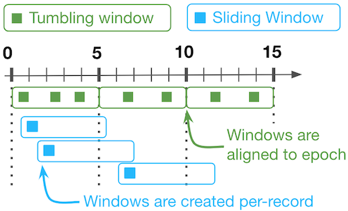

# Fluxtion DSL Deep dive
{: .no_toc }
---

The Fluxtion compiler supports functional construction of event processing logic, this allows developers to bind
functions into the processor without having to construct classes marked with Fluxtion annotations. The goal of using the
functional DSL is to have no Fluxtion api calls in the business logic only vanilla java.

This section describes the Functional DSL in greater depth than the [Fluxtion DSL](../mark-event-handling/functional_event_processing)
exploring concepts like, aggregation, windowing and groupBy in detail.

**Advantages of using Fluxtion functional DSL**

- Business logic components are re-usable and testable outside Fluxtion
- Clear separation between event notification and business logic, event logic is removed from business code
- Complex library functions like windowing and aggregation are well tested and natively supported
- Increased developer productivity, less code to write and support
- New functionality is simple and cheap to integrate, Fluxtion pays the cost of rewiring the event flow
- No vendor lock-in, business code is free from any Fluxtion library dependencies

<details open markdown="block">
  <summary>
    Table of contents
  </summary>
  {: .text-delta }
- TOC
{:toc}
</details>

# API overview
Fluxtion offers a DSL to bind functions into the event processor using the familiar map/filter/peek similar to the java
stream api. Bound functions are invoked in accordance to the [dispatch rules](../fluxtion-explored#event-dispatch-rules).

An event processor is a live structure where new events trigger a set of dispatch operations. The node wrapping a function
supports both stateful and stateless functions, it is the user choice what type of function to bind.

## DataFlow
To bind a functional operation we first create a [DataFlow]({{site.fluxtion_src_compiler}}/builder/dataflow/DataFlow.java) 
in the event processor. A DataFlow triggers when the event processor starts a calculation cycle and there is a matching 
dispatch rule. In the imperative approach an event processor entry point is registered by [annotating a method](processing_events#handle-event-input) 
with `@OnEventHandler` or an interface exported with `@ExportService`.

The [DataFlow]({{site.fluxtion_src_compiler}}/builder/dataflow/DataFlow.java) class provides builder methods to create and bind flows in an event processor. There is no restriction 
on the number of data flows bound inside an event processor.

## Subscribe to event

To create a flow for String events, call  `DataFlow.subscribe(String.class)`, any call to processor.onEvent("myString") will be 
routed to this flow.


DataFlow.subscribe(String.class)


Once a flow has been created map, filter, groupBy, etc. functions can be applied as chained calls.


public static void main(String[] args) {
    var processor = Fluxtion.interpret(c ->
            DataFlow.subscribe(String.class)
                    .console("string in {}")
    );
    processor.init();

    processor.onEvent("AAA");
    processor.onEvent("BBB");
}


Running the example code above logs to console


string in AAA
string in BBB


## Map
A map operation takes the output from a parent node and then applies a function to it. If the return of the
function is null then the event notification no longer propagates down that path.


DataFlow.subscribe(String.class);
    .map(String::toLowerCase);


**Map supports**

- Stateless functions
- Stateful functions
- Primitive specialisation
- Method references
- Inline lambdas - **interpreted mode only support, AOT mode will not serialise the inline lambda**


public static void main(String[] args) {
    var processor = Fluxtion.interpret(c ->
            DataFlow.subscribe(String.class)
                    .map(String::toLowerCase)
                    .console("string mapped {}")
    );
    processor.init();

    processor.onEvent("AAA");
    processor.onEvent("BBB");
}


Running the example code above logs to console


string mapped aaa
string mapped bbb


## BiMap
Two data flows can be mapped with a bi map function. Both flows must have triggered at least once for the bimap function
to be invoked


public static void main(String[] args) {
    var processor = Fluxtion.interpret(c -> {
        var strings = DataFlow.subscribe(String.class);
        var ints = DataFlow.subscribe(Integer.class);
        DataFlow.mapBiFunction((a, b) -> Integer.parseInt(a) + b, strings, ints)
                .console("biMap ans: {}");
    });
    processor.init();

    processor.onEvent("500");
    processor.onEvent(55);
}


Running the example code above logs to console


biMap ans: 555


## Default value
A default value can be assigned to any flow. This can be useful when calculating a bi map function and one data flow
argument is optional


public static void main(String[] args) {
    var processor = Fluxtion.interpret(c -> {
        var strings = DataFlow.subscribe(String.class).defaultValue("99999944");
        var ints = DataFlow.subscribe(Integer.class);
        DataFlow.mapBiFunction((a, b) -> Integer.parseInt(a) + b, strings, ints)
                .console("biMap with default value ans: {}");
    });
    processor.init();

    processor.onEvent(55);
}


Running the example code above logs to console


biMap with default value ans: 99999999


## Filter
A filter predicate can be applied to a node to control event propagation, true continues the propagation and false swallows
the notification. If the predicate returns true then the input to the predicate is passed to the next operation in the
event processor.


DataFlow.subscribe(Integer.class)
    .filter(i -> i > 10)


**Filter supports**

- Stateless functions
- Stateful functions
- Primitive specialisation
- Method references
- Inline lambdas - **interpreted mode only support, AOT mode will not serialise the inline lambda**


public static void main(String[] args) {
    var processor = Fluxtion.interpret(c ->
            DataFlow.subscribe(Integer.class)
                    .filter(i -> i > 10)
                    .console("int {} > 10 ")
    );
    processor.init();

    processor.onEvent(1);
    processor.onEvent(17);
    processor.onEvent(4);
}


Running the example code above logs to console


int 17 > 10


## Reduce
There is no reduce function required in Fluxtion, stateful map functions perform the role of reduce. In a classic batch
environment the reduce operation combines a collection of items into a single value. In a streaming environment
the set of values is never complete, we can view the current value of a stateful map operation which is equivalent to the
reduce operation. The question is rather, when is the value of the stateful map published and reset.

## FlatMap

A Flatmap operation flattens a collection in a data flow. Any operations applied after the flatmap operation are 
performed on each element in the collection. 


public static void main(String[] args) {
    var processor = Fluxtion.interpret(c ->
            DataFlow.subscribe(String.class)
                    .console("\ncsv in [{}]")
                    .flatMap(s -> Arrays.asList(s.split(",")))
                    .console("flattened item [{}]"));
    processor.init();

    processor.onEvent("A,B,C");
    processor.onEvent("2,3,5,7,11");
}


Arrays can be flattened with:


`[data flow].flatMapFromArray(Function<T, R[]> iterableFunction)`


Running the example code above logs to console


csv in [A,B,C]
flattened item [A]
flattened item [B]
flattened item [C]

csv in [2,3,5,7,11]
flattened item [2]
flattened item [3]
flattened item [5]
flattened item [7]
flattened item [11]


## Merge flows
Flows can be merged to output a single flow that can be operated on


public static void main(String[] args) {
    var processor = Fluxtion.interpret(c ->
            DataFlow.merge(
                    subscribe(Long.class).console("long : {}"),
                    subscribe(String.class).console("string : {}").map(Mappers::parseLong),
                    subscribe(Integer.class).console("int : {}").map(Integer::longValue))
                    .console("MERGED FLOW -> {}")
    );
    processor.init();

    processor.onEvent(1234567890835L);
    processor.onEvent("9994567890835");
    processor.onEvent(123);
}


Running the example code above logs to console


long : 1234567890835
MERGED FLOW -> 1234567890835
string : 9994567890835
MERGED FLOW -> 9994567890835
int : 123
MERGED FLOW -> 123


## Merge and map flows

Merge multiple streams of different types into a single output, applying a mapping operation to combine the different types


public static void main(String[] args) {
    var processor = Fluxtion.interpret(c ->
            DataFlow.mergeMap(
                    MergeAndMapFlowBuilder.of(MyData::new)
                            .required(subscribe(String.class), MyData::setCustomer)
                            .required(subscribe(Date.class), MyData::setDate)
                            .required(subscribe(Integer.class), MyData::setId))
                    .console("new customer : {}")
    );
    processor.init();

    processor.onEvent(new Date());
    processor.onEvent("John Doe");
    processor.onEvent(123);
}

@Data
public static class MyData {
    private String customer;
    private Date date;
    private int id;
}


Running the example code above logs to console


new customer : MergeAndMapSample.MyData(customer=John Doe, date=Sat May 11 19:17:11 BST 2024, id=123)


## Sink

An application can register for output from the EventProcessor by supplying a consumer to addSink and removed with a 
call to removeSink. Bound classes can publish to sinks during an event process cycle, any registered sinks will see 
the update as soon as the data is published, not at the end of the cycle. 

* Adding sink - `processor.addSink("mySink", (Consumer<T> t) ->{})`
* Removing sink - `processor.removeSink("mySink")`




public static void main(String[] args) {
    var processor = Fluxtion.interpret(cfg ->
            DataFlow.subscribeToIntSignal("myIntSignal")
                    .mapToObj(d -> "intValue:" + d)
                    .sink("mySink")//CREATE A SINK IN THE PROCESSOR
    );
    processor.init();

    //ADDING A SINK
    processor.addSink("mySink", (Consumer<String>) System.out::println);

    processor.publishSignal("myIntSignal", 10);
    processor.publishSignal("myIntSignal", 256);

    //REMOVING A SINK
    processor.removeSink("mySink");
    processor.publishSignal("myIntSignal", 512);
}



Running the example code above logs to console


intValue:10
intValue:256


## DataFlow node lookup by id
DataFlow nodes are available for lookup from an event processor instance using their name. In this case the lookup 
returns a reference to the wrapped value and not the wrapping node. The application can then use the reference to 
pull data from the node without requiring an event process cycle to push data to an output.

When building the graph with DSL a call to `id` makes that element addressable for lookup.



public class GetFlowNodeByIdExample {
    public static void main(String[] args) throws NoSuchFieldException {
        var processor = Fluxtion.interpret(c ->{
            DataFlow.subscribe(String.class)
                    .filter(s -> s.equalsIgnoreCase("monday"))
                    //ID START - this makes the wrapped value accessible via the id
                    .mapToInt(Mappers.count()).id("MondayChecker")
                    //ID END
                    .console("Monday is triggered");
        });
        processor.init();

        processor.onEvent("Monday");
        processor.onEvent("Tuesday");
        processor.onEvent("Wednesday");

        //ACCESS THE WRAPPED VALUE BY ITS ID
        Integer mondayCheckerCount = processor.getStreamed("MondayChecker");
        System.out.println("Monday count:" + mondayCheckerCount + "\n");

        //ACCESS THE WRAPPED VALUE BY ITS ID
        processor.onEvent("Monday");
        mondayCheckerCount = processor.getStreamed("MondayChecker");
        System.out.println("Monday count:" + mondayCheckerCount);
    }
}



Running the example code above logs to console


Monday is triggered
Monday count:1

Monday is triggered
Monday count:2


## Graph of functions
Fluxtion automatically wraps the function in a node, actually a monad, and binds both into the event processor. The wrapping node
handles all the event notifications, invoking the user function when it is triggered. Each wrapping node can be the
head of multiple child flows forming complex graph structures that obey the dispatch rules. This is in contrast to
classic java streams that have a terminal operation and a pipeline structure.

This example creates a simple graph structure, multiple stateful/stateless functions are bound to a single parent DataFlow.

We are using the `DataFlow.console` operation to print intermediate results to the screen for illustrative purposese. 
The console operation is a specialisation of `DataFlow.peek`.


//STATEFUL FUNCTIONS
MyFunctions myFunctions = new MyFunctions();
SimpleMath simpleMath = new SimpleMath();

//BUILD THE GRAPH WITH DSL
var stringFlow = DataFlow.subscribe(String.class).console("\ninput: '{}'");

var charCount = stringFlow.map(myFunctions::totalCharCount)
    .console("charCount: {}");

var upperCharCount = stringFlow.map(myFunctions::totalUpperCaseCharCount)
    .console("upperCharCount: {}");

DataFlow.mapBiFunction(simpleMath::updatePercentage, upperCharCount, charCount)
    .console("percentage chars upperCase all words:{}");

//STATELESS FUNCTION
DataFlow.mapBiFunction(MyFunctions::wordUpperCasePercentage, upperCharCount, charCount)
    .console("percentage chars upperCase this word:{}");


Running the above with a strings **'test ME', 'and AGAIN'** outputs


input: 'test ME'
charCount: 7
upperCharCount: 2
percentage chars upperCase all words:0.2857142857142857
percentage chars upperCase this word:0.2857142857142857

input: 'and AGAIN'
charCount: 16
upperCharCount: 7
percentage chars upperCase all words:0.391304347826087
percentage chars upperCase this word:0.4375


### Processing graph
{: .no_toc }
Fluxtion DSL only requires the developer to write functions, any wrapping nodes are automatically added to the event processor.
The compiler automatically selects stateful or stateless map functions, binding user instances if a stateful map 
function is specified.

```mermaid
flowchart TB

    {{site.mermaid_eventHandler}}
    {{site.mermaid_graphNode}}
    {{site.mermaid_exportedService}}
    {{site.mermaid_eventProcessor}}
    
    EventA><b>InputEvent</b>::String]:::eventHandler 

    HandlerA[<b>Subscriber</b>::String\nid - stringFlow]:::graphNode
    
    MapData1[<b>Map - stateful</b>\nid - charCount\nmyFunctions::totalCharCount]:::graphNode 
    MapData2[<b>Map - stateful</b>\nid - upperCharCount\nmyFunctions::totalUpperCaseCharCount]:::graphNode
    
    BiMapSum[<b>BiMap - stateful</b>\nsimpleMath::updatePercentage]:::graphNode 
    BiMapSum2[<b>BiMap - stateless</b>\nMyFunctions::wordUpperCasePercentage]:::graphNode
    
    EventA --> HandlerA

    
    subgraph EventProcessor
      myFunctions[<b>User object::MyFunctions</b>\nid - myFunctions]  --- MapData1 & MapData2
      simpleMath[<b>User object::SimpleMath</b>\nid - simpleMath] ----- BiMapSum
      HandlerA --> MapData1 & MapData2 ---> BiMapSum
      MapData1 & MapData2 ---> BiMapSum2
    end
    
```

MyFunctions class is a normal java class bound into the event processor.


@Getter
public class MyFunctions {

    private long totalCharCount;
    private long upperCaseCharCount;

    public static long charCount(String s) {
        return s.length();
    }

    public static long upperCaseCharCount(String s) {
        return s.chars().filter(Character::isUpperCase).count();
    }

    public long totalCharCount(String s) {
        totalCharCount += charCount(s);
        return totalCharCount;
    }

    public long totalUpperCaseCharCount(String s) {
        upperCaseCharCount += upperCaseCharCount(s);
        return upperCaseCharCount;
    }

    public static double wordUpperCasePercentage(long longA, long longB) {
        return (double) longA /longB;
    }

    @Getter
    public static class SimpleMath {
        private double a;
        private double b;
        private double percentage;

        public double updatePercentage(long longA, long longB) {
            a += longA;
            b += longB;
            percentage = a / b;
            return percentage;
        }
    }
}


## Node to DataFlow
A Dataflow can be created by subscribing to a node that has been imperatively added to the event processor. When the node 
triggers in a calculation cycle the DataFlow will be triggered. Create a DataFlow from a node with:

`DataFlow.subscribeToNode(new MyComplexNode())`

If the node referred to in the DataFlow.subscribeToNode method call is not in the event processor it will be bound
automatically.

The example below creates an instance of MyComplexNode as the head of a DataFlow. When a String event is received the
DataFlow path is executed. In this case we are aggregating into a list that has the four most recent elements



public class SubscribeToNodeSample {
    @Getter
    @ToString
    public static class MyComplexNode {
        private String in;

        @OnEventHandler
        public boolean stringUpdate(String in) {
            this.in = in;
            return true;
        }
    }
    
    public static void buildGraph(EventProcessorConfig processorConfig) {
        DataFlow.subscribeToNode(new MyComplexNode())
                .console("node triggered -> {}")
                .map(MyComplexNode::getIn)
                .aggregate(Collectors.listFactory(4))
                .console("last 4 elements:{}\n");
    }

    public static void main(String[] args) {
        var processor = Fluxtion.interpret(SubscribeToNodeSample::buildGraph);
        processor.init();

        processor.onEvent("A");
        processor.onEvent("B");
        processor.onEvent("C");
        processor.onEvent("D");
        processor.onEvent("E");
        processor.onEvent("F");
    }
}


Running the example code above logs to console

node triggered -> SubscribeToNodeSample.MyComplexNode(in=A)
last 4 elements:[A]

node triggered -> SubscribeToNodeSample.MyComplexNode(in=B)
last 4 elements:[A, B]

node triggered -> SubscribeToNodeSample.MyComplexNode(in=C)
last 4 elements:[A, B, C]

node triggered -> SubscribeToNodeSample.MyComplexNode(in=D)
last 4 elements:[A, B, C, D]

node triggered -> SubscribeToNodeSample.MyComplexNode(in=E)
last 4 elements:[B, C, D, E]

node triggered -> SubscribeToNodeSample.MyComplexNode(in=F)
last 4 elements:[C, D, E, F]


## Push to node
A data flow can push a value to any normal java class


public static void main(String[] args) {
    var processor = Fluxtion.interpret(c ->
            DataFlow.subscribe(String.class)
                    .push(new MyPushTarget()::updated)
    );
    processor.init();

    processor.onEvent("AAA");
    processor.onEvent("BBB");
}

public class MyPushTarget{
    public void updated(String in){
        System.out.println("received push: " + in);
    }
}


Running the example code above logs to console

received push: AAA
received push: BBB


## Re-entrant events

Events can be added for processing from inside the graph for processing in the next available cycle. Internal events
are added to LIFO queue for processing in the correct order. The EventProcessor instance maintains the LIFO queue, any
new input events are queued if there is processing currently acting. Support for internal event publishing is built
into the streaming api.

Maps an int signal to a String and republishes to the graph

public static class MyNode {
    @OnEventHandler
    public boolean handleStringEvent(String stringToProcess) {
        System.out.println("received [" + stringToProcess +"]");
        return true;
    }
}

public static void main(String[] args) {
    var processor = Fluxtion.interpret(cfg -> {
        DataFlow.subscribeToIntSignal("myIntSignal")
            .mapToObj(d -> "intValue:" + d)
            .console("republish re-entrant [{}]")
            .processAsNewGraphEvent();
        cfg.addNode(new MyNode());
    });

    processor.init();
    processor.publishSignal("myIntSignal", 256);
}


Output

republish re-entrant [intValue:256]
received [intValue:256]


# Trigger control
Fluxtion offers a way to override the triggering of a flow node in the event processor. There are four trigger controls
available for client code to customise:

* **Flow.publishTrigger** - Notifies a child node when triggered, adds a notification to the normal publish
* **Flow.publishTriggerOverride** - Notifies a child node when triggered, removes all other publish notifications
* **Flow.updateTrigger** - Overrides when the flow node runs its functional operation
* **Flow.resetTrigger** - If the functional operation is stateful calls the reset function

In the trigger examples we are using the `DataFlow.subscribeToSignal` and `processor.publishSignal` to drive the trigger
controls on the flow node.

## PublishTrigger
In this example the publishTrigger control enables multiple publish calls for the flow node. Child notifications are in 
addition to the normal triggering operation of the flow node. The values in the parent node are unchanged when publishing.

`publishTrigger(DataFlow.subscribeToSignal("publishMe"))`

Child DataFlow nodes are notified when publishTrigger fires or the map function executes in a calculation cycle.


public class TriggerPublishSample {
    public static void buildGraph(EventProcessorConfig processorConfig) {
        DataFlow.subscribeToNode(new SubscribeToNodeSample.MyComplexNode())
                .console("node triggered -> {}")
                .map(SubscribeToNodeSample.MyComplexNode::getIn)
                .aggregate(Collectors.listFactory(4))
                .publishTrigger(DataFlow.subscribeToSignal("publishMe"))
                .console("last 4 elements:{}");
    }

    public static void main(String[] args) {
        var processor = Fluxtion.interpret(TriggerPublishSample::buildGraph);
        processor.init();

        processor.onEvent("A");
        processor.onEvent("B");
        processor.onEvent("C");
        processor.onEvent("D");
        processor.onEvent("E");
        processor.onEvent("F");

        processor.publishSignal("publishMe");
        processor.publishSignal("publishMe");
        processor.publishSignal("publishMe");
    }
}


Running the example code above logs to console

node triggered -> SubscribeToNodeSample.MyComplexNode(in=A)
last 4 elements:[A]
node triggered -> SubscribeToNodeSample.MyComplexNode(in=B)
last 4 elements:[A, B]
node triggered -> SubscribeToNodeSample.MyComplexNode(in=C)
last 4 elements:[A, B, C]
node triggered -> SubscribeToNodeSample.MyComplexNode(in=D)
last 4 elements:[A, B, C, D]
node triggered -> SubscribeToNodeSample.MyComplexNode(in=E)
last 4 elements:[B, C, D, E]
node triggered -> SubscribeToNodeSample.MyComplexNode(in=F)
last 4 elements:[C, D, E, F]
last 4 elements:[C, D, E, F]
last 4 elements:[C, D, E, F]
last 4 elements:[C, D, E, F]



## PublishTriggerOverride
In this example the publishTrigger control overrides the normal triggering operation of the flow node. The child is notified
only when publishTriggerOverride fires, changes due to recalculation are swallowed and not published downstream.
The values in the parent node are unchanged when publishing.

`publishTriggerOverride(DataFlow.subscribeToSignal("publishMe"))`

Child DataFlow nodes are notified when publishTriggerOverride fires.


public class TriggerPublishOverrideSample {
    public static void buildGraph(EventProcessorConfig processorConfig) {
        DataFlow.subscribeToNode(new SubscribeToNodeSample.MyComplexNode())
                .console("node triggered -> {}")
                .map(SubscribeToNodeSample.MyComplexNode::getIn)
                .aggregate(Collectors.listFactory(4))
                .publishTriggerOverride(DataFlow.subscribeToSignal("publishMe"))
                .console("last 4 elements:{}\n");
    }

    public static void main(String[] args) {
        var processor = Fluxtion.interpret(TriggerPublishOverrideSample::buildGraph);
        processor.init();

        processor.onEvent("A");
        processor.onEvent("B");
        processor.onEvent("C");
        processor.onEvent("D");

        processor.publishSignal("publishMe");
        processor.onEvent("E");
        processor.onEvent("F");
        processor.onEvent("G");
        processor.onEvent("H");

        processor.publishSignal("publishMe");
    }
}


Running the example code above logs to console


node triggered -> SubscribeToNodeSample.MyComplexNode(in=A)
node triggered -> SubscribeToNodeSample.MyComplexNode(in=B)
node triggered -> SubscribeToNodeSample.MyComplexNode(in=C)
node triggered -> SubscribeToNodeSample.MyComplexNode(in=D)
last 4 elements:[A, B, C, D]

node triggered -> SubscribeToNodeSample.MyComplexNode(in=E)
node triggered -> SubscribeToNodeSample.MyComplexNode(in=F)
node triggered -> SubscribeToNodeSample.MyComplexNode(in=G)
node triggered -> SubscribeToNodeSample.MyComplexNode(in=H)
last 4 elements:[E, F, G, H]


## UpdateTrigger
In this example the updateTrigger controls when the functional mapping operation of the flow node is invoked. The values 
are only aggregated when the update trigger is called. Notifications from the parent node are ignored and do not trigger
a mapping operation.

`updateTrigger(DataFlow.subscribeToSignal("updateMe"))`

A map operation only occurs when the update trigger fires. 


public class TriggerUpdateSample {
    public static void buildGraph(EventProcessorConfig processorConfig) {
        DataFlow.subscribeToNode(new SubscribeToNodeSample.MyComplexNode())
                .console("node triggered -> {}")
                .map(SubscribeToNodeSample.MyComplexNode::getIn)
                .aggregate(Collectors.listFactory(4))
                .updateTrigger(DataFlow.subscribeToSignal("updateMe"))
                .console("last 4 elements:{}\n");
    }

    public static void main(String[] args) {
        var processor = Fluxtion.interpret(TriggerUpdateSample::buildGraph);
        processor.init();

        processor.onEvent("A");
        processor.onEvent("B");
        processor.onEvent("C");
        processor.publishSignal("updateMe");

        processor.onEvent("D");
        processor.onEvent("E");
        processor.onEvent("F");
        processor.publishSignal("updateMe");
    }
}


Running the example code above logs to console


node triggered -> SubscribeToNodeSample.MyComplexNode(in=A)
node triggered -> SubscribeToNodeSample.MyComplexNode(in=B)
node triggered -> SubscribeToNodeSample.MyComplexNode(in=C)
last 4 elements:[C]

node triggered -> SubscribeToNodeSample.MyComplexNode(in=D)
node triggered -> SubscribeToNodeSample.MyComplexNode(in=E)
node triggered -> SubscribeToNodeSample.MyComplexNode(in=F)
last 4 elements:[C, F]


## ResetTrigger
In this example the resetTrigger controls when the functional mapping operation of the flow node is reset. The aggregate
operation is stateful so all the values in the list are removed when then reset trigger fires. The reset operation causes 
trigger a notification to children of the flow node.

`resetTrigger(DataFlow.subscribeToSignal("resetMe"))`

The reset trigger notifies the stateful function to clear its state.


public class TriggerResetSample {
    public static void buildGraph(EventProcessorConfig processorConfig) {
        DataFlow.subscribeToNode(new SubscribeToNodeSample.MyComplexNode())
                .console("node triggered -> {}")
                .map(SubscribeToNodeSample.MyComplexNode::getIn)
                .aggregate(Collectors.listFactory(4))
                .resetTrigger(DataFlow.subscribeToSignal("resetMe").console("\n--- resetTrigger ---"))
                .console("last 4 elements:{}");
    }

    public static void main(String[] args) {
        var processor = Fluxtion.interpret(TriggerResetSample::buildGraph);
        processor.init();

        processor.onEvent("A");
        processor.onEvent("B");
        processor.onEvent("C");
        processor.onEvent("D");

        processor.publishSignal("resetMe");
        processor.onEvent("E");
        processor.onEvent("F");
    }
}


Running the example code above logs to console


node triggered -> SubscribeToNodeSample.MyComplexNode(in=A)
last 4 elements:[A]
node triggered -> SubscribeToNodeSample.MyComplexNode(in=B)
last 4 elements:[A, B]
node triggered -> SubscribeToNodeSample.MyComplexNode(in=C)
last 4 elements:[A, B, C]
node triggered -> SubscribeToNodeSample.MyComplexNode(in=D)
last 4 elements:[A, B, C, D]

--- resetTrigger ---
last 4 elements:[]
node triggered -> SubscribeToNodeSample.MyComplexNode(in=E)
last 4 elements:[E]
node triggered -> SubscribeToNodeSample.MyComplexNode(in=F)
last 4 elements:[E, F]


## Stateful function reset
Stateful functions can be reset by implementing the [Stateful]({{site.fluxtion_src_runtime}}/dataflow/Stateful.java) interface with a reset 
method. Configuring the resetTrigger will automatically route calls to the reset method of the stateful function.



public class ResetFunctionSample {
    public static class MyResetSum implements Stateful<Integer> {
        public int count = 0;

        public int increment(Object o){
            return ++count;
        }

        @Override
        public Integer reset() {
            System.out.println("--- RESET CALLED ---");
            count = 0;
            return count;
        }
    }

    public static void buildGraph(EventProcessorConfig processorConfig) {
        DataFlow.subscribe(String.class)
                .map(new MyResetSum()::increment)
                .resetTrigger(DataFlow.subscribeToSignal("resetMe"))
                .console("count:{}");
    }

    public static void main(String[] args) {
        var processor = Fluxtion.interpret(ResetFunctionSample::buildGraph);
        processor.init();

        processor.onEvent("A");
        processor.onEvent("B");
        processor.onEvent("C");
        processor.onEvent("D");

        processor.publishSignal("resetMe");
        processor.onEvent("E");
        processor.onEvent("F");
    }
}


Running the example code above logs to console


count:1
count:2
count:3
count:4
--- RESET CALLED ---
count:0
count:1
count:2



# Aggregating
Aggregating extends the concept of stateful map functions by adding behaviour when using functions in stateful operations
like windowing and grouping. An aggregate function has these behaviours:

- Stateful - defines the reset method
- aggregate - aggregate a value and calculate a result
- combine/deduct - combine or deduct another instance of this function, used when windowing
- deduct supported - can this instance deduct another instance of this function or is loop required to recalculate

Create an aggregate in a DataFlow with the call:

`DataFlow.aggregate(Supplier<AggregateFlowFunction> aggregateSupplier)` 

DataFlow.aggregate takes a Supplier of [AggregateFlowFunction]({{site.fluxtion_src_runtime}}/dataflow/aggregate/AggregateFlowFunction.java)'s not a 
single AggregateFlowFunction instance. When managing windowing and groupBy operations the event processor creates instances 
of AggregateFlowFunction to partition function state.


public class AggregateSample {
    public record ResetList() {}

    public static void buildGraph(EventProcessorConfig processorConfig) {
        var resetSignal = DataFlow.subscribe(ResetList.class).console("\n--- RESET ---");

        DataFlow.subscribe(String.class)
                .aggregate(Collectors.listFactory(3))
                .resetTrigger(resetSignal)
                .console("ROLLING list: {}");
    }

    public static void main(String[] args) {
        var processor = Fluxtion.interpret(AggregateSample::buildGraph);
        processor.init();
        processor.onEvent("A");
        processor.onEvent("B");
        processor.onEvent("C");
        processor.onEvent("D");
        processor.onEvent("E");

        processor.onEvent(new ResetList());
        processor.onEvent("P");
        processor.onEvent("Q");
        processor.onEvent("R");

        processor.onEvent(new ResetList());
        processor.onEvent("XX");
        processor.onEvent("YY");
    }
}


Running the example code above logs to console


ROLLING list: [A]
ROLLING list: [A, B]
ROLLING list: [A, B, C]
ROLLING list: [B, C, D]
ROLLING list: [C, D, E]

--- RESET ---
ROLLING list: []
ROLLING list: [P]
ROLLING list: [P, Q]
ROLLING list: [P, Q, R]

--- RESET ---
ROLLING list: []
ROLLING list: [XX]
ROLLING list: [XX, YY]


## Custom aggregate function
Users can create aggregate functions that plug into the reset trigger callbacks in a DataFlow. The steps to create a
user aggregate function:

- Extend [AggregateFlowFunction]({{site.fluxtion_src_runtime}}/dataflow/aggregate/AggregateFlowFunction.java), the type parameters define the input and output types of the function
- Implement the reset, get and aggregate methods
- Return null from the aggregate method to indicate no change to the aggregate output

The example below maintains a date range as a String and resets the range when reset trigger is fired. When the date range
is unaltered the aggregate operation returns a null and no notifications are triggered.


public class CustomAggregateFunctionSample {
    public static class DateRangeAggregate implements AggregateFlowFunction<LocalDate, String, DateRangeAggregate> {
        private LocalDate startDate;
        private LocalDate endDate;
        private String message;
        private final transient DateTimeFormatter formatter = DateTimeFormatter.ofPattern("yyyy-MM-dd");

        @Override
        public String reset() {
            System.out.println("--- RESET ---");
            startDate = null;
            endDate = null;
            message = null;
            return get();
        }

        @Override
        public String get() {
            return message;
        }

        @Override
        public String aggregate(LocalDate input) {
            startDate = startDate == null ? input : startDate;
            endDate = endDate == null ? input : endDate;
            if (input.isBefore(startDate)) {
                startDate = input;
            } else if (input.isAfter(endDate)) {
                endDate = input;
            } else {
                //RETURN NULL -> NO CHANGE NOTIFICATIONS FIRED
                return null;
            }
            message = formatter.format(startDate) + " - " + formatter.format(endDate);
            return message;
        }
    }

    public static void buildGraph(EventProcessorConfig processorConfig) {
        DataFlow.subscribe(LocalDate.class)
                .aggregate(DateRangeAggregate::new)
                .resetTrigger(DataFlow.subscribeToSignal("resetDateRange"))
                .console("UPDATED date range : '{}'");
    }

    public static void main(String[] args) {
        var processor = Fluxtion.interpret(CustomAggregateFunctionSample::buildGraph);
        processor.init();

        processor.onEvent(LocalDate.of(2019, 8, 10));
        processor.onEvent(LocalDate.of(2009, 6, 14));
        processor.onEvent(LocalDate.of(2024, 4, 22));
        processor.onEvent(LocalDate.of(2021, 3, 30));

        //reset
        processor.publishSignal("resetDateRange");
        processor.onEvent(LocalDate.of(2019, 8, 10));
        processor.onEvent(LocalDate.of(2021, 3, 30));
    }
}


Running the example code above logs to console


UPDATED date range : '2009-06-14 - 2019-08-10'
UPDATED date range : '2009-06-14 - 2024-04-22'
--- RESET ---
UPDATED date range : '2019-08-10 - 2021-03-30'


# Windowing
Fluxtion supports windowing operations in a DataFlow to aggregate data. There are four types of windows supported:

- Tumbling window with custom start/stop triggers
- Tumbling time based windows start/stop triggers fire on a timer
- Sliding time based windows bucket size is timer based, calculations fire on a timer
- Sliding windows bucket size is based on count calculations fire on a bucket count

Fluxtion does not run threads, it is an event driven data structure. On a calculation cycle the window monitors read 
the time of the clock and expire windows if necessary.

{: .info }
To advance time in an event processor send any event regularly, this causes the window expiry calculation to run
{: .fs-4 }

## Tumbling windows
{: .no_toc }

Imagine tumbling windows as distinct buckets collecting data for a fixed size window. Once a bucket fills up, it's closed and 
published downstream. A new, empty bucket is created to collect the next batch of data. Tumbling windows never overlap, 
ensuring all data points are processed exactly once. This is good for capturing complete snapshots of the data at regular intervals.

## Sliding windows
{: .no_toc }

Think of sliding window as a constantly moving window on the data stream. The window has a fixed size, but it advances 
by a set increment (called the slide). As the window slides forward, new data enters at the front, and old data falls 
out the back. Unlike tumbling windows, sliding windows can overlap significantly, with data points contributing to 
multiple windows. This is useful for capturing trends and changes happening over time. As each slide occurs downstream
nodes are triggered.

## Diagram comparing tumbling and sliding windows
{: .no_toc }

<br/>



## Tumbling time window

Fluxtion supports a tumbling time window for any DataFlow node with this call:

`tumblingAggregate(Supplier<AggregateFlowFunction> aggregateFunction, int bucketSizeMillis)`

The lifecycle of the AggregateFlowFunction is managed by the event processor, tracking the current time and firing 
notifications to child nodes when the timer expires. Reset calls to the stateful function are also handled by the event 
processor.

An automatically added [FixedRateTrigger]({{site.fluxtion_src_runtime}}/time/FixedRateTrigger.java) monitors the tumbling
window for expiry an event is received. If the window has expired, the following actions occur:

* The window aggregate is calculated and cached for inspection
* The aggregate function is reset
* Downstream nodes are triggered with the cached value

This example publishes a random Integer every 10 milliseconds, the int sum calculates the current sum for the window. 
Every 300 milliseconds the cumulative sum for the window just expired is logged to console.


public class TumblingWindowSample {

    public static void buildGraph(EventProcessorConfig processorConfig) {
        DataFlow.subscribe(Integer.class)
                .tumblingAggregate(Aggregates.intSumFactory(), 300)
                .console("current tumble sum:{} timeDelta:%dt");
    }

    public static void main(String[] args) throws InterruptedException {
        var processor = Fluxtion.interpret(TumblingWindowSample::buildGraph);
        processor.init();
        Random rand = new Random();

        try (ScheduledExecutorService executor = Executors.newSingleThreadScheduledExecutor()) {
            executor.scheduleAtFixedRate(
                    () -> processor.onEvent(rand.nextInt(100)),
                    10,10, TimeUnit.MILLISECONDS);
            Thread.sleep(4_000);
        }
    }
}


Running the example code above logs to console


current tumble sum:1679 timeDelta:305
current tumble sum:1398 timeDelta:604
current tumble sum:1404 timeDelta:904
current tumble sum:1518 timeDelta:1204
current tumble sum:1619 timeDelta:1504
current tumble sum:1282 timeDelta:1804
current tumble sum:1303 timeDelta:2103
current tumble sum:1285 timeDelta:2403
current tumble sum:1614 timeDelta:2704
current tumble sum:1167 timeDelta:3004
current tumble sum:1483 timeDelta:3304
current tumble sum:1631 timeDelta:3603
current tumble sum:1161 timeDelta:3905


## Tumbling trigger based window

To create a tumbling cart that is none-time based we use the trigger overrides to control resetting and publishing the
values in the tumbling window:


resetTrigger(resetSignal)
publishTriggerOverride(publishSignal)


In this example we have a shopping cart that can have at the most three items. The cart can be cleared with a ClearCart
event. A GoToCheckout event publishes the contents of the cart down stream if the number of items > 0;


public class TumblingTriggerSample {

    public record ClearCart() {}
    public record GoToCheckout() {}

    public static void buildGraph(EventProcessorConfig processorConfig) {
        var resetSignal = DataFlow.subscribe(ClearCart.class).console("\n--- CLEAR CART ---");
        var publishSignal = DataFlow.subscribe(GoToCheckout.class).console("\n--- CHECKOUT CART ---");

        DataFlow.subscribe(String.class)
                .aggregate(Collectors.listFactory(3))
                .resetTrigger(resetSignal)
                .publishTriggerOverride(publishSignal)
                .filter(l -> !l.isEmpty())
                .console("CURRENT CART: {}");
    }

    public static void main(String[] args) {
        var processor = Fluxtion.interpret(TumblingTriggerSample::buildGraph);
        processor.init();
        processor.onEvent("Gloves");
        processor.onEvent("Toothpaste");
        processor.onEvent("Towel");
        processor.onEvent("Plug");
        processor.onEvent("Mirror");
        processor.onEvent("Drill");
        processor.onEvent("Salt");

        processor.onEvent(new ClearCart());
        processor.onEvent("Apples");
        processor.onEvent("Camera");

        processor.onEvent(new GoToCheckout());
    }
}


Running the example code above logs to console


--- CLEAR CART ---

--- CHECKOUT CART ---
CURRENT CART: [Apples, Camera]


## Sliding time window

Fluxtion supports a sliding time window for any DataFlow node with this call:

`slidingAggregate(Supplier<AggregateFlowFunction> aggregateFunction, int bucketSizeMillis, int bucketsPerWindow)`

The lifecycle of the AggregateFlowFunction is managed by the event processor, tracking the current time and firing
notifications to child nodes when the timer expires. 

An automatically added [FixedRateTrigger]({{site.fluxtion_src_runtime}}/time/FixedRateTrigger.java) monitors the sliding
window for expiry an event is received. If the window has expired, the following actions occur:

* The aggregate for the current window is calculated and combined with the aggregate for the whole sliding window
* The aggregate for the oldest window is deducted from the aggregate for the whole sliding window
* The aggregate for the whole sliding window is cached and stored for inspection
* Downstream nodes are triggered with the cached value

This example publishes a random Integer every 10 milliseconds, the int sum calculates the current sum for the window.
There are 4 buckets each of 300 milliseconds in size, once every 300 milliseconds the aggregate sum for the past 1.2 
seconds is logged to console.

As the effective window size is 1.2 seconds the sliding window values are approximately 4 times larger than the tumbling
window example that resets the sum every 300 milliseconds.


public class SlidingWindowSample {

    public static void buildGraph(EventProcessorConfig processorConfig) {
        DataFlow.subscribe(Integer.class)
                .slidingAggregate(Aggregates.intSumFactory(), 300, 4)
                .console("current sliding 1.2 second sum:{} timeDelta:%dt");
    }

    public static void main(String[] args) throws InterruptedException {
        var processor = Fluxtion.interpret(SlidingWindowSample::buildGraph);
        processor.init();
        Random rand = new Random();

        try (ScheduledExecutorService executor = Executors.newSingleThreadScheduledExecutor()) {
            executor.scheduleAtFixedRate(
                    () -> processor.onEvent(rand.nextInt(100)),
                    10,10, TimeUnit.MILLISECONDS);
            Thread.sleep(4_000);
        }
    }
}


Running the example code above logs to console


current sliding 1.2 second sum:5929 timeDelta:1207
current sliding 1.2 second sum:6021 timeDelta:1507
current sliding 1.2 second sum:6240 timeDelta:1805
current sliding 1.2 second sum:6211 timeDelta:2107
current sliding 1.2 second sum:5945 timeDelta:2407
current sliding 1.2 second sum:6260 timeDelta:2707
current sliding 1.2 second sum:6158 timeDelta:3006
current sliding 1.2 second sum:6071 timeDelta:3307
current sliding 1.2 second sum:6073 timeDelta:3605
current sliding 1.2 second sum:5903 timeDelta:3905



# GroupBy
Fluxtion dsl offers many groupBy operations that partition based on a key function and then apply and aggregate operation
to the partition.

## GroupBy and aggregate


public class GroupBySample {
    public record ResetList() {}

    public static void buildGraph(EventProcessorConfig processorConfig) {
        var resetSignal = DataFlow.subscribe(ResetList.class).console("\n--- RESET ---");

        DataFlow.subscribe(Integer.class)
                .groupBy(i -> i % 2 == 0 ? "evens" : "odds", Aggregates.countFactory())
                .resetTrigger(resetSignal)
                .map(GroupBy::toMap)
                .console("ODD/EVEN map:{}");
    }

    public static void main(String[] args) {
        var processor = Fluxtion.interpret(GroupBySample::buildGraph);
        processor.init();
        processor.onEvent(1);
        processor.onEvent(2);

        processor.onEvent(new ResetList());
        processor.onEvent(5);
        processor.onEvent(7);

        processor.onEvent(new ResetList());
        processor.onEvent(2);
    }
}


Running the example code above logs to console


ODD/EVEN map:{odds=1}
ODD/EVEN map:{odds=1, evens=1}

--- RESET ---
ODD/EVEN map:{}
ODD/EVEN map:{odds=1}
ODD/EVEN map:{odds=2}

--- RESET ---
ODD/EVEN map:{}
ODD/EVEN map:{evens=1}



## GroupBy to list

Collect items in group to a list with this call.

`groupByToList(i -> i % 2 == 0 ? "evens" : "odds")`

This is shorthand for:

`.groupBy(i -> i % 2 == 0 ? "evens" : "odds", Collectors.listFactory())`


public class GroupByToListSample {
    public record ResetList() {}

    public static void buildGraph(EventProcessorConfig processorConfig) {
        var resetSignal = DataFlow.subscribe(ResetList.class).console("\n--- RESET ---");

        DataFlow.subscribe(Integer.class)
                .groupByToList(i -> i % 2 == 0 ? "evens" : "odds")
                .resetTrigger(resetSignal)
                .map(GroupBy::toMap)
                .console("ODD/EVEN map:{}");
    }

    public static void main(String[] args) {
        var processor = Fluxtion.interpret(GroupByToListSample::buildGraph);
        processor.init();
        processor.onEvent(1);
        processor.onEvent(2);
        processor.onEvent(5);
        processor.onEvent(7);
        processor.onEvent(2);
        processor.onEvent(new ResetList());
    }
}


Running the example code above logs to console


ODD/EVEN map:{odds=[1]}
ODD/EVEN map:{odds=[1], evens=[2]}
ODD/EVEN map:{odds=[1, 5], evens=[2]}
ODD/EVEN map:{odds=[1, 5, 7], evens=[2]}
ODD/EVEN map:{odds=[1, 5, 7], evens=[2, 2]}

--- RESET ---
ODD/EVEN map:{}



## GroupBy to set


public class GroupByToSetSample {

    public record ResetList() {}

    public static void buildGraph(EventProcessorConfig processorConfig) {
        var resetSignal = DataFlow.subscribe(ResetList.class).console("\n--- RESET ---");

        DataFlow.subscribe(Integer.class)
                .groupByToSet(i -> i % 2 == 0 ? "evens" : "odds")
                .resetTrigger(resetSignal)
                .map(GroupBy::toMap)
                .console("ODD/EVEN map:{}");
    }

    public static void main(String[] args) {
        var processor = Fluxtion.interpret(GroupByToSetSample::buildGraph);
        processor.init();
        processor.onEvent(1);
        processor.onEvent(2);
        processor.onEvent(2);
        processor.onEvent(5);
        processor.onEvent(5);
        processor.onEvent(5);
        processor.onEvent(7);
        processor.onEvent(2);
        processor.onEvent(new ResetList());
    }
}


Running the example code above logs to console


ODD/EVEN map:{odds=[1]}
ODD/EVEN map:{odds=[1], evens=[2]}
ODD/EVEN map:{odds=[1], evens=[2]}
ODD/EVEN map:{odds=[1, 5], evens=[2]}
ODD/EVEN map:{odds=[1, 5], evens=[2]}
ODD/EVEN map:{odds=[1, 5], evens=[2]}
ODD/EVEN map:{odds=[1, 5, 7], evens=[2]}
ODD/EVEN map:{odds=[1, 5, 7], evens=[2]}

--- RESET ---
ODD/EVEN map:{}


## GroupBy with compound key


public class GroupByFieldsSample {

    public record Pupil(int year, String sex, String name){}

    public static void buildGraph(EventProcessorConfig processorConfig) {

        DataFlow.subscribe(Pupil.class)
                .groupByFieldsAggregate(Aggregates.countFactory(), Pupil::year, Pupil::sex)
                .map(GroupByFieldsSample::formatGroupBy)
                .console("Pupil count by year/sex \n----\n{}----\n");
    }

    private static String formatGroupBy(GroupBy<GroupByKey<Pupil>, Integer> groupBy) {
        Map<GroupByKey<Pupil>, Integer> groupByMap = groupBy.toMap();
        StringBuilder stringBuilder = new StringBuilder();
        groupByMap.forEach((k, v) -> stringBuilder.append(k.getKey() + ": " + v + "\n"));
        return stringBuilder.toString();
    }

    public static void main(String[] args) {
        var processor = Fluxtion.interpret(GroupByFieldsSample::buildGraph);
        processor.init();

        processor.onEvent(new Pupil(2015, "Female", "Bob"));
        processor.onEvent(new Pupil(2013, "Male", "Ashkay"));
        processor.onEvent(new Pupil(2013, "Male", "Channing"));
        processor.onEvent(new Pupil(2013, "Female", "Chelsea"));
        processor.onEvent(new Pupil(2013, "Female", "Tamsin"));
        processor.onEvent(new Pupil(2013, "Female", "Ayola"));
        processor.onEvent(new Pupil(2015, "Female", "Sunita"));
    }
}


Running the example code above logs to console


Pupil count by year/sex
----
2015_Female_: 1
----

Pupil count by year/sex
----
2013_Male_: 1
2015_Female_: 1
----

Pupil count by year/sex
----
2013_Male_: 2
2015_Female_: 1
----

Pupil count by year/sex
----
2013_Male_: 2
2013_Female_: 1
2015_Female_: 1
----

Pupil count by year/sex
----
2013_Male_: 2
2013_Female_: 2
2015_Female_: 1
----

Pupil count by year/sex
----
2013_Male_: 2
2013_Female_: 3
2015_Female_: 1
----

Pupil count by year/sex
----
2013_Male_: 2
2013_Female_: 3
2015_Female_: 2
----


# Windowed GroupBy

## Tumbling GroupBy


public class TumblingGroupBySample {
    public record Trade(String symbol, int amountTraded) {}
    private static String[] symbols = new String[]{"GOOG", "AMZN", "MSFT", "TKM"};

    public static void buildGraph(EventProcessorConfig processorConfig) {
        DataFlow.subscribe(Trade.class)
                .groupByTumbling(Trade::symbol, Trade::amountTraded, Aggregates.intSumFactory(), 250)
                .map(GroupBy::toMap)
                .console("Trade volume for last 250 millis:{} timeDelta:%dt");
    }

    public static void main(String[] args) throws InterruptedException {
        var processor = Fluxtion.interpret(TumblingGroupBySample::buildGraph);
        processor.init();
        Random rand = new Random();

        try (ScheduledExecutorService executor = Executors.newSingleThreadScheduledExecutor()) {
            executor.scheduleAtFixedRate(
                    () -> processor.onEvent(new Trade(symbols[rand.nextInt(symbols.length)], rand.nextInt(100))),
                    10,10, TimeUnit.MILLISECONDS);
            Thread.sleep(4_000);
        }
    }
}




Running the example code above logs to console


Trade volume for last 250 millis:{MSFT=364, GOOG=479, AMZN=243, TKM=219} timeDelta:256
Trade volume for last 250 millis:{MSFT=453, GOOG=426, AMZN=288, TKM=259} timeDelta:505
Trade volume for last 250 millis:{MSFT=341, GOOG=317, AMZN=136, TKM=351} timeDelta:755
Trade volume for last 250 millis:{MSFT=569, GOOG=273, AMZN=168, TKM=297} timeDelta:1005
Trade volume for last 250 millis:{MSFT=219, GOOG=436, AMZN=233, TKM=588} timeDelta:1255
Trade volume for last 250 millis:{MSFT=138, GOOG=353, AMZN=296, TKM=382} timeDelta:1505
Trade volume for last 250 millis:{MSFT=227, GOOG=629, AMZN=271, TKM=202} timeDelta:1755
Trade volume for last 250 millis:{MSFT=315, GOOG=370, AMZN=252, TKM=254} timeDelta:2005
Trade volume for last 250 millis:{MSFT=247, GOOG=418, AMZN=336, TKM=275} timeDelta:2254
Trade volume for last 250 millis:{MSFT=314, GOOG=300, AMZN=218, TKM=367} timeDelta:2506
Trade volume for last 250 millis:{MSFT=354, GOOG=132, AMZN=339, TKM=724} timeDelta:2755
Trade volume for last 250 millis:{MSFT=504, GOOG=55, AMZN=548, TKM=243} timeDelta:3006
Trade volume for last 250 millis:{MSFT=348, GOOG=249, AMZN=392, TKM=340} timeDelta:3255
Trade volume for last 250 millis:{MSFT=216, GOOG=276, AMZN=551, TKM=264} timeDelta:3505
Trade volume for last 250 millis:{MSFT=350, GOOG=348, AMZN=196, TKM=228} timeDelta:3756
Trade volume for last 250 millis:{MSFT=263, GOOG=197, AMZN=411, TKM=373} timeDelta:4005



## Sliding GroupBy


public class SlidingGroupBySample {
    public record Trade(String symbol, int amountTraded) {}
    private static String[] symbols = new String[]{"GOOG", "AMZN", "MSFT", "TKM"};

    public static void buildGraph(EventProcessorConfig processorConfig) {
        DataFlow.subscribe(Trade.class)
                .groupBySliding(Trade::symbol, Trade::amountTraded, Aggregates.intSumFactory(), 250, 4)
                .map(GroupBy::toMap)
                .console("Trade volume for last second:{} timeDelta:%dt");
    }

    public static void main(String[] args) throws InterruptedException {
        var processor = Fluxtion.interpret(SlidingGroupBySample::buildGraph);
        processor.init();
        Random rand = new Random();

        try (ScheduledExecutorService executor = Executors.newSingleThreadScheduledExecutor()) {
            executor.scheduleAtFixedRate(
                    () -> processor.onEvent(new Trade(symbols[rand.nextInt(symbols.length)], rand.nextInt(100))),
                    10,10, TimeUnit.MILLISECONDS);
            Thread.sleep(4_000);
        }
    }
}


Running the example code above logs to console


Trade volume for last second:{MSFT=1458, GOOG=1127, AMZN=789, TKM=1433} timeDelta:1005
Trade volume for last second:{MSFT=1402, GOOG=1025, AMZN=893, TKM=1518} timeDelta:1255
Trade volume for last second:{MSFT=1290, GOOG=1249, AMZN=910, TKM=1278} timeDelta:1505
Trade volume for last second:{MSFT=1125, GOOG=1587, AMZN=1009, TKM=1208} timeDelta:1755
Trade volume for last second:{MSFT=996, GOOG=1487, AMZN=1268, TKM=1353} timeDelta:2005
Trade volume for last second:{MSFT=1016, GOOG=1512, AMZN=1165, TKM=1398} timeDelta:2254
Trade volume for last second:{MSFT=982, GOOG=1711, AMZN=1170, TKM=1388} timeDelta:2504
Trade volume for last second:{MSFT=1188, GOOG=1588, AMZN=931, TKM=1468} timeDelta:2754
Trade volume for last second:{MSFT=1201, GOOG=1757, AMZN=1082, TKM=1210} timeDelta:3005
Trade volume for last second:{MSFT=1375, GOOG=1723, AMZN=1244, TKM=815} timeDelta:3255
Trade volume for last second:{MSFT=1684, GOOG=1507, AMZN=1285, TKM=736} timeDelta:3505
Trade volume for last second:{MSFT=1361, GOOG=1423, AMZN=1466, TKM=811} timeDelta:3754
Trade volume for last second:{MSFT=1384, GOOG=1344, AMZN=1153, TKM=865} timeDelta:4005



## Tumbling GroupBy with compound key



public class TumblingGroupByCompoundKeySample {
    public record Trade(String symbol, String client, int amountTraded) {}
    private static String[] symbols = new String[]{"GOOG", "AMZN", "MSFT", "TKM"};
    private static String[] clients = new String[]{"client_A", "client_B", "client_D", "client_E"};

    public static void buildGraph(EventProcessorConfig processorConfig) {
        DataFlow.subscribe(Trade.class)
                .groupByTumbling(
                        GroupByKey.build(Trade::client, Trade::symbol),
                        Trade::amountTraded,
                        Aggregates.intSumFactory(),
                        250)
                .map(TumblingGroupByCompoundKeySample::formatGroupBy)
                .console("Trade volume tumbling per 250 millis by client and symbol timeDelta:%dt:\n{}----------------------\n");
    }

    private static <T> String formatGroupBy(GroupBy<GroupByKey<T>, Integer> groupBy) {
        Map<GroupByKey<T>, Integer> groupByMap = groupBy.toMap();
        StringBuilder stringBuilder = new StringBuilder();
        groupByMap.forEach((k, v) -> stringBuilder.append(k.getKey() + ": " + v + "\n"));
        return stringBuilder.toString();
    }

    public static void main(String[] args) throws InterruptedException {
        var processor = Fluxtion.interpret(TumblingGroupByCompoundKeySample::buildGraph);
        processor.init();
        Random rand = new Random();

        try (ScheduledExecutorService executor = Executors.newSingleThreadScheduledExecutor()) {
            executor.scheduleAtFixedRate(
                    () -> processor.onEvent(new Trade(symbols[rand.nextInt(symbols.length)], clients[rand.nextInt(clients.length)], rand.nextInt(100))),
                    10,10, TimeUnit.MILLISECONDS);
            Thread.sleep(4_000);
        }
    }
}


Running the example code above logs to console


Trade volume tumbling per 250 millis by client and symbol timeDelta:258:
client_E_TKM_: 123
client_D_GOOG_: 106
client_E_AMZN_: 63
client_B_AMZN_: 83
client_D_AMZN_: 156
client_A_GOOG_: 2
client_B_GOOG_: 13
client_A_TKM_: 197
client_E_MSFT_: 95
client_B_MSFT_: 199
client_D_MSFT_: 7
client_A_MSFT_: 116
----------------------

Trade volume tumbling per 250 millis by client and symbol timeDelta:506:
client_B_TKM_: 73
client_E_AMZN_: 78
client_D_AMZN_: 60
client_E_TKM_: 85
client_A_AMZN_: 40
client_B_AMZN_: 104
client_D_TKM_: 103
client_A_GOOG_: 29
client_B_GOOG_: 42
client_E_MSFT_: 0
client_D_MSFT_: 193
client_B_MSFT_: 68
client_A_MSFT_: 60
----------------------

Trade volume tumbling per 250 millis by client and symbol timeDelta:754:
client_B_TKM_: 14
client_E_AMZN_: 73
client_D_AMZN_: 91
client_A_TKM_: 33
client_E_GOOG_: 56
client_E_TKM_: 194
client_D_GOOG_: 51
client_A_AMZN_: 148
client_B_AMZN_: 92
client_B_GOOG_: 143
client_E_MSFT_: 133
client_B_MSFT_: 45
client_D_MSFT_: 181
client_A_MSFT_: 65
----------------------



## Sliding GroupBy with compound key


public class SlidingGroupByCompoundKeySample {
    public record Trade(String symbol, String client, int amountTraded) {}
    private static String[] symbols = new String[]{"GOOG", "AMZN", "MSFT", "TKM"};
    private static String[] clients = new String[]{"client_A", "client_B", "client_D", "client_E"};

    public static void buildGraph(EventProcessorConfig processorConfig) {
        DataFlow.subscribe(Trade.class)
                .groupBySliding(
                        GroupByKey.build(Trade::client, Trade::symbol),
                        Trade::amountTraded, 
                        Aggregates.intSumFactory(),
                        250, 4)
                .map(SlidingGroupByCompoundKeySample::formatGroupBy)
                .console("Trade volume for last second by symbol/client timeDelta:%dt:\n{} \n--------\n");
    }

    private static String formatGroupBy(GroupBy<GroupByKey<Trade>, Integer> groupBy) {
        Map<GroupByKey<Trade>, Integer> groupByMap = groupBy.toMap();
        StringBuilder stringBuilder = new StringBuilder();
        groupByMap.forEach((k, v) -> stringBuilder.append(k.getKey() + ": " + v + "\n"));
        return stringBuilder.toString();
    }

    public static void main(String[] args) throws InterruptedException {
        var processor = Fluxtion.interpret(SlidingGroupByCompoundKeySample::buildGraph);
        processor.init();
        Random rand = new Random();

        try (ScheduledExecutorService executor = Executors.newSingleThreadScheduledExecutor()) {
            executor.scheduleAtFixedRate(
                    () -> processor.onEvent(new Trade(symbols[rand.nextInt(symbols.length)], clients[rand.nextInt(clients.length)], rand.nextInt(100))),
                    10,10, TimeUnit.MILLISECONDS);
            Thread.sleep(4_000);
        }
    }
}



Running the example code above logs to console


Trade volume for last second by client and symbol timeDelta:1008:
client_B_TKM_: 184
client_E_AMZN_: 254
client_A_TKM_: 577
client_B_MSFT_: 432
client_A_GOOG_: 174
client_A_MSFT_: 111
client_B_GOOG_: 134
client_E_GOOG_: 392
client_D_GOOG_: 170
client_E_TKM_: 499
client_E_MSFT_: 526
client_D_MSFT_: 538
client_A_AMZN_: 179
client_B_AMZN_: 213
client_D_AMZN_: 274
client_D_TKM_: 329
----------------------

Trade volume for last second by client and symbol timeDelta:1256:
client_B_TKM_: 198
client_E_AMZN_: 123
client_A_TKM_: 544
client_B_MSFT_: 340
client_A_GOOG_: 174
client_A_MSFT_: 211
client_B_GOOG_: 96
client_E_GOOG_: 271
client_D_GOOG_: 164
client_E_TKM_: 531
client_E_MSFT_: 486
client_D_MSFT_: 477
client_A_AMZN_: 179
client_B_AMZN_: 478
client_D_AMZN_: 222
client_D_TKM_: 333
----------------------

Trade volume for last second by client and symbol timeDelta:1505:
client_B_TKM_: 259
client_E_AMZN_: 123
client_A_TKM_: 544
client_B_MSFT_: 238
client_A_GOOG_: 178
client_A_MSFT_: 267
client_B_GOOG_: 88
client_E_GOOG_: 280
client_D_GOOG_: 65
client_E_TKM_: 317
client_E_MSFT_: 576
client_D_MSFT_: 361
client_A_AMZN_: 215
client_B_AMZN_: 461
client_D_AMZN_: 197
client_D_TKM_: 305
----------------------


# GroupBy functional support

Fluxtion offers extended methods for manipulating a GroupBy instance of DataFlow node

## Mapping keys
Keys of GroupBy can be mapped with

`mapKeys(Function<KEY_OLD, KEY_NEW> keyMappingFunction)`



public class GroupByMapKeySample {

    public record Pupil(int year, String sex, String name){}

    public static void buildGraph(EventProcessorConfig processorConfig) {
        DataFlow.subscribe(Pupil.class)
                .groupByFieldsAggregate(Aggregates.countFactory(), Pupil::year, Pupil::sex)
                .mapKeys(GroupByKey::getKey)//MAPS KEYS
                .map(GroupBy::toMap)
                .console("{}\n----");
    }
    
    public static void main(String[] args) {
        var processor = Fluxtion.interpret(GroupByMapKeySample::buildGraph);
        processor.init();

        processor.onEvent(new Pupil(2015, "Female", "Bob"));
        processor.onEvent(new Pupil(2013, "Male", "Ashkay"));
        processor.onEvent(new Pupil(2013, "Male", "Channing"));
        processor.onEvent(new Pupil(2013, "Female", "Chelsea"));
        processor.onEvent(new Pupil(2013, "Female", "Tamsin"));
        processor.onEvent(new Pupil(2013, "Female", "Ayola"));
        processor.onEvent(new Pupil(2015, "Female", "Sunita"));
    }
}


Running the example code above logs to console


{2015_Female_=1}
{2013_Male_=1, 2015_Female_=1}
{2013_Male_=2, 2015_Female_=1}
{2013_Male_=2, 2013_Female_=1, 2015_Female_=1}
{2013_Male_=2, 2013_Female_=2, 2015_Female_=1}
{2013_Male_=2, 2013_Female_=3, 2015_Female_=1}
{2013_Male_=2, 2013_Female_=3, 2015_Female_=2}



## Mapping values
Values of GroupBy can be mapped with

`mapValues(Function<VALUE_OLD, VALUE_NEW> valueMappingFunction)`



public class GroupByMapValuesSample {

    public record ResetList() {
    }

    public static void buildGraph(EventProcessorConfig processorConfig) {
        var resetSignal = DataFlow.subscribe(ResetList.class).console("\n--- RESET ---");

        DataFlow.subscribe(Integer.class)
                .groupByToSet(i -> i % 2 == 0 ? "evens" : "odds")
                .resetTrigger(resetSignal)
                .mapValues(GroupByMapValuesSample::toRange)//MAPS VALUES
                .map(GroupBy::toMap)
                .console("ODD/EVEN map:{}");
    }

    private static String toRange(Set<Integer> integers) {
        int max = integers.stream().max(Integer::compareTo).get();
        int min = integers.stream().min(Integer::compareTo).get();
        return "range [" + min + "," + max + "]";
    }

    public static void main(String[] args) {
        var processor = Fluxtion.interpret(GroupByMapValuesSample::buildGraph);
        processor.init();
        processor.onEvent(1);
        processor.onEvent(2);
        processor.onEvent(2);
        processor.onEvent(5);
        processor.onEvent(5);
        processor.onEvent(5);
        processor.onEvent(7);
        processor.onEvent(2);
        processor.onEvent(new ResetList());
    }
}


Running the example code above logs to console


ODD/EVEN map:{odds=range [1,1]}
ODD/EVEN map:{odds=range [1,1], evens=range [2,2]}
ODD/EVEN map:{odds=range [1,1], evens=range [2,2]}
ODD/EVEN map:{odds=range [1,5], evens=range [2,2]}
ODD/EVEN map:{odds=range [1,5], evens=range [2,2]}
ODD/EVEN map:{odds=range [1,5], evens=range [2,2]}
ODD/EVEN map:{odds=range [1,7], evens=range [2,2]}
ODD/EVEN map:{odds=range [1,7], evens=range [2,2]}

--- RESET ---
ODD/EVEN map:{}


## Reducing values
All the values of GroupBy can be reduced to a single value

`reduceValues(Supplier<AggregateFlowFunction> aggregateFactory)`

All the values are passed to the aggregate function and the single scalar output is published for downstream nodes to
consume.


public class GroupByReduceSample {

    public static void buildGraph(EventProcessorConfig processorConfig) {
        DataFlow.subscribe(Integer.class)
                .groupBy(i -> i % 2 == 0 ? "evens" : "odds", Aggregates.intSumFactory())
                .console("ODD/EVEN sum:{}")
                .reduceValues(Aggregates.intSumFactory())
                .console("REDUCED sum:{}\n");
    }

    public static void main(String[] args) {
        var processor = Fluxtion.interpret(GroupByReduceSample::buildGraph);
        processor.init();
        processor.onEvent(1);
        processor.onEvent(2);
        processor.onEvent(5);
        processor.onEvent(7);
        processor.onEvent(2);
    }
}


Running the example code above logs to console


ODD/EVEN sum:GroupByFlowFunctionWrapper{mapOfValues={odds=1}}
REDUCED sum:1

ODD/EVEN sum:GroupByFlowFunctionWrapper{mapOfValues={odds=1, evens=2}}
REDUCED sum:3

ODD/EVEN sum:GroupByFlowFunctionWrapper{mapOfValues={odds=6, evens=2}}
REDUCED sum:8

ODD/EVEN sum:GroupByFlowFunctionWrapper{mapOfValues={odds=13, evens=2}}
REDUCED sum:15

ODD/EVEN sum:GroupByFlowFunctionWrapper{mapOfValues={odds=13, evens=4}}
REDUCED sum:17



# Joining 
Fluxtion supports join operations for groupBy data flow nodes.

## Inner join
Joins are create with the data flow node of a group by or using the [JoinFlowBuilder]({{site.fluxtion_src_compiler}}/builder/dataflow/JoinFlowBuilder.java)

`JoinFlowBuilder.innerJoin(schools, pupils)`

The value type of the joined GroupBy is a Tuple, the first value is the left join and the second value is the right join.
The utility static method in [Tuples]({{site.fluxtion_src_runtime}}/dataflow/helpers/Tuples.java)

`Tuples.mapTuple`

Is used to map the School, Pupil Tuple into a pretty print String.


public class GroupByJoinSample {
    
    public record Pupil(int year, String school, String name){}
    public record School(String name){}

    public static void buildGraph(EventProcessorConfig processorConfig) {

        var pupils = DataFlow.subscribe(Pupil.class).groupByToList(Pupil::school);
        var schools = DataFlow.subscribe(School.class).groupBy(School::name);

        JoinFlowBuilder.innerJoin(schools, pupils)
                .mapValues(Tuples.mapTuple(GroupByJoinSample::prettyPrint))
                .map(GroupBy::toMap)
                .console();
    }

    private static String prettyPrint(School schoolName, List<Pupil> pupils) {
        return pupils.stream().map(Pupil::name).collect(Collectors.joining(",", "pupils[", "] ") );
    }

    public static void main(String[] args) {
        var processor = Fluxtion.interpret(GroupByJoinSample::buildGraph);
        processor.init();

        //register some schools
        processor.onEvent(new School("RGS"));
        processor.onEvent(new School("Belles"));
        
        //register some pupils
        processor.onEvent(new Pupil(2015, "RGS", "Bob"));
        processor.onEvent(new Pupil(2013, "RGS", "Ashkay"));
        processor.onEvent(new Pupil(2013, "Belles", "Channing"));
        processor.onEvent(new Pupil(2013, "RGS", "Chelsea"));
        processor.onEvent(new Pupil(2013, "Belles", "Tamsin"));
        processor.onEvent(new Pupil(2013, "Belles", "Ayola"));
        processor.onEvent(new Pupil(2015, "Belles", "Sunita"));
    }
}


Running the example code above logs to console


{RGS=pupils[Bob]}
{RGS=pupils[Bob,Ashkay]}
{Belles=pupils[Channing], RGS=pupils[Bob,Ashkay]}
{Belles=pupils[Channing], RGS=pupils[Bob,Ashkay,Chelsea]}
{Belles=pupils[Channing,Tamsin], RGS=pupils[Bob,Ashkay,Chelsea]}
{Belles=pupils[Channing,Tamsin,Ayola], RGS=pupils[Bob,Ashkay,Chelsea]}
{Belles=pupils[Channing,Tamsin,Ayola,Sunita], RGS=pupils[Bob,Ashkay,Chelsea]}


## Left outer join
Joins are create with the data flow node of a group by or using the [JoinFlowBuilder]({{site.fluxtion_src_compiler}}/builder/dataflow/JoinFlowBuilder.java)

`JoinFlowBuilder.leftJoin(schools, pupils)`

A default value of an empty collection is assigned to the pupil groupBy so the first school can join against a non-null
value.



public class GroupByLeftOuterJoinSample {

    public record Pupil(int year, String school, String name){}
    public record School(String name){}

    public static void buildGraph(EventProcessorConfig processorConfig) {

        var schools = DataFlow.subscribe(School.class)
                .groupBy(School::name);
        var pupils = DataFlow.subscribe(Pupil.class)
                .groupByToList(Pupil::school)
                .defaultValue(GroupBy.emptyCollection());

        JoinFlowBuilder.leftJoin(schools, pupils)
                .mapValues(Tuples.mapTuple(GroupByLeftOuterJoinSample::prettyPrint))
                .map(GroupBy::toMap)
                .console();
    }

    private static String prettyPrint(School schoolName, List<Pupil> pupils) {
        pupils = pupils == null ? Collections.emptyList() : pupils;
        return pupils.stream().map(Pupil::name).collect(Collectors.joining(",", "pupils[", "]") );
    }


    public static void main(String[] args) {
        var processor = Fluxtion.interpret(GroupByLeftOuterJoinSample::buildGraph);
        processor.init();

        //register some schools
        processor.onEvent(new School("RGS"));
        processor.onEvent(new School("Belles"));

        //register some pupils
        processor.onEvent(new Pupil(2015, "RGS", "Bob"));
        processor.onEvent(new Pupil(2013, "RGS", "Ashkay"));
        processor.onEvent(new Pupil(2013, "Belles", "Channing"));
        processor.onEvent(new Pupil(2015, "Belles", "Sunita"));

        System.out.println("left outer join\n");
        //left outer
        processor.onEvent(new School("Framling"));
    }
}


Running the example code above logs to console


{RGS=pupils[]}
{Belles=pupils[], RGS=pupils[]}
{Belles=pupils[], RGS=pupils[Bob]}
{Belles=pupils[], RGS=pupils[Bob,Ashkay]}
{Belles=pupils[Channing], RGS=pupils[Bob,Ashkay]}
{Belles=pupils[Channing,Sunita], RGS=pupils[Bob,Ashkay]}
left outer join

{Belles=pupils[Channing,Sunita], RGS=pupils[Bob,Ashkay], Framling=pupils[]}


## right outer join
Joins are create with the data flow node of a group by or using the [JoinFlowBuilder]({{site.fluxtion_src_compiler}}/builder/dataflow/JoinFlowBuilder.java)

`JoinFlowBuilder.rightJoin(schools, pupils)`

A default value of an empty collection is assigned to the pupil groupBy so the first school can join against a non-null
value.


public class GroupByRightOuterJoinSample {

    public record Pupil(int year, String school, String name){}
    public record School(String name){}

    public static void buildGraph(EventProcessorConfig processorConfig) {

        var schools = DataFlow.subscribe(School.class)
                .groupBy(School::name);
        var pupils = DataFlow.subscribe(Pupil.class)
                .groupByToList(Pupil::school);

        JoinFlowBuilder.rightJoin(schools, pupils)
                .mapValues(Tuples.mapTuple(GroupByRightOuterJoinSample::prettyPrint))
                .map(GroupBy::toMap)
                .console();
    }

    private static String prettyPrint(School schoolName, List<Pupil> pupils) {
        pupils = pupils == null ? Collections.emptyList() : pupils;
        return pupils.stream().map(Pupil::name).collect(Collectors.joining(",", "pupils[", "]") );
    }


    public static void main(String[] args) {
        var processor = Fluxtion.interpret(GroupByRightOuterJoinSample::buildGraph);
        processor.init();

        //register some schools
        processor.onEvent(new School("RGS"));
        processor.onEvent(new School("Belles"));

        //register some pupils
        processor.onEvent(new Pupil(2015, "RGS", "Bob"));
        processor.onEvent(new Pupil(2013, "RGS", "Ashkay"));
        processor.onEvent(new Pupil(2013, "Belles", "Channing"));

        System.out.println("right outer join\n");
        //right outer
        processor.onEvent(new Pupil(2015, "Framling", "Sunita"));
    }
}



Running the example code above logs to console


{RGS=pupils[Bob]}
{RGS=pupils[Bob,Ashkay]}
{Belles=pupils[Channing], RGS=pupils[Bob,Ashkay]}
right outer join

{Belles=pupils[Channing], RGS=pupils[Bob,Ashkay], Framling=pupils[Sunita]}



## Full outer join
Joins are create with the data flow node of a group by or using the [JoinFlowBuilder]({{site.fluxtion_src_compiler}}/builder/dataflow/JoinFlowBuilder.java)

`JoinFlowBuilder.outerJoin(schools, pupils)`

A default value of an empty collection is assigned to the pupil groupBy so the first school can join against a non-null
value.


public class GroupByFullOuterJoinSample {

    public record Pupil(int year, String school, String name){}
    public record School(String name){}

    public static void buildGraph(EventProcessorConfig processorConfig) {

        var schools = DataFlow.subscribe(School.class)
                .groupBy(School::name);
        var pupils = DataFlow.subscribe(Pupil.class)
                .groupByToList(Pupil::school);

        JoinFlowBuilder.outerJoin(schools, pupils)
                .mapValues(Tuples.mapTuple(GroupByFullOuterJoinSample::prettyPrint))
                .map(GroupBy::toMap)
                .console();
    }

    private static String prettyPrint(School schoolName, List<Pupil> pupils) {
        pupils = pupils == null ? Collections.emptyList() : pupils;
        return pupils.stream().map(Pupil::name).collect(Collectors.joining(",", "pupils[", "]") );
    }


    public static void main(String[] args) {
        var processor = Fluxtion.interpret(GroupByFullOuterJoinSample::buildGraph);
        processor.init();

        //register some schools
        processor.onEvent(new School("RGS"));
        processor.onEvent(new School("Belles"));

        //register some pupils
        processor.onEvent(new Pupil(2015, "RGS", "Bob"));
        processor.onEvent(new Pupil(2013, "RGS", "Ashkay"));
        processor.onEvent(new Pupil(2013, "Belles", "Channing"));

        System.out.println("full outer join\n");
        //full outer
        processor.onEvent(new Pupil(2015, "Framling", "Sunita"));
        processor.onEvent(new School("St trinians"));
    }
}



Running the example code above logs to console


07-May-24 21:31:33 [main] INFO GenerationContext - classloader:jdk.internal.loader.ClassLoaders$AppClassLoader@4e0e2f2a
{Belles=pupils[], RGS=pupils[Bob]}
{Belles=pupils[], RGS=pupils[Bob,Ashkay]}
{Belles=pupils[Channing], RGS=pupils[Bob,Ashkay]}
full outer join

{Belles=pupils[Channing], RGS=pupils[Bob,Ashkay], Framling=pupils[Sunita]}
{Belles=pupils[Channing], St trinians=pupils[], RGS=pupils[Bob,Ashkay], Framling=pupils[Sunita]}
