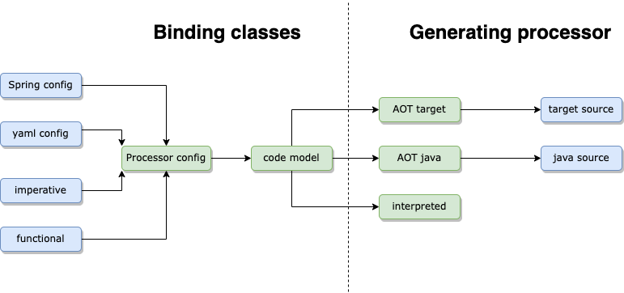

# Introduction
Building and executing an event processor are independent functions that can run in separate processes. This section 
documents the binding of functions into an event processor and the generation of the processor for use at runtime.

There are three steps to use Fluxtion, step 2 is covered here:

## Three steps to using Fluxtion
{: .no_toc }

{: .info }
1 - Mark event handling methods with annotations or via functional programming 
2 - **Build the event processor using fluxtion compiler utility** 
3 - Integrate the event processor in the app and feed it events
{: .fs-4 }

Building an event processor has two phases, binding event handler methods into the model and then generating the finished
event processor.

{: .info }
The binding and generation functions are located in the Fluxtion compiler library.
{: .fs-4 }

## Binding
The compiler analyses the configuration information provided by the programmer and builds a code model that provides all
the information required to generate the event processor. Several source types are supported for supplying the binding
information, Fluxtion transforms each of these sources into a common representation before generating the code model. 
Supported source config types:
* Imperative api
* Functional dsl api
* Spring based
* Yaml based

## Generating
To complete building an event processor the code model and a target runtime is passed to the compiler. The final event
processor binds in all user classes combined with pre-calculated event dispatch to meet the dispatch rules.

The supported target runtime are:

- In memory execution running in an interpreted mode
- In memory execution of compiled event processor
- Ahead of time generation of compiled event processor
