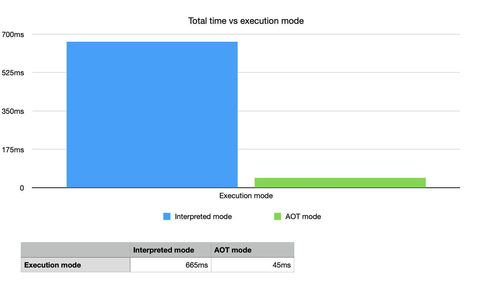

  

    Table of contents
  

  {: .text-delta }
1. TOC
{:toc}

# Introduction

This tutorial is an introduction to building Fluxtion dependency injection container ahead of time. The reader should
be proficient in Java, maven, git, Spring and have completed the [first lottery tutorial](tutorial-1.md) before starting
this tutorial. The project source can be found [here.]({{site.getting_started}}/tutorial2-lottery-aot)

Our goal is to create the lottery processing logic ahead of time so the application has no change in functional
behaviour compared to the first tutorial. An aot application has the advantage of starting quicker, using less resources
and requiring fewer dependencies at runtime.

At the end of this tutorial you should understand:

- The relationship between Fluxtion runtime and compiler components
- How to generate a container ahead of time using the fluxtion maven plugin
- How the serialised container source file is used in an application

# Building AOT

Fluxtion has two components, the runtime and the compiler, that in combination create a dependency injection container.
In the first tutorial both components were used at runtime building a container that executes in **interpreted mode**. In
this
tutorial we invoke the compiler in the build phase and generate the container ahead of time. This is known as running
in **aot mode**.

The compiler serialises the configured dependency container to a standard java source file when in aot mode. The steps
for creating a container ahead of time:

- Add the fluxtion maven plugin to the build with configuration pointing to the spring config file as an input
- The [LotteryProcessor]({{site.getting_started}}/tutorial2-lottery-aot/src/main/java/com/fluxtion/example/cookbook/lottery/aot/LotteryProcessor.java) will be generated as part of the build process
- Use the generated event processor as a concrete type in tests and within the application
- The application's **compile** dependencies must include the Fluxtion runtime, Fluxtion compiler and Spring libraries
- The application's **runtime** dependencies must include the Fluxtion runtime and can exclude both Fluxtion compiler and Spring libraries

## Build output
Running the build generates the
[LotteryProcessor]({{site.getting_started}}/tutorial2-lottery-aot/src/main/java/com/fluxtion/example/cookbook/lottery/aot/LotteryProcessor.java)

The maven plugin will print to console the event processors it is generating.


[INFO]
[INFO] --- fluxtion:3.0.14:springToFluxtion (spring to fluxtion builder) @ getting-started-tutorial2 ---
[main] INFO com.fluxtion.compiler.generation.compiler.EventProcessorCompilation - generated EventProcessor file: /development/fluxtion-examples/getting-started/tutorial2-lottery-aot/src/main/java/com/fluxtion/example/cookbook/lottery/aot/LotteryProcessor.java
[INFO] ------------------------------------------------------------------------
[INFO] BUILD SUCCESS
[INFO] ------------------------------------------------------------------------
[INFO] Total time:  3.129 s
[INFO] Finished at: 2024-03-02T17:10:40Z
[INFO] ------------------------------------------------------------------------



## Build system
The example uses the maven plugin to generate the container aot so we only need the compiler 
dependency at build time. We could leave the pom file dependencies unchanged from tutorial 1 but having less runtime 
dependencies will make for easier integration in the future. The following changes are made to the pom file dependencies

| Nmae              | Purpose                    | scope    | available at runtime |
|-------------------|----------------------------|----------|----------------------|
| fluxtion-runtime  | libraries for di container | compile  | YES                  |
| Slf4j             | runtime logging            | compile  | YES                  |
| fluxtion-compiler | generating di container    | provided | NO                   |
| Spring            | spring config parsing      | provided | NO                   |
| lombok            | source annotations         | provided | NO                   |

The updated [pom.xml]({{site.getting_started}}/tutorial2-lottery-aot/pom.xml) file


<?xml version="1.0" encoding="UTF-8"?>
<project xmlns="http://maven.apache.org/POM/4.0.0"
xmlns:xsi="http://www.w3.org/2001/XMLSchema-instance"
xsi:schemaLocation="http://maven.apache.org/POM/4.0.0 http://maven.apache.org/xsd/maven-4.0.0.xsd">
<modelVersion>4.0.0</modelVersion>
<groupId>com.fluxtion.example</groupId>
<artifactId>getting-started-tutorial2</artifactId>
<version>1.0.0-SNAPSHOT</version>
<packaging>jar</packaging>
<name>getting-started :: tutorial 2 :: aot</name>

    <properties>
        <maven.compiler.source>21</maven.compiler.source>
        <maven.compiler.target>21</maven.compiler.target>
        <project.build.sourceEncoding>UTF-8</project.build.sourceEncoding>
        <fluxtion.version>{{site.fluxtion_version}}</fluxtion.version>
    </properties>

    <build>
        <plugins>
            <plugin>
                <groupId>com.fluxtion</groupId>
                <artifactId>fluxtion-maven-plugin</artifactId>
                <version>3.0.14</version>
                <executions>
                    <execution>
                        <id>spring to fluxtion builder</id>
                        <goals>
                            <goal>springToFluxtion</goal>
                        </goals>
                        <configuration>
                            <springFile>src/main/resources/spring-lottery.xml</springFile>
                            <className>LotteryProcessor</className>
                            <packageName>com.fluxtion.example.cookbook.lottery.aot</packageName>
                        </configuration>
                    </execution>
                </executions>
            </plugin>
        </plugins>
    </build>

    <dependencies>
        <!--        RUNTIME SCOPE NO LONGER SUPPLIED BY FLUXTION COMPILER-->
        <dependency>
            <groupId>com.fluxtion</groupId>
            <artifactId>runtime</artifactId>
            <version>${fluxtion.version}</version>
            <scope>compile</scope>
        </dependency>
        <dependency>
            <groupId>org.slf4j</groupId>
            <artifactId>slf4j-simple</artifactId>
            <scope>compile</scope>
            <version>2.0.7</version>
        </dependency>
        <!--        PROVIDED SCOPE-->
        <dependency>
            <groupId>com.fluxtion</groupId>
            <artifactId>compiler</artifactId>
            <version>${fluxtion.version}</version>
            <scope>provided</scope>
        </dependency>
        <dependency>
            <groupId>org.springframework</groupId>
            <artifactId>spring-context</artifactId>
            <version>5.3.29</version>
            <scope>provided</scope>
        </dependency>
        <dependency>
            <groupId>org.projectlombok</groupId>
            <artifactId>lombok</artifactId>
            <version>1.18.30</version>
            <scope>provided</scope>
        </dependency>
    </dependencies>
</project>



# Running the application
Running the [application]({{site.getting_started}}/tutorial2-lottery-aot/src/main/java/com/fluxtion/example/cookbook/lottery/LotteryApp.java)
is almost unchanged from the first tutorial, the only line that is changed how the lotteryEventProcessor
instance is instantiated in the start method from the aot generated class, [LotteryProcessor]({{site.getting_started}}/tutorial2-lottery-aot/src/main/java/com/fluxtion/example/cookbook/lottery/aot/LotteryProcessor.java).


public class LotteryApp {
    //code removed for clarity ....

    public static void start(Consumer<String> ticketReceiptHandler, Consumer<String> resultsPublisher){
        //AOT USAGE LINE BELOW
        var lotteryEventProcessor = new LotteryProcessor();
        lotteryEventProcessor.init();
        //...
    }
}


Executing our application produces the same output as the first tutorial, but executes much faster as all the event 
processor generation is moved to the build time phase.


[main] INFO LotteryMachineNode - started
[main] INFO LotteryApp - store shut - no tickets can be bought
[main] INFO TicketStoreNode - store opened
[main] INFO LotteryApp - good luck with Ticket[number=126556, id=bdd084c8-de6f-4e6a-aa6c-15976724c8d3]
[main] INFO LotteryMachineNode - tickets sold:1
[main] INFO LotteryApp - good luck with Ticket[number=365858, id=5b211b4c-0364-4406-a412-5bb0f214b8b7]
[main] INFO LotteryMachineNode - tickets sold:2
[main] INFO LotteryApp - good luck with Ticket[number=730012, id=a8de75a9-a647-4612-b6c9-ef14116d4847]
[main] INFO LotteryMachineNode - tickets sold:3
[main] INFO LotteryApp - invalid numbers Ticket[number=25, id=e50a72f2-e305-4053-a344-97d75b9ab7f6]
[main] INFO TicketStoreNode - store closed
[main] INFO LotteryApp - store shut - no tickets can be bought
[main] INFO LotteryMachineNode - WINNING ticket Ticket[number=126556, id=bdd084c8-de6f-4e6a-aa6c-15976724c8d3]

Process finished with exit code 0


# Note on performance
Running the application in a single shot mode and adding timing points to the start and end of the main method, we see
an approximate 12-fold decrease in execution time. The calculation and generation of the event processor is a relatively
expensive operation, aot mode brings great efficiency benefits to a deployed application.

# Conclusion
In this tutorial we have seen that moving from interpreted to aot generated event processor is simple with Fluxtion. The
use of the aot container within the client code is totally unchanged. With very little effort the following benefits are 
realised:

- Moving to aot container is quick and easy with the maven plugin and a single line change to tha application
- Aot generation reduces cost and startup times as more work is in the build phase
- The AOT approach results in zero gc Fluxtion operation 
- Generated source makes debugging easier for the developer
- The aot container has a single runtime Fluxtion dependency and no 3rd party dependencies
- Less dynamic behaviour at runtime, great for security conscious deployments

I hope you have enjoyed reading this tutorial, and it has given you a desire to try running the container in aot mode
within your applications. Please send me in any comments or suggestions to improve this tutorial

[next tutorial 3](tutorial-3.md)
{: .text-right }