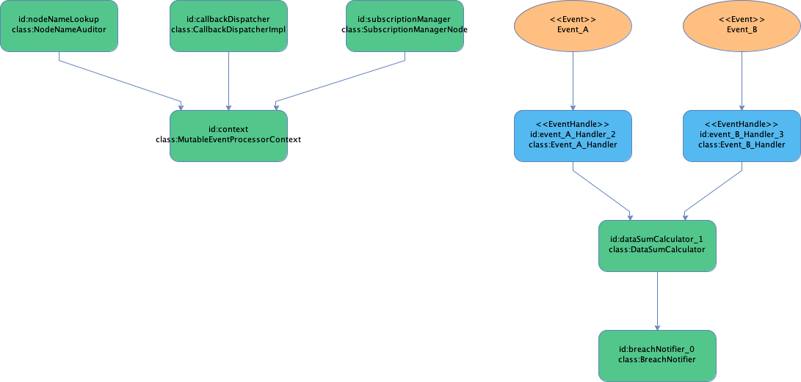

# 5 minute hello world

Use Fluxtion to add two numbers from different event streams and log when the sum > 100.
The sum is the addition of the current value from each event stream. The stream of events can be infinitely long, 
calculations are run whenever a new event is received. 

This example creates an event processor, initialises it and fires data events at the processor. If a breach occurs
a warning will be logged to console.

All dispatch and change notification is handled by Fluxtion when an event is received. Business logic resides in the 
user functions/classes.

Code is available as a [maven project]({{page.example_src}})

## Steps to build an EventProcessor

All projects that build a Fluxtion [EventProcessor]({{site.EventProcessor_link}}) at runtime follow similar steps

- Create a maven or gradle project adding the Fluxtion compiler dependency to the project runtime classpath
- Write pojo's that will provide event driven logic, set references between the pojo's as per normal java
- [Annotate]({{site.fluxtion_src_runtime}}/annotations/) a method to indicate it is an event handling entry pont or a callback trigger method
- Build the EventProcessor containg user pojo's by either:
  - Calling one of the [Fluxtion]({{site.Fluxtion_link}}) compile/interpret methods passing in the list of nodes to the builder method
  - Add the Fluxtion maven plugin to your pom.xml for ahead of time compilation(AOT) of builder methods
- An EventProcessor instance is returned ready to be used
- Call EventProcessor.init() to ensure the graph is ready to process events
- To publish events to the processor call EventProcessor.onEvent(object)

## Dependencies

  <button class="tablinks" onclick="openTab(event, 'Maven')" id="defaultOpen">Maven</button>
  <button class="tablinks" onclick="openTab(event, 'Gradle')">Gradle</button>


    <dependencies>
        <dependency>
            <groupId>com.fluxtion</groupId>
            <artifactId>compiler</artifactId>
            <version>{{site.fluxtion_version}}</version>
        </dependency>
    </dependencies>



implementation 'com.fluxtion:compiler:{{site.fluxtion_version}}'


## Maven pom


<?xml version="1.0" encoding="UTF-8"?>
<project xmlns="http://maven.apache.org/POM/4.0.0"
xmlns:xsi="http://www.w3.org/2001/XMLSchema-instance"
xsi:schemaLocation="http://maven.apache.org/POM/4.0.0 http://maven.apache.org/xsd/maven-4.0.0.xsd">
<parent>
<artifactId>example.master</artifactId>
<groupId>com.fluxtion.example</groupId>
<version>1.0.0-SNAPSHOT</version>
</parent>

    <modelVersion>4.0.0</modelVersion>
    <artifactId>imperative-helloworld</artifactId>
    <name>imperative :: hello world</name>

    <build>
        <plugins>
            <plugin>
                <groupId>com.fluxtion</groupId>
                <artifactId>fluxtion-maven-plugin</artifactId>
                <version>3.0.14</version>
                <executions>
                    <execution>
                        <goals>
                            <goal>scan</goal>
                        </goals>
                    </execution>
                </executions>
            </plugin>
        </plugins>
    </build>

    <dependencies>
        <dependency>
            <groupId>com.fluxtion</groupId>
            <artifactId>compiler</artifactId>
            <version>{{site.fluxtion_version}}</version>
        </dependency>
    </dependencies>
</project>


# Java code

There are two types of user classes employed at runtime, pojo's that hold processing logic and events that are 
fed into the generated BreachNotifierProcessor. 

The example [Main method]({{page.example_src}}/Main.java) instantiates the [BreachNotifierProcessor]({{page.example_src}}/generated/BreachNotifierProcessor.java), 
initialises it and submits events for processing using the onEvent method.

All the pojo classes required for processing are linked together using an imperative style in our [AotBuilder.java]({{page.example_src}}/AotBuilder.java).
The Fluxtion maven plugin runs at build time, interrogating the AotBuilder to generate the BreachNotifierProcessor.

## Pojo classes

| Name               | Event handler | Trigger handler | Description                                                      |
|--------------------|---------------|-----------------|------------------------------------------------------------------|
| Event_A_Handler    | yes           | no              | Handles incoming events of type Event_A                          |
| Event_B_Handler    | yes           | no              | Handles incoming events of type Event_B                          |
| DataSumCalculator  | no            | yes             | References DataHandler nodes and calculates the current sum      |
| BreachNotifier     | no            | yes             | References the DataSumCalculator and logs a warning if sum > 100 |

The event handler method is called when a matching event type is published to the container, the trigger handler is 
called when a parent dependency haa been trigger or a parent event handler method has been called.

### [Event_A_Handler]({{page.example_src}}/Event_A_Handler.java)

An entry point for processing events of type Event_A and stores the latest value as a member variable.
Annotate the event handler method with **@OnEventHandler** as follows:


public class Event_A_Handler {
    private double value;

    @OnEventHandler
    public boolean data1Update(Event_A data1) {
        value = data1.value();
        return true;
    }

    public double getValue() {
        return value;
    }
}


### [Event_B_Handler]({{page.example_src}}/Event_B_Handler.java)

An entry point for processing events of type Event_B and stores the latest value as a member variable.
Annotate the event handler method with **@OnEventHandler** as follows:


public class Event_B_Handler {
    private double value;

    @OnEventHandler
    public boolean data1Update(Event_B data2) {
        value = data2.value();
        return true;
    }

    public double getValue() {
        return value;
    }
}


### [DataSumCalculator]({{page.example_src}}/DataSumCalculator.java)

Calculates the current sum adding the values of Event_A_Handler and Event_B_Handler. Will be triggered when either handler
has its updated method invoked. Annotate the trigger method with **@OnTrigger** as follows:


public class DataSumCalculator {
    private final Event_A_Handler event_A_Handler;
    private final Event_B_Handler event_B_Handler;
    private double sum;

    public DataSumCalculator(Event_A_Handler event_A_Handler, Event_B_Handler event_B_Handler) {
        this.event_A_Handler = event_A_Handler;
        this.event_B_Handler = event_B_Handler;
    }

    public DataSumCalculator() {
        this(new Event_A_Handler(), new Event_B_Handler());
    }

    /**
     * The {@link OnTrigger} annotation marks this method to be called if any parents have changed
     *
     * @return flag indicating a change and a propagation of the event wave to child dependencies if the sum > 100
     */
    @OnTrigger
    public boolean calculate() {
        sum = event_A_Handler.getValue() + event_B_Handler.getValue();
        System.out.println("sum:" + sum);
        return sum > 100;
    }

    public double getSum() {
        return sum;
    }
}


The return flag indicates that the event notification should be propagated and any child nodes trigger methods
should be invoked.

### [BreachNotifier]({{page.example_src}}/BreachNotifier.java)

Logs to console when the sum breaches a value, BreachNotifier holds a reference to the DataSumCalculator instance.
The trigger method is only invoked if the DataSumCalculator propagates the notification, by returning true from its
trigger method. Annotate the trigger method with **@OnTrigger** as follows:


public class BreachNotifier {
    private final DataSumCalculator dataAddition;

    public BreachNotifier(DataSumCalculator dataAddition) {
        this.dataAddition = dataAddition;
    }

    public BreachNotifier() {
        this(new DataSumCalculator());
    }

    @OnTrigger
    public boolean printWarning() {
        System.out.println("WARNING DataSumCalculator value is greater than 100 sum = " + dataAddition.getSum());
        return true;
    }
}


## Event classes

Java records as used as events.


public record Event_A(double value) {}
public record Event_B(double value) {}


## Building an EventProcessor containing user classes

The process for building an event processor AOT with Fluxtion are quite simple:

- Create user classes with business logic
- Annotate callback methods
    - **@OnEventHandler** annotation declares the [entry point]({{page.example_src}}/Event_A_Handler.java) of an execution path, triggered by an external event.
    - **@OnTrigger** annotated [methods]({{page.example_src}}/DataSumCalculator.java) indicate call back methods to be invoked if a parent propagates a change.
      The return boolean flag from a trigger method indicates if event notification should be propagated
- Add the user classes to a [fluxtion builder]({{page.example_src}}/AotBuilder.java)
- Add the Fluxtion maven plugin to your build [pom.xml](https://github.com/v12technology/fluxtion-examples/tree/main/imperative-helloworld/pom.xml), the event processor will be generated ahead of time (AOT)
  as part of the build

## [AotBuilder]({{page.example_src}}/AotBuilder.java) 
AotBuilder adds user classes imperatively to the EventProcessorConfig in the buildGraph method.

Fluxtion inspects all the references from the supplied object list to generate the EventProcessor. As instances of 
Event_A_Handler, Event_B_Handler and DataSumCalculator are all directly or indirectly referenced by BreachNotifier 
there is no need to tell Fluxtion about them. Any connected instance will be automatically discovered and added to the 
final EventProcessor. 

Source generation configuration is handled in the configureGeneration method.


public class AotBuilder implements FluxtionGraphBuilder {

    @Override
    public void buildGraph(EventProcessorConfig eventProcessorConfig) {
        eventProcessorConfig.addNode(new BreachNotifier());
    }

    @Override
    public void configureGeneration(FluxtionCompilerConfig fluxtionCompilerConfig) {
        fluxtionCompilerConfig.setClassName("BreachNotifierProcessor");
        fluxtionCompilerConfig.setPackageName("com.fluxtion.example.imperative.helloworld.generated");
    }
}


## Generated event processor source
The AOT generated event processor source file is here [BreachNotifierProcessor.java]({{page.example_src}}/generated/BreachNotifierProcessor.java)

# Executing the example

Before publishing events to the EventProcessor it must be initialised by calling init. After initialisation event processing is 
ready, call onEvent() with instances of Event_A or Event_B as required. 

The code for instantiating, initializing and sending events is:


public class Main {
private static final boolean USE_AOT = true;

    public static void main(String[] args) {
        var eventProcessor = USE_AOT ? new BreachNotifierProcessor() : Fluxtion.interpret(new BreachNotifier());
        eventProcessor.init();
        eventProcessor.onEvent(new Event_A(34.4));
        eventProcessor.onEvent(new Event_B(52.1));
        eventProcessor.onEvent(new Event_A(105));//should create a breach warning
        eventProcessor.onEvent(new Event_A(12.4));
    }

}


Fluxtion can be run in an interpreted mode, in this case no AOT build step is required and the maven plugin can be
removed from the pom.xml file. 

## Example execution output


sum:34.4
sum:86.5
sum:157.1
WARNING DataSumCalculator value is greater than 100 sum = 157.1
sum:64.5


## Processing graph

The AOT processing generates a diagram of the event processor graph that can be very helpful when graphs become
complicated.

