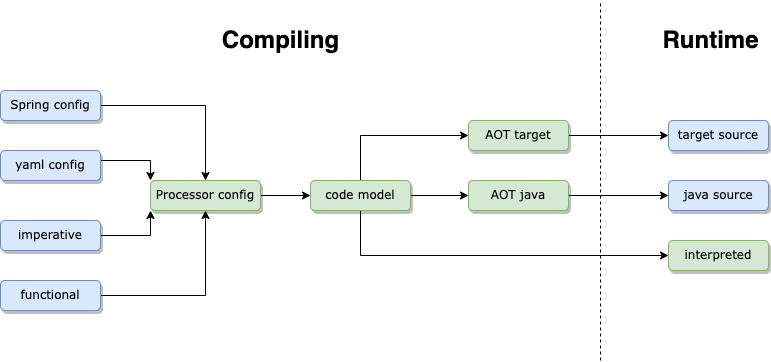

# Introduction
{: .no_toc }

Building and executing an event processor are independent functions that can run in separate processes. This section
documents integrating an event processor into an application and unit testing the event processor.

There are three steps to use Fluxtion, step 3 is covered here:

## Three steps to using Fluxtion
{: .no_toc }

{: .info }
1 - Mark event handling methods with annotations or via functional programming 
2 - Build the event processor using fluxtion compiler utility 
3 - **Integrate the event processor in the app and feed it events**
{: .fs-4 }

## Using an event processor
{: .no_toc }

Once the event processor has been generated with user methods bound in it can be used by the application. An instance of an
[EventProcessor](https://github.com/v12technology/fluxtion/tree/{{site.fluxtion_version}}/runtime/src/main/java/com/fluxtion/runtime/EventProcessor.java)
is the bridge between event streams and processing logic, user code connects
the EventProcessor to the application event sources. An application can contain multiple EventProcessors instances, and
routes events to an instance.

{: .warning }
**EventProcessors are not thread safe** a single event should be processed at one time. Application code is responsible 
for synchronizing thread access to an event processor instance. 
{: .fs-4 }

User code interacts with an event processor instance in one of five ways
1. Creating a new processor
2. Input to a processor
2. Output from a processor
3. Control of a processor
4. Query into a processor

{: .no_toc }

  

    Table of contents
  

  {: .text-delta }
- TOC
{:toc}

# Creating a new processor
Creating a new processor is simply an instance of creating a new instance of an AOT processor or using one the in process
methods` Fluxtion.interpret` or `Fluxtion.compile`. 

## Factory method
An event processor instance provides a factory method that creates new instances of the same event processor class. This
can be useful when a multiple instances of the same processor are required but each with different state. Event streams
are sometimes partitioned, each instance of the event processor can be bound to that partitioned stream.

### Code sample
{: .no_toc }



public class FactoryExample {
    public static void main(String[] args) {
        var processor = Fluxtion.compile(new MyPartitionedLogic());
    
        var processor_A = processor.newInstance();
        var processor_B = processor.newInstance();
    
        //Factory method to create new event processor instances
        processor_A.init();
        processor_B.init();
    
        //user partitioning event flow logic
        processor_A.onEvent("for A");
        processor_B.onEvent("for B");
    }
    
    public static class MyPartitionedLogic {
        @OnEventHandler
        public boolean onString(String signal) {
            System.out.println(signal);
            return true;
        }
    }
}



### Sample log
{: .no_toc }


for A
for B


### Compiled event processor only support
{: .no_toc }
The compiled event processors create bound nodes using their constructors so each compiled event processor has no shared 
references. As an interpreted instance refers to the nodes it has been generated with, it does create new instance of bound nodes,
it cannot create a segregated instance of an event processor. 

{: .warning }
Factory method processor.newInstance() is only supported for compiled event processors
{: .fs-4 }
 
## Partitioning
Fluxtion provides an automatic [partitioning function]({{site.fluxtion_src_runtime}}/partition/Partitioner.java) 
that can be used to query event flow, partition it and assign a new event processor instance to that flow. The partitioner
takes a factory method to create new event processor instances and a key function to separate event flow.

The partitioner will create and initialise a new event processor when the key function returns a previously unseen key. 

### Code sample
{: .no_toc }



public class AutomaticPartitionExample {

    public record DayEvent(String day, int amount) {}

    public static void main(String[] args) {
        var processorFactory = Fluxtion.compile(new DayEventProcessor());

        //Create a partitioner that will partition data based on a property
        Partitioner<StaticEventProcessor> partitioner = new Partitioner<>(processorFactory::newInstance);
        partitioner.partition(DayEvent::day);

        //new processor for Monday
        partitioner.onEvent(new DayEvent("Monday", 2));
        partitioner.onEvent(new DayEvent("Monday", 4));

        //new processor for Tuesday
        partitioner.onEvent(new DayEvent("Tuesday", 14));

        //new processor for Friday
        partitioner.onEvent(new DayEvent("Friday", 33));

        //re-use processor for Monday
        System.out.println();
        partitioner.onEvent(new DayEvent("Monday", 999));
    }

    public static class DayEventProcessor {
        @Initialise
        public void initialise() {
            System.out.println("\nDayEventProcessor::initialise");
        }

        @OnEventHandler
        public boolean onDayaEvent(DayEvent signal) {
            System.out.println(signal);
            return true;
        }
    }
}



### Sample log
{: .no_toc }


DayEventProcessor::initialise
DayEvent[day=Monday, amount=2]
DayEvent[day=Monday, amount=4]

DayEventProcessor::initialise
DayEvent[day=Tuesday, amount=14]

DayEventProcessor::initialise
DayEvent[day=Friday, amount=33]

DayEvent[day=Monday, amount=4]


# Inputs to a processor
An event processor responds to input by triggering a calculation cycle. Functions are bound to the calculation
cycle to meet the business requirements. Triggering a calculation cycle is covered in this section. To process inputs 
the event processor instance it must be initialised before any input is submitted.

{: .info }
1 - Call EventProcessor.init() before submitting any input 
2 - Each new input triggers a graph calculation cycle
{: .fs-4 }

## Events

### Code sample
{: .no_toc }


public class EventInput {
    public static void main(String[] args) {
        EventProcessor<?> processor = Fluxtion.interpret(c -> DataFlow.subscribe(String.class).console("Hello {}"));
        //lifecycle init required
        processor.init();

        //send event
        processor.onEvent("WORLD");
    }
}



### Sample log
{: .no_toc }


Hello WORLD


## Exported service

### Code sample
{: .no_toc }


public class ServiceInput {

    public static void main(String[] args) {
        EventProcessor<?> processor = Fluxtion.interpret(new MyConsumer());

        //lifecycle init required
        processor.init();

        //lookup service using type inference
        ServiceController svc = processor.getExportedService();
        svc.serviceOn(System.out::println, "WORLD");

        //SUPPORTED  service lookups

        //lookup with explicit type
        svc = processor.getExportedService(ServiceController.class);
        svc.serviceOn(System.out::println, "WORLD");

        //lookup with explicit type, use default value if none exported
        MiaServiceController svcMissing = processor.getExportedService(MiaServiceController.class, (consumer, message) -> {
            System.out.println("MiaServiceController not exported");
            return false;
        });
        svcMissing.serviceOn(System.out::println, "WORLD");

        //lookup and consume service if exported
        processor.consumeServiceIfExported(ServiceController.class, s -> s.serviceOn(System.out::println, "WORLD"));

        //is service exported
        System.out.println("ServiceController.class exported   : " + processor.exportsService(ServiceController.class));
        System.out.println("MiaServiceController.class exported: " + processor.exportsService(MiaServiceController.class));
    }

    public interface ServiceController {
        boolean serviceOn(Consumer<String> consumer, String message);
    }

    public interface MiaServiceController {
        boolean serviceOn(Consumer<String> consumer, String message);
    }

    public static class MyConsumer implements @ExportService ServiceController {
        @Override
        public boolean serviceOn(Consumer<String> consumer, String message) {
            consumer.accept("hello " + message);
            return false;
        }
    }
}



### Sample log
{: .no_toc }


hello WORLD
hello WORLD
MiaServiceController not exported
hello WORLD
ServiceController.class exported   : true
MiaServiceController.class exported: false


## Signals

### Code sample
{: .no_toc }


public class SignalInput {

    public static void main(String[] args) {
        var processor = Fluxtion.interpret(new SignalInput());
        processor.init();

        processor.publishIntSignal("1", 200);
        processor.publishSignal("ALERT_SIGNAL", "alert!!");
        processor.publishSignal("WAKEUP");
        processor.publishObjectSignal("WAKEUP");
        processor.publishObjectSignal(new Date());
    }

    @OnEventHandler(filterString = "1")
    public boolean intSignal(Signal.IntSignal value) {
        System.out.println("intSignal [" + value.getValue() + "]");
        return true;
    }

    @OnEventHandler(filterString = "ALERT_SIGNAL")
    public boolean alertSignal(Signal<String> signalToProcess) {
        System.out.println("alertStringSignal [" + signalToProcess + "]");
        return true;
    }

    @OnEventHandler(filterStringFromClass = String.class)
    public boolean anyStringSignal(Signal<String> signalToProcess) {
        System.out.println("anyStringSignal [" + signalToProcess + "]");
        return true;
    }

    @OnEventHandler(filterStringFromClass = Date.class)
    public boolean anyDateSignal(Signal<Date> signalToProcess) {
        System.out.println("anyDateSignal [" + signalToProcess + "]");
        return true;
    }

    @OnEventHandler(filterString = "WAKEUP")
    public boolean namedSignal(Signal<?> signalToProcess) {
        System.out.println("namedSignal [" + signalToProcess.filterString() + "]");
        return true;
    }
}


### Sample log
{: .no_toc }


intSignal [200]
alertStringSignal [Signal: {filterString: ALERT_SIGNAL, value: alert!!}]
namedSignal [WAKEUP]
anyStringSignal [Signal: {filterString: java.lang.String, value: WAKEUP}]
anyDateSignal [Signal: {filterString: java.util.Date, value: Sat Apr 27 06:25:28 BST 2024}]


## Batch support

Batch callbacks are supported through the BatchHandler interface that the generated EventHandler implements. Any methods 
that are annotated with, `@OnBatchPause` or `@OnBatchEnd` will receive calls from the matching BatchHandler method. 

### Code sample
{: .no_toc }



public static void main(String[] args) {
    var processor = Fluxtion.interpret(new MyNode());
    processor.init();

    processor.onEvent("test");

    //use BatchHandler service
    BatchHandler batchHandler = (BatchHandler)processor;
    batchHandler.batchPause();
    batchHandler.batchEnd();
}

public static class MyNode {
    @OnEventHandler
    public boolean handleStringEvent(String stringToProcess) {
        System.out.println("MyNode event received:" + stringToProcess);
        return true;
    }

    @OnBatchPause
    public void batchPause(){
        System.out.println("MyNode::batchPause");
    }

    @OnBatchEnd
    public void batchEnd(){
        System.out.println("MyNode::batchEnd");
    }
}



### Sample log
{: .no_toc }


MyNode event received:test
MyNode::batchPause
MyNode::batchEnd


## Buffer and trigger

An event processor can buffer multiple events without causing any triggers to fire, and at some point in the future 
cause all potentially dirty trigger to fire. This is known as buffering and triggering it is achieved by call 
`EventProcessr.bufferEvent` multiple times and then following it with a call `EventProcessor.triggerCalculation`

### Code sample
{: .no_toc }



public static void main(String[] args) {
    var processor = Fluxtion.interpret(new Child(new MyNode(), new MyNode2()));
    processor.init();
    processor.bufferEvent("test");
    System.out.println();
    processor.bufferEvent(200);
    System.out.println();
    processor.bufferEvent(50);
    System.out.println();
    processor.triggerCalculation();
}

public static class MyNode {
    @OnEventHandler
    public boolean handleStringEvent(String stringToProcess) {
        System.out.println("MyNode event received:" + stringToProcess);
        return true;
    }
}

public static class MyNode2 {
    @OnEventHandler
    public boolean handleIntEvent(int intToProcess) {
        boolean propagate = intToProcess > 100;
        System.out.println("MyNode2 conditional propagate:" + propagate);
        return propagate;
    }

    @OnEventHandler
    public boolean handleStringEvent(String stringToProcess) {
        System.out.println("MyNode2 event received:" + stringToProcess);
        return true;
    }
}

public static class Child{
    private final MyNode myNode;
    private final MyNode2 myNode2;

    public Child(MyNode myNode, MyNode2 myNode2) {
        this.myNode = myNode;
        this.myNode2 = myNode2;
    }

    @OnParentUpdate
    public void node1Updated(MyNode myNode1){
        System.out.println("1 - myNode updated");
    }

    @OnParentUpdate
    public void node2Updated(MyNode2 myNode2){
        System.out.println("2 - myNode2 updated");
    }

    @OnTrigger
    public boolean triggered(){
        System.out.println("Child:triggered");
        return true;
    }
}



### Sample log
{: .no_toc }


MyNode2 event received:test
2 - myNode2 updated
MyNode event received:test
1 - myNode updated

MyNode2 conditional propagate:true
2 - myNode2 updated

MyNode2 conditional propagate:false

Child:triggered


# Outputs from a processor

## Sink

An application can register for output from the EventProcessor by supplying a consumer
to addSink. Support for publishing to a sink is built into the streaming api, `[builder_type]#sink`.
A consumer has a string key to partition outputs.

### Code sample
{: .no_toc }



public static void main(String[] args) {
    var processor = Fluxtion.interpret(cfg ->
    DataFlow.subscribeToIntSignal("myIntSignal")
        .mapToObj(d -> "intValue:" + d)
        .sink("mySink"));
    processor.init();
    processor.addSink("mySink", (Consumer<String>) System.out::println);
    processor.publishSignal("myIntSignal", 10);
    processor.publishSignal("myIntSignal", 256);

    processor.removeSink("mySink");
    processor.publishSignal("myIntSignal", 512);
}



### Sample log
{: .no_toc }


intValue:10
intValue:256


An application can remove sink using the call `EventProcessor#removeSink`

## Audit logging and log level control

### Code sample
{: .no_toc }


public class AuditExample {
    public static void main(String[] args) {
        var processor = Fluxtion.interpret(c ->{
           c.addNode(new MyAuditingNode());
           c.addEventAudit();
        });
        
        processor.init();

        processor.onEvent("detailed message 1");
        
        //change log level dynamically
        processor.setAuditLogLevel(EventLogControlEvent.LogLevel.DEBUG);
        processor.onEvent("detailed message 2");
    }

    public static class MyAuditingNode extends EventLogNode {

        @Initialise
        public void init(){
            auditLog.info("MyAuditingNode", "init");
            auditLog.info("MyAuditingNode_debug", "some debug message");
        }

        @OnEventHandler
        public boolean stringEvent(String event) {
            auditLog.info("event", event);
            auditLog.debug("charCount", event.length());
            return true;
        }
    }
}



### Sample log
{: .no_toc }



eventLogRecord: 
    eventTime: 1714197503584
    logTime: 1714197503584
    groupingId: null
    event: LifecycleEvent
    eventToString: Init
    nodeLogs: 
        - myAuditingNode_0: { MyAuditingNode: init, MyAuditingNode_debug: some debug message}
    endTime: 1714197503584
---
Apr 27, 2024 6:58:23 AM com.fluxtion.runtime.audit.EventLogManager calculationLogConfig
INFO: updating event log config:EventLogConfig{level=DEBUG, logRecordProcessor=null, sourceId=null, groupId=null}
eventLogRecord: 
    eventTime: 1714197503597
    logTime: 1714197503598
    groupingId: null
    event: String
    eventToString: detailed message 1
    nodeLogs: 
        - myAuditingNode_0: { event: detailed message 1, charCount: 18}
    endTime: 1714197503598
---
Apr 27, 2024 6:58:23 AM com.fluxtion.runtime.audit.EventLogManager calculationLogConfig
INFO: updating event log config:EventLogConfig{level=INFO, logRecordProcessor=null, sourceId=null, groupId=null}
eventLogRecord: 
    eventTime: 1714197503599
    logTime: 1714197503599
    groupingId: null
    event: String
    eventToString: detailed message 2
    nodeLogs: 
        - myAuditingNode_0: { event: detailed message 2}
    endTime: 1714197503599
---



# Control of a processor

## Lifecycle

User nodes that are added to the processing graph can attach to the lifecycle callbacks by annotating methods with 
the relevant annotations.



public static void main(String[] args) {
    var processor = Fluxtion.interpret(new MyNode());
    processor.init();
    processor.start();
    processor.stop();
    processor.tearDown();
}

public static class MyNode {

    @Initialise
    public void myInitMethod() {
        System.out.println("Initialise");
    }

    @Start
    public void myStartMethod() {
        System.out.println("Start");
    }

    @Stop
    public void myStopMethod() {
        System.out.println("Stop");
    }

    @TearDown
    public void myTearDownMethod() {
        System.out.println("TearDown");
    }
}



Output

Initialise
Start
Stop
TearDown


## Clocks and time

## Audit log record encoding and sink

### Code sample
{: .no_toc }


public class AuditEncodeExample {
    public static void main(String[] args) {
        var processor = Fluxtion.interpret(c ->{
           c.addNode(new MyAuditingNode());
           c.addEventAudit();
        });
        processor.init();

        //REPLACE LOGRECORD ENCODER
        processor.setAuditLogRecordEncoder(new MyLogEncoder(Clock.DEFAULT_CLOCK));
        //REPLACE LOGRECORD PROCESSOR
        processor.setAuditLogProcessor(logRecord -> {
            System.err.println("WARNING -> "+ logRecord.toString());
        });

        processor.onEvent("detailed message 1");
        processor.onEvent("detailed message 2");
    }

    public static class MyLogEncoder extends LogRecord{
        public MyLogEncoder(Clock clock) {
            super(clock);
        }

        @Override
        public CharSequence asCharSequence(){
            return "IGNORING ALL RECORDS!!";
        }
    }

    public static class MyAuditingNode extends EventLogNode {
        @Initialise
        public void init(){
            auditLog.info("MyAuditingNode", "init");
            auditLog.info("MyAuditingNode_debug", "some debug message");
        }

        @OnEventHandler
        public boolean stringEvent(String event) {
            auditLog.info("event", event);
            auditLog.debug("charCount", event.length());
            return true;
        }
    }
}


### Sample log
{: .no_toc }


eventLogRecord: 
    eventTime: 1714198359106
    logTime: 1714198359106
    groupingId: null
    event: LifecycleEvent
    eventToString: Init
    nodeLogs: 
        - myAuditingNode_0: { MyAuditingNode: init, MyAuditingNode_debug: some debug message}
    endTime: 1714198359107
---
WARNING -> IGNORING ALL RECORDS!!
WARNING -> IGNORING ALL RECORDS!!


## Context parameters

### Code sample
{: .no_toc }



### Sample log
{: .no_toc }




## Runtime inject
Instances can be injected at runtime to a node using the `@Inject(instanceName = "startData")` annotation on a
[InstanceSupplier]({{site.fluxtion_src_runtime}}/node/InstanceSupplier.java)  data member. The instance has to be injected at runtime to a built event processor before calling init with:

`processor.injectNamedInstance(new Date(1000000), "startData")`

Instances can be updated once the processor is running by injecting a new instance with the same name.

### Code sample
{: .no_toc }


public static void main(String[] args) {
    var processor = Fluxtion.interpret(new MyNode());
    processor.injectNamedInstance(new Date(1000000), "startData");

    processor.init();
    processor.onEvent("TEST");

    processor.injectNamedInstance(new Date(999000000), "startData");
    processor.onEvent("TEST");
}

public static class MyNode{
    @Inject(instanceName = "startData")
    public InstanceSupplier<Date> myDate;

    @OnEventHandler
    public boolean handleStringEvent(String stringToProcess) {
        System.out.println("runtime injected:" + myDate.get());
        return true;
    }
}



### Sample log
{: .no_toc }


runtime injected:Thu Jan 01 01:16:40 GMT 1970
runtime injected:Mon Jan 12 14:30:00 GMT 1970


# Query into a processor

## Node lookup by id

### Code sample
{: .no_toc }



### Sample log
{: .no_toc }




## Streaming node lookup by id

### Code sample
{: .no_toc }



### Sample log
{: .no_toc }




## Auditor lookup by id

### Code sample
{: .no_toc }



### Sample log
{: .no_toc }


