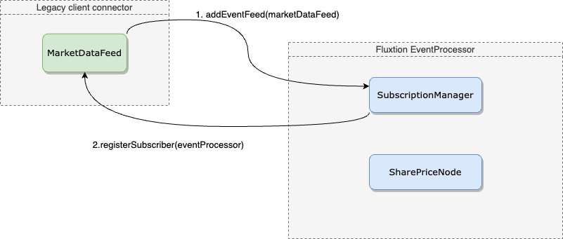
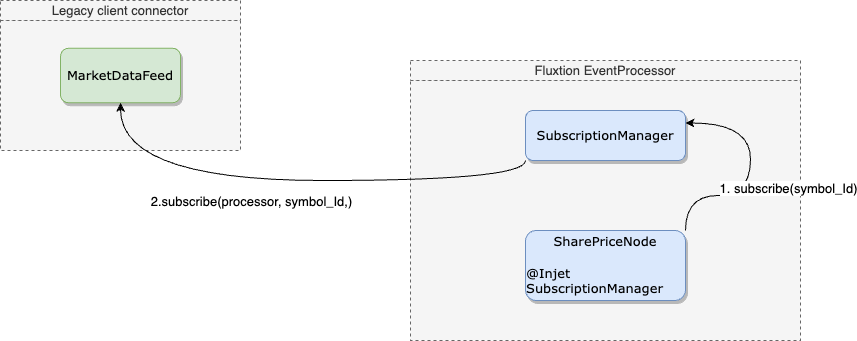
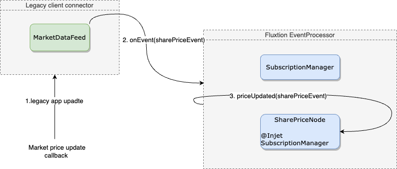

## Introduction
This example demonstrates the pattern to integrate external data feeds with an [EventProcessor]({{site.EventProcessor_link}}). 
An application specific [EventFeed]({{site.fluxtion_src_runtime}}/input/EventFeed.java) acts as a bridge 
from the legacy application into the EventProcessor. The Fluxtion [SubscriptionManager]({{site.fluxtion_src_runtime}}/input/SubscriptionManager.java) 
automatically orchestrates subscription and unsubscription requests from graph nodes to the EventFeed bridge. 

Steps to integrate an EventFeed:

1. Create a custom class that implements the [EventFeed]({{site.fluxtion_src_runtime}}/input/EventFeed.java) interface
2. The implementation of an EventFeed converts external data into events and publishes to registered EventProcessors 
3. Build an EventProcessor containing a node(s) that injects a [SubscriptionManager]({{site.fluxtion_src_runtime}}/input/SubscriptionManager.java) 
4. The node issues subscription requests to the injected SubscriptionManager
5. Add an EventFeed to an EventProcessor by calling EventProcessor.addEventFeed(eventFeed)
7. The custom EventFeed receives subscription requests and connects to external data streams as appropriate
6. The custom EventFeed converts data stream updates/callbacks into events and publishes them by calling EventProcessor.onEvent(event)

It is the responsibility of the custom EventFeed to decide which events are published to an EventProcessor. By filtering
incoming data an EventFeed can greatly reduce the load on the system.

## Subscription and publishing call interaction
Diagrams below demonstrate the interaction between key subscription components for this example.

### Register an EventFeed with EventProcessor
  

### SharePriceNode subscribes to symbols
  

### Publish data from legacy app
  

## Example

The [MarketDataFeed]({{page.example_src}}/MarketDataFeed.java) implements the EventFeed interface, converting a 
market price update from the external environment into a [SharePriceEvent's]({{page.example_src}}/SharePriceEvent.java)
and publishes that event to an EventProcessor.

There are several [SharePriceNode's]({{page.example_src}}/imperative/SharePriceNode.java) in the 
EventProcessor, each one listening to a different symbol. The symbol identifier is provided as a constructor argument. 
A SharePriceNode subscribes to a symbol using the injected SubscriptionManager. 


@Inject
public SubscriptionManager subscriptionManager;

@Initialise
public void init() {
 subscriptionManager.subscribe(symbolId);
}


The SubscriptionManager sends a subscription request to any registered EventFeed coupled with the EventProcessor instance 
that is the target of the event stream.

Methods annotated with @OnEventHandler will receive published SharePriceEvent's where the symbol matches the filter 
specified in the @OnEventHandler annotation:


@OnEventHandler(filterVariable = "symbolId")
public void AssetPrice(SharePrice assetPriceUpdate) {}


### EventProcessor node [SharePriceNode's]({{page.example_src}}/imperative/SharePriceNode.java)
A SharePriceSubscriber is a node managed by an EventProcessor, full code:


public class SharePriceSubscriber {

 private final String symbolId;
 @Inject
 public SubscriptionManager subscriptionManager;
 
 public SharePriceSubscriber(String symbolId) {
  this.symbolId = symbolId;
 }
 
 @Initialise
 public void init() {
  subscriptionManager.subscribe(symbolId);
 }
 
 @OnEventHandler(filterVariable = "symbolId")
 public void AssetPrice(SharePrice assetPriceUpdate) {
  System.out.println("subscriber:" + symbolId + " -> " + assetPriceUpdate);
 }
}


### External [MarketDataFeed]({{page.example_src}}/MarketDataFeed.java)
The simplified example EventFeed is driven programmatically in the main method to simulate operation.

Full code:


public class MarketDataFeed implements EventFeed {

 private final Set<StaticEventProcessor> targetProcessorSet = new HashSet<>();
 
 public void publish(String symbolId, double price) {
   targetProcessorSet.forEach(e -> {
     e.onEvent(new SharePrice(symbolId, price));
   });
 }
 
 @Override
 public void registerFeedTarget(StaticEventProcessor staticEventProcessor) {
   //do nothing feed arrived
 }
 
 @Override
 public void subscribe(StaticEventProcessor target, Object subscriptionId) {
  if (!targetProcessorSet.contains(target)) {
   targetProcessorSet.add(target);
   System.out.println("MarketDataFeed adding EventProcessor as a sink, count:" + targetProcessorSet.size());
  }
 }
 
 @Override
 public void unSubscribe(StaticEventProcessor target, Object subscriptionId) {
  //some complex unsubscription logic
 }
 
 @Override
 public void removeAllSubscriptions(StaticEventProcessor eventProcessor) {
  targetProcessorSet.remove(eventProcessor);
  System.out.println("MarketDataFeed removing EventProcessor as sink, count:" + targetProcessorSet.size());
 }
}


## [Running the example]({{page.example_src}}/imperative/SubscriberImperative.java) 

Builds an interpreted EventProcessor in memory, adds the MarketDataFeed as an EventFeed. Simulating:
- firing external updates as SharePriceEvent's
- Subscribing/unsubscribing to symbols
- EventProcessors connecting and disconnecting

Full code:


public class SubscriberImperative {

 public static void main(String[] args) {
  var marketPriceProcessor = Fluxtion.interpret(c -> c.addNode(
          new SharePriceNode("MSFT"),
          new SharePriceNode("AMZN")
  ));
  marketPriceProcessor.init();
  
  MarketDataFeed eventFeed = new MarketDataFeed();
  marketPriceProcessor.addEventFeed(eventFeed);
  
  System.out.println("\npublishing prices from MarketDataFeed:");
  eventFeed.publish("MSFT", 21.36);
  eventFeed.publish("MSFT", 22.11);
  eventFeed.publish("IBM", 25);
  eventFeed.publish("AMZN", 72.6);
  eventFeed.publish("GOOGL", 179);
  
  System.out.println("\ntear down marketPriceProcessor:");
  marketPriceProcessor.tearDown();
  eventFeed.publish("MSFT", 23.64);
  
  System.out.println("\nrestart marketPriceProcessor:");
  marketPriceProcessor.init();
  System.out.println("\npublishing prices from MarketDataFeed:");
  eventFeed.publish("MSFT", 22.51);
 }

}


Running the example prints this to console:


subscriber registered
MarketDataFeed adding new subscriber, count:1
MarketDataFeed subscription:MSFT
MarketDataFeed subscription:AMZN

publishing prices from MarketDataFeed:
SharePriceNode:MSFT -> SharePriceEvent[symbolId=MSFT, price=21.36]
SharePriceNode:MSFT -> SharePriceEvent[symbolId=MSFT, price=22.11]
SharePriceNode:AMZN -> SharePriceEvent[symbolId=AMZN, price=72.6]

tear down marketPriceProcessor:
remove subscription:AMZN subscriber:com.fluxtion.compiler.generation.targets.InMemoryEventProcessor@29f69090
remove subscription:MSFT subscriber:com.fluxtion.compiler.generation.targets.InMemoryEventProcessor@29f69090
MarketDataFeed removing subscriber, count:0

restart marketPriceProcessor:
MarketDataFeed adding new subscriber, count:1
MarketDataFeed subscription:MSFT
MarketDataFeed subscription:AMZN

publishing prices from MarketDataFeed:
SharePriceNode:MSFT -> SharePriceEvent[symbolId=MSFT, price=22.51]


