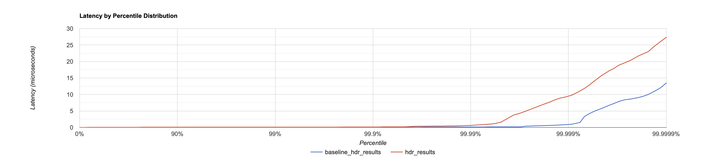

# Introduction

A Fluxtion event processor is a high performance event processor, below are the performance results for a test project. 

Jmh is used to measure throughput per second and latency for a single calculation cycle. 

HdrHistogram is used to record latency percentiles for an execution run

{: .info }
All the results are in the nanosecond range as Fluxtion operates in the sub-microsecond range
{: .fs-4 }

## Summary results

* **33 million events processed per second** 
* **Average latency is 30 nanoseconds to process one event including app logic** 
* **The Fluxtion event processor is in the low nanosecond range for event processing overhead**
* **Zero gc**
* **Single threaded application**

## Test setup

The [test project]({{page.example_src}}) process a market update and carries out a set of calculation for each
market data price ladder event:


public class PriceLadder {
    private final int[] bidSizes = new int[5];
    private final int[] bidPrices = new int[5];
    private final int[] askSizes = new int[5];
    private final int[] askPrices = new int[5];
}


* A graph with four nodes each performing some calculations
* A set of 10,000 randomly generated data events is passed into the processor for processing
* Single threaded
* No core pinning or isolation
* AOT generated version of an event processor is under test

The goal is to create a representative test with randomly distributed input data set to remove bias in the results.  

### Node description

| Eval order  | Class                                                                    | Description                                                                                    |
|-------------|--------------------------------------------------------------------------|------------------------------------------------------------------------------------------------|
| Node 1      | [MidCalculator]({{page.example_nodes}}/MidCalculator.java)               | mid price calculator                                                                           |
| Node 2      | [SkewCalculator]({{page.example_nodes}}/SkewCalculator.java)             | Skew calculation, move all prices at each level by the skew amount                             |
| Node 3      | [LevelsCalculator]({{page.example_nodes}}/LevelsCalculator.java)         | Remove levels by setting to zero for price and volume if max levels < input ladder level count |
| Node 4      | [PriceLadderPublisher]({{page.example_nodes}}/PriceLadderPublisher.java) | Publish the calculated PriceLadder to a consumer for distribution                              |

## Jmh results


Benchmark                                               Mode  Cnt         Score   Error  Units
PriceLadderBenchmark.throughPut_BranchingProcessor     thrpt    2  33315147.680          ops/s
PriceLadderBenchmark.throughPut_No_BranchingProcessor  thrpt    2  34325482.879          ops/s
PriceLadderBenchmark.avgTime_BranchingProcessor         avgt    2        29.309          ns/op
PriceLadderBenchmark.avgTime_No_BranchingProcessor      avgt    2        30.614          ns/op


The average time to process an event is 30 nanoseconds, this includes the application logic  invoked for each node.

## Latency distribution 
At 99.99% the latency is measured at 0.625 microseconds, which includes the underlying machine jitter. The results are 
recorded using HdrHistogram which adds an overhead of several nanoseconds to each reading.

* red line - total latency
* blue line - machine jitter with no processing