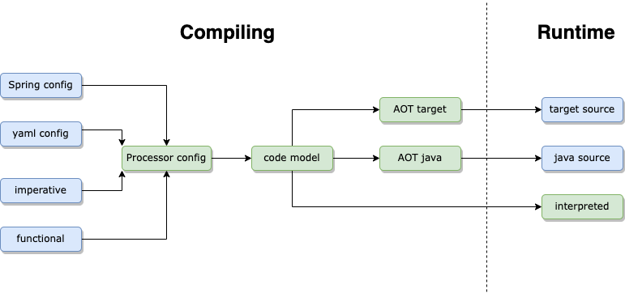

# Introduction

Building and executing an event processor are independent functions that can run in separate processes. This section details the runtime 
execution of the event processor and its integration with client code.

An instance of an
[EventProcessor](https://github.com/v12technology/fluxtion/tree/{{site.fluxtion_version}}/runtime/src/main/java/com/fluxtion/runtime/EventProcessor.java)
is the bridge between event streams and processing logic, user code connects
the EventProcessor to the application event sources. An application can contain multiple EventProcessors instances, and
routes events to an instance.

- **Call EventProcessor.init() before first use**
- **EventProcessors are not thread safe** a single event should be processed at one time.
- **Each new event processed triggers a graph calculation cycle.**

## Three steps to using Fluxtion

1. Mark event handling methods with annotations or via functional programming
2. Build the event processor using fluxtion compiler utility
3. Integrate the event processor in the app and feed it events

The runtime execution behaviour of the event processor is step 1

